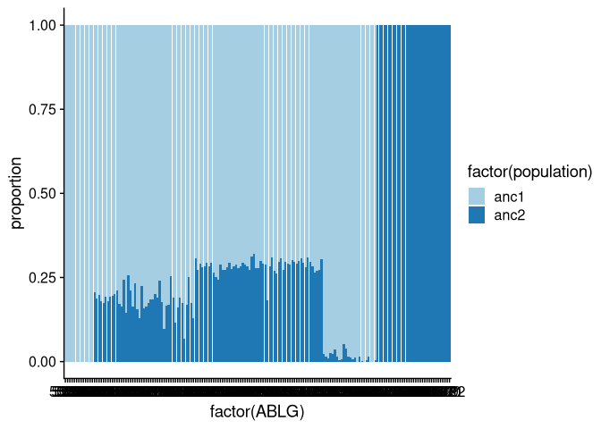
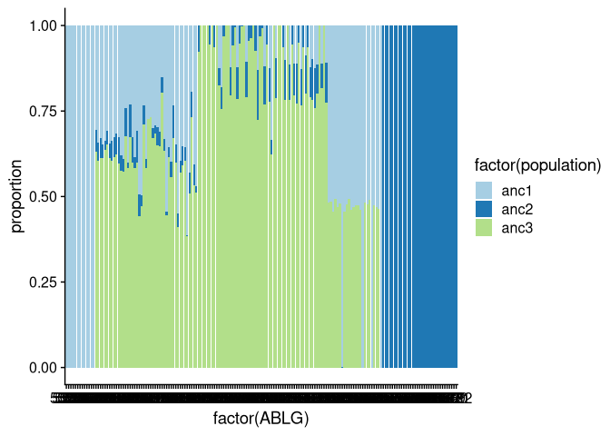
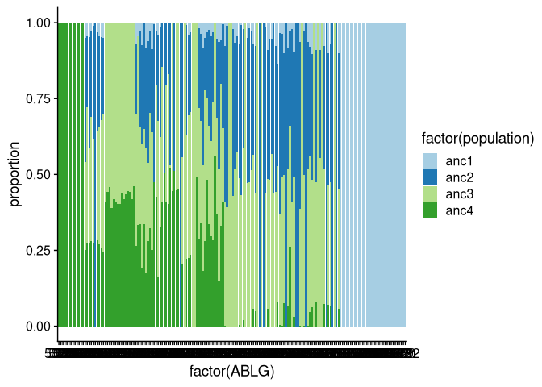
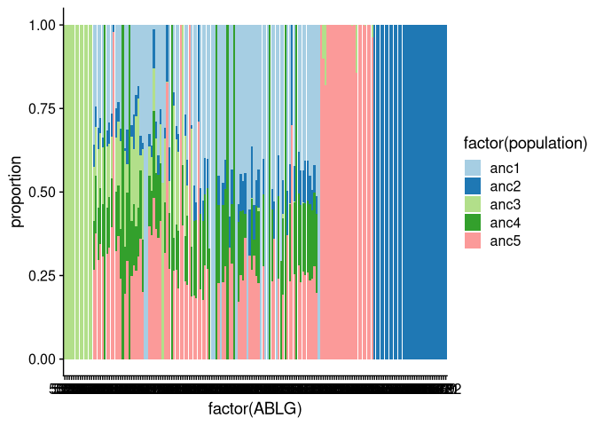
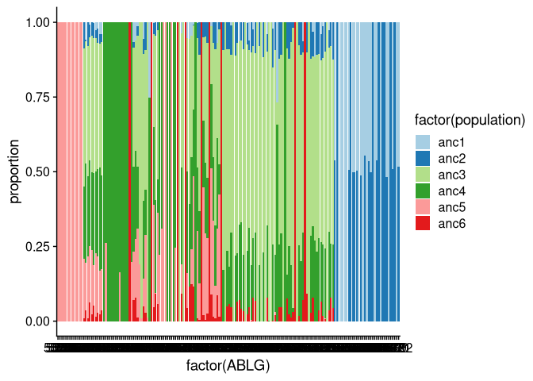
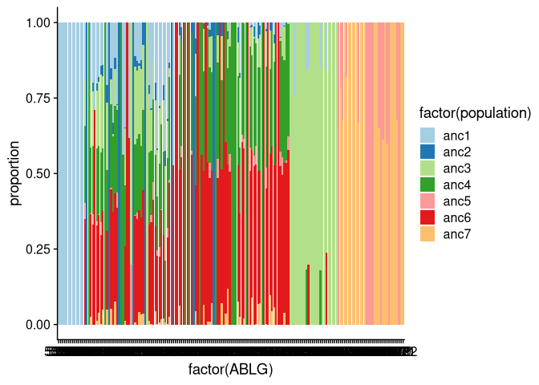
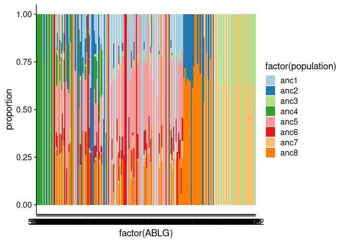
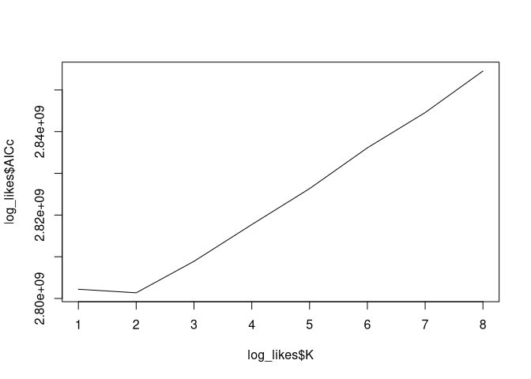
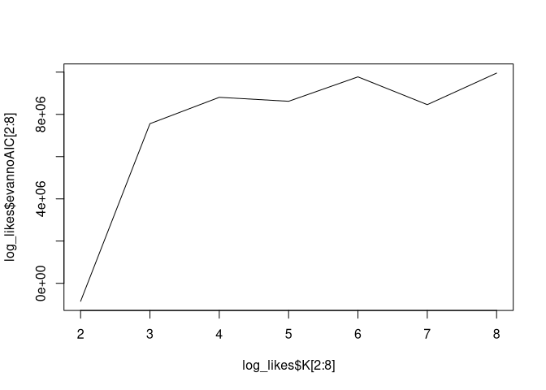
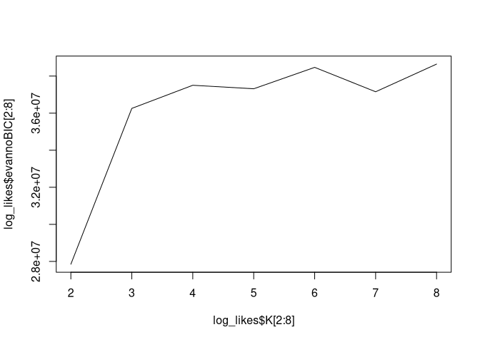

NgsAdmix
================

## Run NgsAdmix

``` bash
echo '#!/bin/bash
#SBATCH --job-name=ngsadmix_rkcR3
#SBATCH --output=/home/cas399/rkc/log/ngsadmix_wgph_1-8_rkc.log
#SBATCH --partition=regular
#SBATCH --nodes=1
#SBATCH --ntasks=16
#SBATCH --array=1-8
#SBATCH --mem=75G
#SBATCH --mail-user=cas399@cornell.edu  
#SBATCH --mail-type=ALL

## Mount the storage
/programs/bin/labutils/mount_server cbsunt246 /workdir
/programs/bin/labutils/mount_server cbsubscb16 /storage

## Define some variables
INPUT_PATH=/fs/cbsubscb16/storage/rkc/angsd/
BEAGLE=PCAM-PPLA_wgph.beagle.gz
MINMAF=0.05
MININD=86
THREADS=16
NGSADMIX=/programs/NGSadmix/NGSadmix
SCRIPT=/fs/cbsubscb16/storage/rkc/scripts/run_ngsadmix_csj.sh

##################################################

## Keep a record of the Job ID
echo $SLURM_JOB_ID

## Create and move to working directory for job
WORKDIR=/workdir/$USER/$SLURM_JOB_ID-$SLURM_ARRAY_TASK_ID/
mkdir -p $WORKDIR
cd $WORKDIR

## Transfer the input files
cp $INPUT_PATH$BEAGLE $WORKDIR

## Run the run_ngsadmix.sh script
bash $SCRIPT \
$WORKDIR \
$BEAGLE \
$MINMAF \
$MININD \
$SLURM_ARRAY_TASK_ID \
$SLURM_ARRAY_TASK_ID \
$THREADS \
$NGSADMIX

## Move output files back
rm $WORKDIR$BEAGLE
cp * $INPUT_PATH' | sbatch
```

## Load relevant libraries and files

``` r
library(tidyverse)
```

    ## ── Attaching core tidyverse packages ──────────────────────── tidyverse 2.0.0 ──
    ## ✔ dplyr     1.1.0     ✔ readr     2.1.4
    ## ✔ forcats   1.0.0     ✔ stringr   1.5.0
    ## ✔ ggplot2   3.4.1     ✔ tibble    3.1.8
    ## ✔ lubridate 1.9.2     ✔ tidyr     1.3.0
    ## ✔ purrr     1.0.1     
    ## ── Conflicts ────────────────────────────────────────── tidyverse_conflicts() ──
    ## ✖ dplyr::filter() masks stats::filter()
    ## ✖ dplyr::lag()    masks stats::lag()
    ## ℹ Use the ]8;;http://conflicted.r-lib.org/conflicted package]8;; to force all conflicts to become errors

``` r
sample_table <- read_tsv("/fs/cbsubscb16/storage/rkc/sample_lists/sample_table.tsv")
```

    ## Rows: 183 Columns: 9
    ## ── Column specification ────────────────────────────────────────────────────────
    ## Delimiter: "\t"
    ## chr (6): population, Loc, GeneralLoc, k3_inferred_pop, k4_inferred_pop, k5_i...
    ## dbl (3): ABLG, StartLatDD, StartLonDD
    ## 
    ## ℹ Use `spec()` to retrieve the full column specification for this data.
    ## ℹ Specify the column types or set `show_col_types = FALSE` to quiet this message.

## load datasets with kmeans 1-8

``` r
k1 <- read_tsv("/fs/cbsubscb16/storage/rkc/angsd/NGSadmix/ngsadmix_PCAM-PPLA-wholegenome_polymorphic_k1.qopt", col_names = c("anc1")) %>% mutate(ABLG = sample_table$ABLG, pop = sample_table$Loc) %>% filter(ABLG != 5617, ABLG != 5618, ABLG != 5637, ABLG != 5644, ABLG != 5648, ABLG != 5650, ABLG != 5651, ABLG != 5663, ABLG != 5667, ABLG != 5669, ABLG != 5670) %>% dplyr::select(ABLG,pop,anc1) %>% 
  gather(population,proportion,anc1,factor_key = T) %>% 
  arrange(pop)
```

    ## Rows: 183 Columns: 1
    ## ── Column specification ────────────────────────────────────────────────────────
    ## Delimiter: "\t"
    ## dbl (1): anc1
    ## 
    ## ℹ Use `spec()` to retrieve the full column specification for this data.
    ## ℹ Specify the column types or set `show_col_types = FALSE` to quiet this message.

``` r
k1$ABLG <- as.character(k1$ABLG)
k1$ABLG <- factor(k1$ABLG, levels = unique(k1$ABLG))

k2 <- read_delim("/fs/cbsubscb16/storage/rkc/angsd/NGSadmix/ngsadmix_PCAM-PPLA-wholegenome_polymorphic_k2.qopt", col_names = c("anc1","anc2"), delim = " ") %>% mutate(ABLG = sample_table$ABLG, pop = sample_table$Loc) %>% filter(ABLG != 5617, ABLG != 5618, ABLG != 5637, ABLG != 5644, ABLG != 5648, ABLG != 5650, ABLG != 5651, ABLG != 5663, ABLG != 5667, ABLG != 5669, ABLG != 5670) %>% dplyr::select(ABLG,pop,anc1,anc2) %>% 
  gather(population,proportion,anc1:anc2,factor_key = T) %>% 
  arrange(pop)
```

    ## Rows: 183 Columns: 3
    ## ── Column specification ────────────────────────────────────────────────────────
    ## Delimiter: " "
    ## dbl (2): anc1, anc2
    ## lgl (1): X3
    ## 
    ## ℹ Use `spec()` to retrieve the full column specification for this data.
    ## ℹ Specify the column types or set `show_col_types = FALSE` to quiet this message.

``` r
k2$ABLG <- as.character(k2$ABLG)
k2$ABLG <- factor(k2$ABLG, levels = unique(k2$ABLG))

k3 <- read_delim("/fs/cbsubscb16/storage/rkc/angsd/NGSadmix/ngsadmix_PCAM-PPLA-wholegenome_polymorphic_k3.qopt", col_names = c("anc1","anc2","anc3"), delim = " ") %>% mutate(ABLG = sample_table$ABLG, pop = sample_table$Loc) %>% filter(ABLG != 5617, ABLG != 5618, ABLG != 5637, ABLG != 5644, ABLG != 5648, ABLG != 5650, ABLG != 5651, ABLG != 5663, ABLG != 5667, ABLG != 5669, ABLG != 5670) %>% dplyr::select(ABLG,pop,anc1,anc2,anc3) %>% 
  gather(population,proportion,anc1:anc3,factor_key = T) %>% 
  arrange(pop)
```

    ## Rows: 183 Columns: 4
    ## ── Column specification ────────────────────────────────────────────────────────
    ## Delimiter: " "
    ## dbl (3): anc1, anc2, anc3
    ## lgl (1): X4
    ## 
    ## ℹ Use `spec()` to retrieve the full column specification for this data.
    ## ℹ Specify the column types or set `show_col_types = FALSE` to quiet this message.

``` r
k3$ABLG <- as.character(k3$ABLG)
k3$ABLG <- factor(k3$ABLG, levels = unique(k3$ABLG))

k4 <- read_delim("/fs/cbsubscb16/storage/rkc/angsd/NGSadmix/ngsadmix_PCAM-PPLA-wholegenome_polymorphic_k4.qopt", col_names = c("anc1","anc2","anc3","anc4"), delim = " ") %>% mutate(ABLG = sample_table$ABLG, pop = sample_table$GeneralLoc) %>% filter(ABLG != 5617, ABLG != 5618, ABLG != 5637, ABLG != 5644, ABLG != 5648, ABLG != 5650, ABLG != 5651, ABLG != 5663, ABLG != 5667, ABLG != 5669, ABLG != 5670) %>% dplyr::select(ABLG,pop,anc1,anc2,anc3,anc4) %>% 
  gather(population,proportion,anc1:anc4,factor_key = T) %>% 
  arrange(pop)
```

    ## Rows: 183 Columns: 5
    ## ── Column specification ────────────────────────────────────────────────────────
    ## Delimiter: " "
    ## dbl (4): anc1, anc2, anc3, anc4
    ## lgl (1): X5
    ## 
    ## ℹ Use `spec()` to retrieve the full column specification for this data.
    ## ℹ Specify the column types or set `show_col_types = FALSE` to quiet this message.

``` r
k4$ABLG <- as.character(k4$ABLG)
k4$ABLG <- factor(k4$ABLG, levels = unique(k4$ABLG))

k5 <- read_delim("/fs/cbsubscb16/storage/rkc/angsd/NGSadmix/ngsadmix_PCAM-PPLA-wholegenome_polymorphic_k5.qopt", col_names = c("anc1","anc2","anc3","anc4","anc5"), delim = " ") %>% mutate(ABLG = sample_table$ABLG, pop = sample_table$Loc) %>% filter(ABLG != 5617, ABLG != 5618, ABLG != 5637, ABLG != 5644, ABLG != 5648, ABLG != 5650, ABLG != 5651, ABLG != 5663, ABLG != 5667, ABLG != 5669, ABLG != 5670) %>% dplyr::select(ABLG,pop,anc1,anc2,anc3,anc4,anc5) %>% 
  gather(population,proportion,anc1:anc5,factor_key = T) %>% 
  arrange(pop)
```

    ## Rows: 183 Columns: 6
    ## ── Column specification ────────────────────────────────────────────────────────
    ## Delimiter: " "
    ## dbl (5): anc1, anc2, anc3, anc4, anc5
    ## lgl (1): X6
    ## 
    ## ℹ Use `spec()` to retrieve the full column specification for this data.
    ## ℹ Specify the column types or set `show_col_types = FALSE` to quiet this message.

``` r
k5$ABLG <- as.character(k5$ABLG)
k5$ABLG <- factor(k5$ABLG, levels = unique(k5$ABLG))

k6 <- read_delim("/fs/cbsubscb16/storage/rkc/angsd/NGSadmix/ngsadmix_PCAM-PPLA-wholegenome_polymorphic_k6.qopt", col_names = c("anc1","anc2","anc3","anc4","anc5","anc6"), delim = " ") %>% mutate(ABLG = sample_table$ABLG, pop = sample_table$GeneralLoc) %>% filter(ABLG != 5617, ABLG != 5618, ABLG != 5637, ABLG != 5644, ABLG != 5648, ABLG != 5650, ABLG != 5651, ABLG != 5663, ABLG != 5667, ABLG != 5669, ABLG != 5670) %>% dplyr::select(ABLG,pop,anc1,anc2,anc3,anc4,anc5,anc6) %>% 
  gather(population,proportion,anc1:anc6,factor_key = T) %>% 
  arrange(pop)
```

    ## Rows: 183 Columns: 7
    ## ── Column specification ────────────────────────────────────────────────────────
    ## Delimiter: " "
    ## dbl (6): anc1, anc2, anc3, anc4, anc5, anc6
    ## lgl (1): X7
    ## 
    ## ℹ Use `spec()` to retrieve the full column specification for this data.
    ## ℹ Specify the column types or set `show_col_types = FALSE` to quiet this message.

``` r
k6$ABLG <- as.character(k6$ABLG)
k6$ABLG <- factor(k6$ABLG, levels = unique(k6$ABLG))

k7 <- read_delim("/fs/cbsubscb16/storage/rkc/angsd/NGSadmix/ngsadmix_PCAM-PPLA-wholegenome_polymorphic_k7.qopt", col_names = c("anc1","anc2","anc3","anc4","anc5","anc6","anc7"), delim = " ") %>% mutate(ABLG = sample_table$ABLG, pop = sample_table$Loc) %>% filter(ABLG != 5617, ABLG != 5618, ABLG != 5637, ABLG != 5644, ABLG != 5648, ABLG != 5650, ABLG != 5651, ABLG != 5663, ABLG != 5667, ABLG != 5669, ABLG != 5670) %>% dplyr::select(ABLG,pop,anc1,anc2,anc3,anc4,anc5,anc6,anc7) %>% 
  gather(population,proportion,anc1:anc7,factor_key = T) %>% 
  arrange(pop)
```

    ## Rows: 183 Columns: 8
    ## ── Column specification ────────────────────────────────────────────────────────
    ## Delimiter: " "
    ## dbl (7): anc1, anc2, anc3, anc4, anc5, anc6, anc7
    ## lgl (1): X8
    ## 
    ## ℹ Use `spec()` to retrieve the full column specification for this data.
    ## ℹ Specify the column types or set `show_col_types = FALSE` to quiet this message.

``` r
k7$ABLG <- as.character(k7$ABLG)
k7$ABLG <- factor(k7$ABLG, levels = unique(k7$ABLG))

k8 <- read_delim("/fs/cbsubscb16/storage/rkc/angsd/NGSadmix/ngsadmix_PCAM-PPLA-wholegenome_polymorphic_k8.qopt", col_names = c("anc1","anc2","anc3","anc4","anc5","anc6","anc7","anc8"), delim = " ") %>% mutate(ABLG = sample_table$ABLG, pop = sample_table$Loc) %>% filter(ABLG != 5617, ABLG != 5618, ABLG != 5637, ABLG != 5644, ABLG != 5648, ABLG != 5650, ABLG != 5651, ABLG != 5663, ABLG != 5667, ABLG != 5669, ABLG != 5670) %>% dplyr::select(ABLG,pop,anc1,anc2,anc3,anc4,anc5,anc6,anc7,anc8) %>% 
  gather(population,proportion,anc1:anc8,factor_key = T) %>% 
  arrange(pop)
```

    ## Rows: 183 Columns: 9
    ## ── Column specification ────────────────────────────────────────────────────────
    ## Delimiter: " "
    ## dbl (8): anc1, anc2, anc3, anc4, anc5, anc6, anc7, anc8
    ## lgl (1): X9
    ## 
    ## ℹ Use `spec()` to retrieve the full column specification for this data.
    ## ℹ Specify the column types or set `show_col_types = FALSE` to quiet this message.

``` r
k8$ABLG <- as.character(k8$ABLG)
k8$ABLG <- factor(k8$ABLG, levels = unique(k8$ABLG))
```

## Plot admixture results

``` r
ggplot(data = k2, aes(x=factor(ABLG),y=proportion,fill=factor(population))) + 
  geom_bar(stat="identity",position="stack") +
  scale_fill_brewer(type = "qual", palette = 3) +
  theme(axis.text.x = element_text(angle = 90)) +
  cowplot::theme_cowplot()
```

<!-- -->

``` r
#ggsave("/fs/cbsubscb16/storage/rkc/figures/admix_k2.png", height = 5, width = 20, device = "png")

ggplot(data = k3, aes(x=factor(ABLG),y=proportion,fill=factor(population))) + 
  geom_bar(stat="identity",position="stack") +
  scale_fill_brewer(type = "qual", palette = 3) +
  theme(axis.text.x = element_text(angle = 90)) +
  cowplot::theme_cowplot()
```

<!-- -->

``` r
ggplot(data = k4, aes(x=factor(ABLG),y=proportion,fill=factor(population))) + 
  geom_bar(stat="identity",position="stack") +
  scale_fill_brewer(type = "qual", palette = 3) +
  theme(axis.text.x = element_text(angle = 90)) +
  cowplot::theme_cowplot()
```

<!-- -->

``` r
ggplot(data = k5, aes(x=factor(ABLG),y=proportion,fill=factor(population))) + 
  geom_bar(stat="identity",position="stack") +
  scale_fill_brewer(type = "qual", palette = 3) +
  theme(axis.text.x = element_text(angle = 90)) +
  cowplot::theme_cowplot()
```

<!-- -->

``` r
ggplot(data = k6, aes(x=factor(ABLG),y=proportion,fill=factor(population))) + 
  geom_bar(stat="identity",position="stack") +
  scale_fill_brewer(type = "qual", palette = 3) +
  theme(axis.text.x = element_text(angle = 90)) +
  cowplot::theme_cowplot()
```

<!-- -->

``` r
#ggsave("/fs/cbsubscb16/storage/rkc/figures/admix_k6.png", height = 5, width = 20, device = "png")
ggplot(data = k7, aes(x=factor(ABLG),y=proportion,fill=factor(population))) + 
  geom_bar(stat="identity",position="stack") +
  scale_fill_brewer(type = "qual", palette = 3) +
  theme(axis.text.x = element_text(angle = 90)) +
  cowplot::theme_cowplot()
```

<!-- -->

``` r
#ggsave("/fs/cbsubscb16/storage/rkc/figures/admix_k7.png", height = 5, width = 20, device = "png")

ggplot(data = k8, aes(x=factor(ABLG),y=proportion,fill=factor(population))) + 
  geom_bar(stat="identity",position="stack") +
  scale_fill_brewer(type = "qual", palette = 3) +
  theme(axis.text.x = element_text(angle = 90)) +
  cowplot::theme_cowplot()
```

<!-- -->

``` r
#ggsave("/fs/cbsubscb16/storage/rkc/figures/admix_k8.png", height = 5, width = 20, device = "png")
```

## Chose best K

``` r
likes <- list.files("/fs/cbsubscb16/storage/rkc/angsd/NGSadmix", pattern = ".log", full.names = T)
likes
```

    ## [1] "/fs/cbsubscb16/storage/rkc/angsd/NGSadmix/ngsadmix_PCAM-PPLA-wholegenome_polymorphic_k1.log"
    ## [2] "/fs/cbsubscb16/storage/rkc/angsd/NGSadmix/ngsadmix_PCAM-PPLA-wholegenome_polymorphic_k2.log"
    ## [3] "/fs/cbsubscb16/storage/rkc/angsd/NGSadmix/ngsadmix_PCAM-PPLA-wholegenome_polymorphic_k3.log"
    ## [4] "/fs/cbsubscb16/storage/rkc/angsd/NGSadmix/ngsadmix_PCAM-PPLA-wholegenome_polymorphic_k4.log"
    ## [5] "/fs/cbsubscb16/storage/rkc/angsd/NGSadmix/ngsadmix_PCAM-PPLA-wholegenome_polymorphic_k5.log"
    ## [6] "/fs/cbsubscb16/storage/rkc/angsd/NGSadmix/ngsadmix_PCAM-PPLA-wholegenome_polymorphic_k6.log"
    ## [7] "/fs/cbsubscb16/storage/rkc/angsd/NGSadmix/ngsadmix_PCAM-PPLA-wholegenome_polymorphic_k7.log"
    ## [8] "/fs/cbsubscb16/storage/rkc/angsd/NGSadmix/ngsadmix_PCAM-PPLA-wholegenome_polymorphic_k8.log"

#### Read in all log files

``` r
likes_data <- lapply(1:8, FUN = function(i) readLines(likes[i]))
## pull out line containing best likelihood
log_likes <- data.frame(K = rep(1:8))
temp_set <- sapply(1:8, function(x) likes_data[[x]][which(str_sub(likes_data[[x]], 1, 1) == 'b')])

log_likes <- log_likes %>% mutate(LL = as.numeric(sub("\\D*(\\d+).*", "\\1", temp_set))*-1)
```

#### Calculate AIC

\#BIC =
<https://wikimedia.org/api/rest_v1/media/math/render/svg/9fb26ce833300f98a6df6039624fc7ffaf4ce7fb> -
works best with simple model extract - - AIC works better with lots of
weak affects - what model would be most predictive for new data
(sequence data)

``` r
log_likes <- log_likes %>% mutate(params = K*8973301+K*183) %>% 
  mutate(aic = 2*params-(2*LL)) %>% 
  mutate(AICc = aic + (2*K^2+2*params)/(183-K-1)) %>% 
  mutate(delta_AICc = (AICc - 2801357575)) %>%
  mutate(bic = params*log(183)-2*LL) %>% 
  mutate(evannoAIC = AICc-lag(AICc)) %>% 
  mutate(evannoBIC = bic -lag(bic)) %>% 
  mutate(AICcrl =  exp(-0.5*(AICc - 2801357575))) %>%
  mutate(AICcwt = AICcrl/sum(AICcrl)) 

plot(log_likes$K,log_likes$AICc, type = "l")
```

<!-- -->

``` r
plot(log_likes$K[2:8],log_likes$evannoAIC[2:8], type = "l")
```

<!-- -->

``` r
plot(log_likes$K,log_likes$bic, type = "l")
```

<!-- -->

``` r
plot(log_likes$K[2:8], log_likes$evannoBIC[2:8], type = "l")
```

<!-- -->

## NGS Admix for BSEA and GOA

``` bash
echo '#!/bin/bash
#SBATCH --job-name=ngsadmix_BSEAGOA
#SBATCH --output=/home/cas399/rkc/log/ngsadmix_BSEAGOA_T2_1-5_rkc.log
#SBATCH --partition=regular
#SBATCH --nodes=1
#SBATCH --ntasks=16
#SBATCH --array=1-5
#SBATCH --mem=75G
#SBATCH --mail-user=cas399@cornell.edu  
#SBATCH --mail-type=ALL

## Mount the storage
/programs/bin/labutils/mount_server cbsunt246 /workdir
/programs/bin/labutils/mount_server cbsubscb16 /storage

## Define some variables
INPUT_PATH=/fs/cbsubscb16/storage/rkc/angsd/
BEAGLE=BSEA_GOA_PCAM-PPLA-wholegenome_polymorphic.beagle.gz
MINMAF=0.05
MININD=86
THREADS=16
NGSADMIX=/programs/NGSadmix/NGSadmix
SCRIPT=/fs/cbsubscb16/storage/rkc/scripts/run_ngsadmix_csj.sh

##################################################

## Keep a record of the Job ID
echo $SLURM_JOB_ID

## Create and move to working directory for job
WORKDIR=/workdir/$USER/$SLURM_JOB_ID-$SLURM_ARRAY_TASK_ID/
mkdir -p $WORKDIR
cd $WORKDIR

## Transfer the input files
cp $INPUT_PATH$BEAGLE $WORKDIR

## Run the run_ngsadmix.sh script
bash $SCRIPT \
$WORKDIR \
$BEAGLE \
$MINMAF \
$MININD \
$SLURM_ARRAY_TASK_ID \
$SLURM_ARRAY_TASK_ID \
$THREADS \
$NGSADMIX

## Move output files back
rm $WORKDIR$BEAGLE
cp * $INPUT_PATH' | sbatch
```
