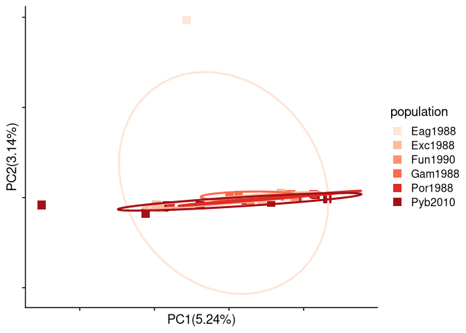
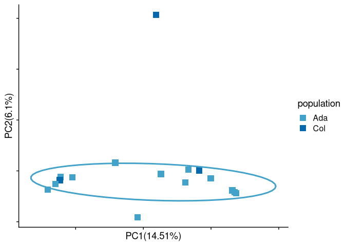
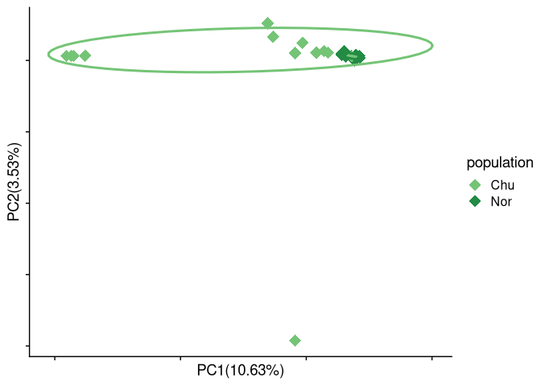
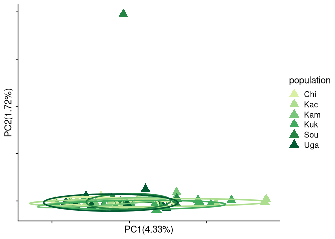
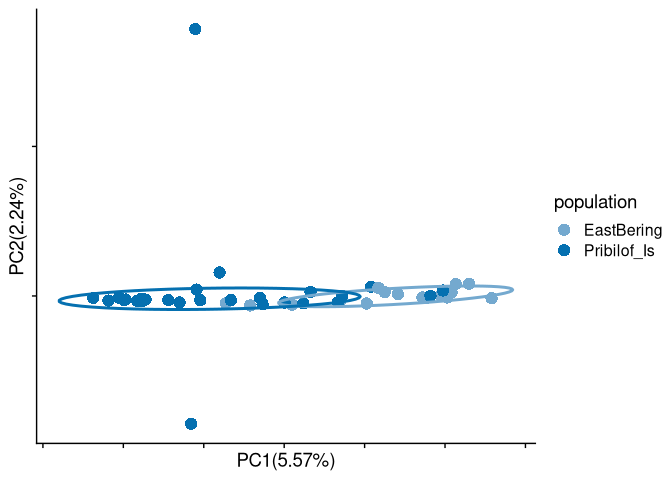

data analysis
================

#### load packages

``` r
library("tidyverse")
```

    ## ── Attaching core tidyverse packages ──────────────────────── tidyverse 2.0.0 ──
    ## ✔ dplyr     1.1.0     ✔ readr     2.1.4
    ## ✔ forcats   1.0.0     ✔ stringr   1.5.0
    ## ✔ ggplot2   3.4.1     ✔ tibble    3.1.8
    ## ✔ lubridate 1.9.2     ✔ tidyr     1.3.0
    ## ✔ purrr     1.0.1     
    ## ── Conflicts ────────────────────────────────────────── tidyverse_conflicts() ──
    ## ✖ dplyr::filter() masks stats::filter()
    ## ✖ dplyr::lag()    masks stats::lag()
    ## ℹ Use the ]8;;http://conflicted.r-lib.org/conflicted package]8;; to force all conflicts to become errors

``` r
library("ggplot2")
library("cowplot")
```

    ## 
    ## Attaching package: 'cowplot'
    ## 
    ## The following object is masked from 'package:lubridate':
    ## 
    ##     stamp

``` r
library("maps")
```

    ## 
    ## Attaching package: 'maps'
    ## 
    ## The following object is masked from 'package:purrr':
    ## 
    ##     map

``` r
library("mapdata")
library(RcppCNPy)
source("/fs/cbsubscb16/storage/sucker_sp2021/scripts/individual_pca_functions_csj.R")
sample_table <- read_tsv("/fs/cbsubscb16/storage/rkc/sample_lists/sample_table.tsv")
```

    ## Rows: 183 Columns: 9
    ## ── Column specification ────────────────────────────────────────────────────────
    ## Delimiter: "\t"
    ## chr (6): population, Loc, GeneralLoc, k3_inferred_pop, k4_inferred_pop, k5_i...
    ## dbl (3): ABLG, StartLatDD, StartLonDD
    ## 
    ## ℹ Use `spec()` to retrieve the full column specification for this data.
    ## ℹ Specify the column types or set `show_col_types = FALSE` to quiet this message.

# make sample table from rkc metadata

``` r
metadata <- read_csv("/fs/cbsubscb16/storage/rkc/sample_lists/rkc_whitelist_1x_metadata.csv")
```

    ## Rows: 183 Columns: 26
    ## ── Column specification ────────────────────────────────────────────────────────
    ## Delimiter: ","
    ## chr (10): AltID, CommonName, SpeciesName, CollectionDate, Locality, Loc, Gen...
    ## dbl (16): ABLG, notSEAK, StartLatDD, StartLonDD, k3_A, k3_B, k3_C, k4_A, k4_...
    ## 
    ## ℹ Use `spec()` to retrieve the full column specification for this data.
    ## ℹ Specify the column types or set `show_col_types = FALSE` to quiet this message.

``` r
sample_table_pribs <- metadata %>% 
  mutate(CollectionDate = parse_date(CollectionDate, format = "%m/%d/%Y")) %>% 
  mutate(year = as.character(format(CollectionDate, "%Y"))) %>% 
  mutate(month = as.character(format(CollectionDate, "%m"))) %>% 
  mutate(day = as.character(format(CollectionDate, "%d"))) %>%
  mutate(population = str_c(substr(Locality, 1, 3), year,sep="")) %>% 
  mutate(Loc = ifelse(str_detect(population, "Pri") | str_detect(population, "Sai"), "Pribilof_Is", Locality)) %>% dplyr::select(ABLG, population, Loc, GeneralLoc, StartLatDD, StartLonDD, k3_inferred_pop, k4_inferred_pop, k5_inferred_pop)

#write_tsv(sample_table, "/fs/cbsubscb16/storage/rkc/sample_lists/sample_table.tsv")
```

## run pcangsd

``` bash
nohup bash /fs/cbsubscb16/storage/genomic-data-analysis/scripts/run_pcangsd.sh /fs/cbsubscb16/storage/rkc/ /fs/cbsubscb16/storage/rkc/angsd/PCAM-PPLA-wholegenome_polymorphic.beagle.gz 0.05 pca 1 8 > /fs/cbsubscb16/storage/rkc/nohups/run_pcangsd_pca.nohup &

## NGSparalog dataset
# job ID 1732677
echo '#!/bin/bash
#SBATCH --job-name=allPCA
#SBATCH --output=/home/cas399/rkc/log/run_pcangsd_wgph.log
#SBATCH --partition=short
#SBATCH --nodes=1
#SBATCH --ntasks=16
#SBATCH --mem=75G
#SBATCH --mail-user=cas399@cornell.edu  
#SBATCH --mail-type=ALL

## Mount the storage
/programs/bin/labutils/mount_server cbsubscb16 /storage

## Define some variables
INPUT_PATH=/fs/cbsubscb16/storage/rkc/angsd/
BEAGLE=PCAM-PPLA_wgph.beagle.gz
MINMAF=0.05
TYPE=1
EIGENS=8
SCRIPT=/fs/cbsubscb16/storage/sucker_sp2021/scripts/run_pcangsd_csj.sh

##################################################

## Keep a record of the Job ID
echo $SLURM_JOB_ID

## Create and move to working directory for job
WORKDIR=/workdir/$USER/$SLURM_JOB_ID/
mkdir -p $WORKDIR
cd $WORKDIR
mkdir angsd/

## Transfer the input files
cp $INPUT_PATH$BEAGLE $WORKDIR

## Run the run_pcangsd.sh script
bash $SCRIPT $WORKDIR $BEAGLE $MINMAF pca $TYPE $EIGENS

## Move output files back
rm $WORKDIR$BEAGLE
cp angsd/* $INPUT_PATH' | sbatch

nohup bash /fs/cbsubscb16/storage/sucker_sp2021/scripts/run_pcangsd_csj.sh /fs/cbsubscb16/storage/rkc/ /fs/cbsubscb16/storage/rkc/angsd/PCAM-PPLA_wgph.beagle.gz 0.05 pca 1 8 > /fs/cbsubscb16/storage/rkc/nohups/run_pcangsd_pca_wgph2.nohup &
```

## Plot all pop PCA

- The following individuals are considered outliers: ABLG5617, ABLG5618,
  ABLG5637, ABLG5644, ABLG5648, ABLG5650, ABLG5651, ABLG5663, ABLG5667,
  ABLG5669, ABLG5670
- The Gulf of Alaska individuals grouping with Bristol Bay are from
  Uga2002 and Chi1991

Plot of every site to see if there are any strange outliers. Nothing
obvious here

``` r
alpha = 0.7
size = 2
All_pop_pca <- PCA(genome_cov, sample_table$ABLG, sample_table$Loc, 1, 2, show.ellipse = F, show.line = F, show.label = F, size = 4, alpha = 0.2, index_exclude=c(94, 95, 103, 106, 107, 109, 110, 118, 119, 120, 121))
```

    ## Warning in geom_enterotype(alpha = alpha, size = size, show.point =
    ## show.point, : Ignoring unknown parameters: `size`

    ## Warning: Using `size` aesthetic for lines was deprecated in ggplot2 3.4.0.
    ## ℹ Please use `linewidth` instead.

<!-- -->

``` r
#ggsave("/fs/cbsubscb16/storage/rkc/figures/All_pop_pca.png", device = "png", height = 5, width = 7, bg = 'transparent')
```

- All regions group together with some putative geneflow/migration
  between Gulf of Alaska (Kodiak) and East Bering Sea (Bristol Bay and
  Pribilof islands)
- this is consistent with previous studies using mtDNA and nuclear
  markers.

#### Subsample populations to even out sample sizes and run PCA

#### Run pcangsd

``` bash
# Run on cbsunt246
# PID 4134831
nohup bash /fs/cbsubscb16/storage/genomic-data-analysis/scripts/run_pcangsd.sh /fs/cbsubscb16/storage/rkc/ /fs/cbsubscb16/storage/rkc/angsd/subsamp_PCAM-PPLA_wgph.beagle.gz 0.05 pca 1 8 > /fs/cbsubscb16/storage/rkc/nohups/run_pcangsd_pca_subsamp.nohup &
```

#### Subsetted PCA

- The PCA with equal sample sizes has the same grouping pattern as the
  full dataset therefore, unequal sample sizes are not affecting PCAs

``` r
PCA_continuous_var(genome_cov, sample_table$ABLG, sample_table$StartLatDD, 1, 2, "RKC_pca_latitude", show.ellipse = F, show.line = F, show.label = F)

RKC_PCA_lat_plot <- ggplot(data=RKC_pca_latitude,aes(x=PC1, y=PC2)) +
  geom_point(aes(color = population), size = 4, alpha = 0.5) +
  #geom_text(aes(label = individual), nudge_x = -0.1) +
  scale_color_viridis_c(name = "Latitude (DD)", begin = 1, end = 0, option = "plasma") +
  cowplot::theme_cowplot() +
    xlab(paste0("PC1 ", round(RKC_pca_latitude_x_var,2),"%")) +
    ylab(paste0("PC2 ",round(RKC_pca_latitude_y_var,2),"%"))
RKC_PCA_lat_plot
```

<!-- -->

PCA colored by latitude - conceptual plot of first steps for local
adaptation analysis - could use avg sea surface temp or salinity or
other environmental analysis - GxE analysis may also be appropriate
though I’m not sure if these analyses are developed for low coverage
data yet

## Fst peaks from Lauren

<figure>

<figcaption aria-hidden="true">Fst plot</figcaption>
</figure>

## PCAs by region

#### Define PCA function

``` r
PCA <- function(cov_matrix, ind_label, pop_label, x_axis, y_axis, show.point=T, show.label=T, show.ellipse=T, show.line=T, alpha=0, index_exclude=vector(), shape, values, size)
{
  ## This function takes a covariance matrix and performs PCA. 
  # cov_matrix: a square covariance matrix generated by most pca softwares
  # ind_label: a vector in the same order and length as cov_matrix; it contains the individual labels of the individuals represented in the covariance matrix
  # pop_label: a vector in the same order and length as cov_matrix; it contains the population labels of the individuals represented in the covariance matrix
  # x_axis: an integer that determines which principal component to plot on the x axis
  # y_axis: an integer that determines which principal component to plot on the y axis
  # show.point: whether to show individual points
  # show.label: whether to show population labels
  # show.ellipse: whether to show population-specific ellipses
  # show.line: whether to show lines connecting population means with each individual point
  # alpha: the transparency of ellipses
  # index_exclude: the indices of individuals to exclude from the analysis
  index_include <- setdiff(seq_along(ind_label), index_exclude)
  m <- as.matrix(cov_matrix)
  m[is.na(m)]<- median(m, na.rm = T)
  m<-m[index_include, index_include] ## Remove 4SJH, four 3Ps individuals, and contaminated ones
  e <- eigen(m)
  e_value<-e$values
  x_variance<-e_value[x_axis]/sum(e_value)*100
  y_variance<-e_value[y_axis]/sum(e_value)*100
  e <- as.data.frame(e$vectors)
  e <- cbind(ind_label[index_include], pop_label[index_include], e) ## with the above individuals removed
  #colnames(e)[3:331]<-paste0("PC",1:329)
  colnames(e)[3:(dim(e)[1])]<-paste0("PC",1:(dim(e)[1]-2)) ## with the above individuals removed
  colnames(e)[1:2]<-c("individual", "population")
  assign("pca_table", e, .GlobalEnv)
  
  PCA_plot<-ggplot(data=e[,],aes(x=e[,x_axis+2], y=e[,y_axis+2], color=population,label=population), alpha=alpha, shape = shape) + 
    geom_enterotype(alpha=alpha, size=size, show.point=show.point, show.label=show.label, show.ellipse=show.ellipse, show.line=show.line, shape = shape) +
    #scale_shape_manual(values = c(rep(c(15,16,17,18),7), 15, 16)) +
    scale_color_manual(values = colors) +
    theme_cowplot() +
    theme(
      axis.text.x = element_blank(),
      axis.text.y = element_blank()
    ) +
    xlab(paste0("PC", x_axis, "(",round(x_variance,2),"%)")) +
    ylab(paste0("PC", y_axis ,"(",round(y_variance,2),"%)")) 
  print(PCA_plot)
  
}
```

## Run pcangsd for southeast alaska

copy and past the above beagle index column list into the script below
to cut the correct columns

#### Run pcangsd

``` bash
# Run on cbsunt246
# PID 7765
nohup bash /fs/cbsubscb16/storage/genomic-data-analysis/scripts/run_pcangsd.sh /fs/cbsubscb16/storage/rkc/ /fs/cbsubscb16/storage/rkc/angsd/SEAK_PCAM-PPLA_wgph.beagle.gz 0.05 pca 1 8 > /fs/cbsubscb16/storage/rkc/nohups/run_pcangsd_pca_SEAK.nohup &

## NGS paralogs dataset
# job ID 1732677
echo '#!/bin/bash
#SBATCH --job-name=SEAKPCA
#SBATCH --output=/home/cas399/rkc/log/run_pcangsd_wgph_SEAK.log
#SBATCH --partition=short
#SBATCH --nodes=1
#SBATCH --ntasks=16
#SBATCH --mem=75G
#SBATCH --mail-user=cas399@cornell.edu  
#SBATCH --mail-type=ALL

## Mount the storage
/programs/bin/labutils/mount_server cbsubscb16 /storage

## Define some variables
INPUT_PATH=/fs/cbsubscb16/storage/rkc/angsd/
BEAGLE=SEAK_PCAM-PPLA_wgph.beagle.gz
MINMAF=0.05
TYPE=1
EIGENS=8
SCRIPT=/fs/cbsubscb16/storage/sucker_sp2021/scripts/run_pcangsd_csj.sh

##################################################

## Keep a record of the Job ID
echo $SLURM_JOB_ID

## Create and move to working directory for job
WORKDIR=/workdir/$USER/$SLURM_JOB_ID/
mkdir -p $WORKDIR
cd $WORKDIR
mkdir angsd/

## Transfer the input files
cp $INPUT_PATH$BEAGLE $WORKDIR

## Run the run_pcangsd.sh script
bash $SCRIPT $WORKDIR $BEAGLE $MINMAF pca $TYPE $EIGENS

## Move output files back
rm $WORKDIR$BEAGLE
cp angsd/* $INPUT_PATH' | sbatch
```

#### Plot SEAK PCA

``` r
## Read in data
genome_cov_SEAK <- read_table("/fs/cbsubscb16/storage/rkc/angsd/pcangsd_SEAK_PCAM-PPLA_wgph.cov", col_names = F)
```

    ## 
    ## ── Column specification ────────────────────────────────────────────────────────
    ## cols(
    ##   .default = col_double()
    ## )
    ## ℹ Use `spec()` for the full column specifications.

``` r
# Color by collection location and date
alpha = 0.5
size = 4
colors = c("#fee5d9",
"#fcbba1",
"#fc9272",
"#fb6a4a",
"#de2d26",
"#a50f15")
SEAK_pca <- PCA(genome_cov_SEAK, sample_table_SEAK$ABLG, sample_table_SEAK$population, 1, 2, show.ellipse = T, show.line = F, alpha = 0, show.label = F, index_exclude = c(23,24), shape = 15, values = colors, size = 4)
```

    ## Warning in geom_enterotype(alpha = alpha, size = size, show.point =
    ## show.point, : Ignoring unknown parameters: `size` and `shape`

    ## Warning in geom_enterotype(alpha = alpha, size = size, show.point = show.point, : Ignoring unknown parameters: `shape`
    ## Ignoring unknown parameters: `shape`

    ## 
    ## Attaching package: 'MASS'

    ## The following object is masked from 'package:dplyr':
    ## 
    ##     select

<!-- -->

``` r
SEAK_pca
```

<!-- -->

``` r
# PCA_continuous_var(genome_cov_SEAK, sample_table_SEAK$ABLG, sample_table_SEAK$population, 1, 2, "SEAK_label_pca", show.ellipse = F, show.line = F, show.label = F, index_exclude = c(23,24))
# SEAK_label_pca_plot <- ggplot(SEAK_label_pca, aes(x=PC1,y=PC2)) +
#   geom_point(aes(color = population)) +
#   #eom_text(aes(label = individual)) +
#   cowplot::theme_cowplot() +
#     xlab(paste0("PC1 ", round(SEAK_label_pca_x_var,2),"%")) +
#     ylab(paste0("PC2 ",round(SEAK_label_pca_y_var,2),"%"))
# SEAK_label_pca_plot

ggsave("/fs/cbsubscb16/storage/rkc/figures/SEAK_pop_pca.png", SEAK_pca, device = "png", bg = 'transparent', width = 7, height = 5, units = "in")
```

- no obvious structure among southeast Alaska populations

<figure>

<figcaption aria-hidden="true">SEAK map</figcaption>
</figure>

## Run pcangsd for Aleutian Islands

#### subset beagle file

#### run pcangsd

``` bash
# Run on cbsunt246
# PID 3161905
nohup bash /fs/cbsubscb16/storage/genomic-data-analysis/scripts/run_pcangsd.sh /fs/cbsubscb16/storage/rkc/ /fs/cbsubscb16/storage/rkc/angsd/AI_PCAM-PPLA_wgph.beagle.gz 0.05 pca 1 8 > /fs/cbsubscb16/storage/rkc/nohups/run_pcangsd_pca_AI.nohup &

## NGS paralogs dataset
# job ID 1732677
echo '#!/bin/bash
#SBATCH --job-name=AIPCA
#SBATCH --output=/home/cas399/rkc/log/run_pcangsd_wgph_AI.log
#SBATCH --partition=short
#SBATCH --nodes=1
#SBATCH --ntasks=16
#SBATCH --mem=75G
#SBATCH --mail-user=cas399@cornell.edu  
#SBATCH --mail-type=ALL

## Mount the storage
/programs/bin/labutils/mount_server cbsubscb16 /storage

## Define some variables
INPUT_PATH=/fs/cbsubscb16/storage/rkc/angsd/
BEAGLE=AI_PCAM-PPLA_wgph.beagle.gz
MINMAF=0.05
TYPE=1
EIGENS=8
SCRIPT=/fs/cbsubscb16/storage/sucker_sp2021/scripts/run_pcangsd_csj.sh

##################################################

## Keep a record of the Job ID
echo $SLURM_JOB_ID

## Create and move to working directory for job
WORKDIR=/workdir/$USER/$SLURM_JOB_ID/
mkdir -p $WORKDIR
cd $WORKDIR
mkdir angsd/

## Transfer the input files
cp $INPUT_PATH$BEAGLE $WORKDIR

## Run the run_pcangsd.sh script
bash $SCRIPT $WORKDIR $BEAGLE $MINMAF pca $TYPE $EIGENS

## Move output files back
rm $WORKDIR$BEAGLE
cp angsd/* $INPUT_PATH' | sbatch
```

#### Plot PCA for Aleutian Islands

``` r
## Read in data
genome_cov_AI <- read_table("/fs/cbsubscb16/storage/rkc/angsd/pcangsd_AI_PCAM-PPLA_wgph.cov", col_names = F)
```

    ## 
    ## ── Column specification ────────────────────────────────────────────────────────
    ## cols(
    ##   X1 = col_double(),
    ##   X2 = col_double(),
    ##   X3 = col_double(),
    ##   X4 = col_double(),
    ##   X5 = col_double(),
    ##   X6 = col_double(),
    ##   X7 = col_double(),
    ##   X8 = col_double(),
    ##   X9 = col_double(),
    ##   X10 = col_double(),
    ##   X11 = col_double(),
    ##   X12 = col_double(),
    ##   X13 = col_double(),
    ##   X14 = col_double(),
    ##   X15 = col_double(),
    ##   X16 = col_double()
    ## )

``` r
# Color by collection location
sample_table_AI <- sample_table_AI %>% 
  mutate(year = as.numeric(str_sub(population, 4,7)))

alpha = 0.5
size = 4
colors = c("#43a2ca",
"#0868ac")
AI_pop_pca <- PCA(genome_cov_AI, sample_table_AI$ABLG, sample_table_AI$geo_population, 1, 2, show.ellipse = T, show.line = F, alpha = 0, show.label = F, shape = 15, values = colors, size = 4)
```

    ## Warning in geom_enterotype(alpha = alpha, size = size, show.point =
    ## show.point, : Ignoring unknown parameters: `size` and `shape`

    ## Warning in geom_enterotype(alpha = alpha, size = size, show.point = show.point, : Ignoring unknown parameters: `shape`
    ## Ignoring unknown parameters: `shape`

<!-- -->

``` r
ggsave("/fs/cbsubscb16/storage/rkc/figures/AI_pop_pca.png", AI_pop_pca, device = "png", bg = 'transparent', width = 7, height = 5, units = "in")
```

- No obvious structure between Cold Bay and Adak populations

#### Colored by collections (location and sampling year)

- some grouping between Adak 1988 and Adak 2015 collections. This could
  result from temporal evolution but more likely is an artifact of
  sample quality

## run pcangsd for North Bering

#### subset beagle file

#### run pcangsd

``` bash
# Run on cbsunt246
# PID 2786036
nohup bash /fs/cbsubscb16/storage/genomic-data-analysis/scripts/run_pcangsd.sh /fs/cbsubscb16/storage/rkc/ /fs/cbsubscb16/storage/rkc/angsd/NorthBering_PCAM-PPLA_wgph.beagle.gz 0.05 pca 1 8 > /fs/cbsubscb16/storage/rkc/nohups/run_pcangsd_pca_NorthBering.nohup &

echo '#!/bin/bash
#SBATCH --job-name=NBSPCA
#SBATCH --output=/home/cas399/rkc/log/run_pcangsd_wgph_NBS.log
#SBATCH --partition=short
#SBATCH --nodes=1
#SBATCH --ntasks=16
#SBATCH --mem=75G
#SBATCH --mail-user=cas399@cornell.edu  
#SBATCH --mail-type=ALL

## Mount the storage
/programs/bin/labutils/mount_server cbsubscb16 /storage

## Define some variables
INPUT_PATH=/fs/cbsubscb16/storage/rkc/angsd/
BEAGLE=NBS_PCAM-PPLA_wgph.beagle.gz
MINMAF=0.05
TYPE=1
EIGENS=8
SCRIPT=/fs/cbsubscb16/storage/sucker_sp2021/scripts/run_pcangsd_csj.sh

##################################################

## Keep a record of the Job ID
echo $SLURM_JOB_ID

## Create and move to working directory for job
WORKDIR=/workdir/$USER/$SLURM_JOB_ID/
mkdir -p $WORKDIR
cd $WORKDIR
mkdir angsd/

## Transfer the input files
cp $INPUT_PATH$BEAGLE $WORKDIR

## Run the run_pcangsd.sh script
bash $SCRIPT $WORKDIR $BEAGLE $MINMAF pca $TYPE $EIGENS

## Move output files back
rm $WORKDIR$BEAGLE
cp angsd/* $INPUT_PATH' | sbatch
```

#### Plot PCA for North Bering

``` r
## Read in data
genome_cov_NorthBering <- read_table("/fs/cbsubscb16/storage/rkc/angsd/pcangsd_NBS_PCAM-PPLA_wgph.cov", col_names = F)
```

    ## 
    ## ── Column specification ────────────────────────────────────────────────────────
    ## cols(
    ##   .default = col_double()
    ## )
    ## ℹ Use `spec()` for the full column specifications.

``` r
# Color by collection location
sample_table_northbering <- sample_table_northbering %>% 
  mutate(year = as.numeric(str_sub(population, 4,7)))

alpha = 0.5
size = 3
colors = c("#74c476",
"#238b45")
NorthBering_pop_pca <- PCA(genome_cov_NorthBering, sample_table_northbering$ABLG, sample_table_northbering$geo_population, 1, 2, show.ellipse = T, show.line = F, show.label = F, size = 5, alpha = 0,shape = 18, values = colors)
```

    ## Warning in geom_enterotype(alpha = alpha, size = size, show.point =
    ## show.point, : Ignoring unknown parameters: `size` and `shape`

    ## Warning in geom_enterotype(alpha = alpha, size = size, show.point = show.point, : Ignoring unknown parameters: `shape`
    ## Ignoring unknown parameters: `shape`

<!-- -->

``` r
ggsave("/fs/cbsubscb16/storage/rkc/figures/NorthBering_pop_pca.png", NorthBering_pop_pca, device = "png", bg = 'transparent', width = 7, height = 5, units = "in")
```

- Perhaps some difference between Chukchi and Norton Sound populations.

## run pcangsd for Gulf of Alaska

#### run pcangsd

``` bash
# Run on cbsunt246
# PID 3158619
nohup bash /fs/cbsubscb16/storage/genomic-data-analysis/scripts/run_pcangsd.sh /fs/cbsubscb16/storage/rkc/ /fs/cbsubscb16/storage/rkc/angsd/GOA_PCAM-PPLA_wgph.beagle.gz 0.05 pca 1 8 > /fs/cbsubscb16/storage/rkc/nohups/run_pcangsd_pca_GOA.nohup &

echo '#!/bin/bash
#SBATCH --job-name=GOAPCA
#SBATCH --output=/home/cas399/rkc/log/run_pcangsd_wgph_GOA.log
#SBATCH --partition=short
#SBATCH --nodes=1
#SBATCH --ntasks=16
#SBATCH --mem=75G
#SBATCH --mail-user=cas399@cornell.edu  
#SBATCH --mail-type=ALL

## Mount the storage
/programs/bin/labutils/mount_server cbsubscb16 /storage

## Define some variables
INPUT_PATH=/fs/cbsubscb16/storage/rkc/angsd/
BEAGLE=GOA_PCAM-PPLA_wgph.beagle.gz
MINMAF=0.05
TYPE=1
EIGENS=8
SCRIPT=/fs/cbsubscb16/storage/sucker_sp2021/scripts/run_pcangsd_csj.sh

##################################################

## Keep a record of the Job ID
echo $SLURM_JOB_ID

## Create and move to working directory for job
WORKDIR=/workdir/$USER/$SLURM_JOB_ID/
mkdir -p $WORKDIR
cd $WORKDIR
mkdir angsd/

## Transfer the input files
cp $INPUT_PATH$BEAGLE $WORKDIR

## Run the run_pcangsd.sh script
bash $SCRIPT $WORKDIR $BEAGLE $MINMAF pca $TYPE $EIGENS

## Move output files back
rm $WORKDIR$BEAGLE
cp angsd/* $INPUT_PATH' | sbatch
```

#### Plot PCA for GOA

``` r
## Read in data
genome_cov_GOA <- read_table("/fs/cbsubscb16/storage/rkc/angsd/pcangsd_GOA_PCAM-PPLA_wgph.cov", col_names = F)
```

    ## 
    ## ── Column specification ────────────────────────────────────────────────────────
    ## cols(
    ##   .default = col_double()
    ## )
    ## ℹ Use `spec()` for the full column specifications.

``` r
# Color by collection location
sample_table_GOA <- sample_table_GOA %>%
  mutate(year = as.numeric(str_sub(population, 4,7)))

alpha = 0.5
size = 2
colors = c("#d9f0a3",
"#addd8e",
"#78c679",
"#41ab5d",
"#238443",
"#005a32")
GOA_pop_pca <- PCA(genome_cov_GOA, sample_table_GOA$ABLG, sample_table_GOA$geo_population, 1, 2, show.ellipse = T, show.line = F, show.label = F, size = 5, alpha = 0, values = colors, shape = 17)
```

    ## Warning in geom_enterotype(alpha = alpha, size = size, show.point =
    ## show.point, : Ignoring unknown parameters: `size` and `shape`

    ## Warning in geom_enterotype(alpha = alpha, size = size, show.point = show.point, : Ignoring unknown parameters: `shape`
    ## Ignoring unknown parameters: `shape`

    ## Warning in cov.trob(cbind(data$x, data$y)): Probable convergence failure

<!-- -->

``` r
ggsave("/fs/cbsubscb16/storage/rkc/figures/GOA_pop_pca.png", GOA_pop_pca, device = "png", bg = 'transparent', width = 7, height = 5, units = "in")
```

    ## Warning in cov.trob(cbind(data$x, data$y)): Probable convergence failure

- no genetic differences between Gulf of Alaska populations

## run pcangsd for Bristol Bay

#### subset beagle file

#### run pcangsd

``` bash
# Run on cbsunt246
# PID 2723881
nohup bash /fs/cbsubscb16/storage/genomic-data-analysis/scripts/run_pcangsd.sh /fs/cbsubscb16/storage/rkc/ /fs/cbsubscb16/storage/rkc/angsd/EastBering_PCAM-PPLA_wgph.beagle.gz 0.05 pca 1 8 > /fs/cbsubscb16/storage/rkc/nohups/run_pcangsd_pca_EastBering.nohup &

echo '#!/bin/bash
#SBATCH --job-name=EBSPCA
#SBATCH --output=/home/cas399/rkc/log/run_pcangsd_wgph_EBS.log
#SBATCH --partition=short
#SBATCH --nodes=1
#SBATCH --ntasks=16
#SBATCH --mem=75G
#SBATCH --mail-user=cas399@cornell.edu  
#SBATCH --mail-type=ALL

## Mount the storage
/programs/bin/labutils/mount_server cbsubscb16 /storage

## Define some variables
INPUT_PATH=/fs/cbsubscb16/storage/rkc/angsd/
BEAGLE=EBS_PCAM-PPLA_wgph.beagle.gz
MINMAF=0.05
TYPE=1
EIGENS=8
SCRIPT=/fs/cbsubscb16/storage/sucker_sp2021/scripts/run_pcangsd_csj.sh

##################################################

## Keep a record of the Job ID
echo $SLURM_JOB_ID

## Create and move to working directory for job
WORKDIR=/workdir/$USER/$SLURM_JOB_ID/
mkdir -p $WORKDIR
cd $WORKDIR
mkdir angsd/

## Transfer the input files
cp $INPUT_PATH$BEAGLE $WORKDIR

## Run the run_pcangsd.sh script
bash $SCRIPT $WORKDIR $BEAGLE $MINMAF pca $TYPE $EIGENS

## Move output files back
rm $WORKDIR$BEAGLE
cp angsd/* $INPUT_PATH' | sbatch
```

#### Plot EastBering PCA

``` r
## Read in data
genome_cov_EastBering <- read_table("/fs/cbsubscb16/storage/rkc/angsd/pcangsd_EBS_PCAM-PPLA_wgph.cov", col_names = F)
```

    ## 
    ## ── Column specification ────────────────────────────────────────────────────────
    ## cols(
    ##   .default = col_double()
    ## )
    ## ℹ Use `spec()` for the full column specifications.

``` r
# Color by collection location
sample_table_eastbering_prib <- sample_table_eastbering %>% 
  mutate(Loc = ifelse(str_detect(population, "Pri") | str_detect(population, "Sai"), "Pribilof_Is", Loc)) %>% 
  mutate(year = as.numeric(str_sub(population, 4,7)))

alpha = 0.5
size = 2
colors = c("#74a9cf","#0570b0")
EastBering_pop_pca <- PCA(genome_cov_EastBering, sample_table_eastbering_prib$ABLG, sample_table_eastbering_prib$Loc, 1, 2, show.ellipse = T, show.line = F, size = 4, alpha = 0, show.label = F, shape = 16)
```

    ## Warning in geom_enterotype(alpha = alpha, size = size, show.point =
    ## show.point, : Ignoring unknown parameters: `size` and `shape`

    ## Warning in geom_enterotype(alpha = alpha, size = size, show.point = show.point, : Ignoring unknown parameters: `shape`
    ## Ignoring unknown parameters: `shape`

<!-- -->

``` r
ggsave("/fs/cbsubscb16/storage/rkc/figures/EBS_pop_pca.png", EastBering_pop_pca, device = "png", bg = 'transparent', width = 7, height = 5, units = "in")
```
