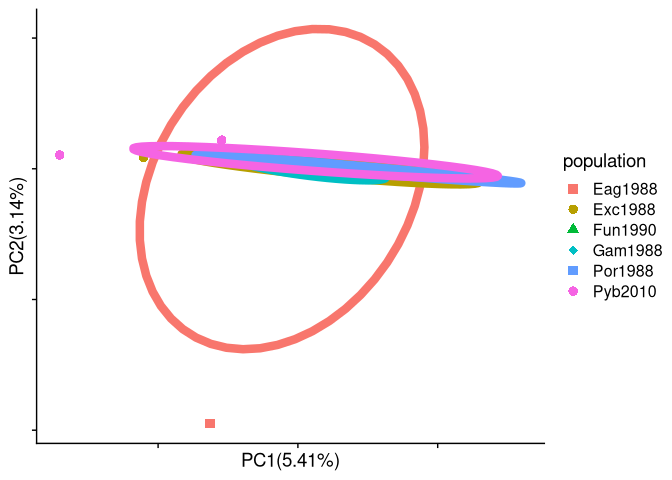
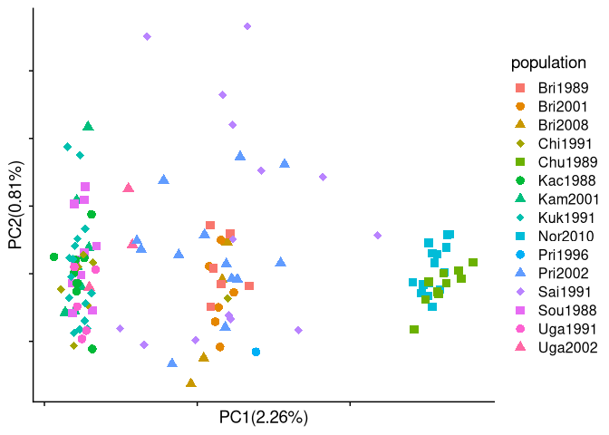
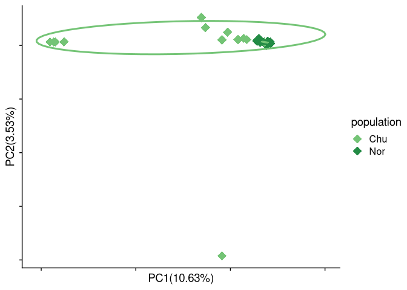
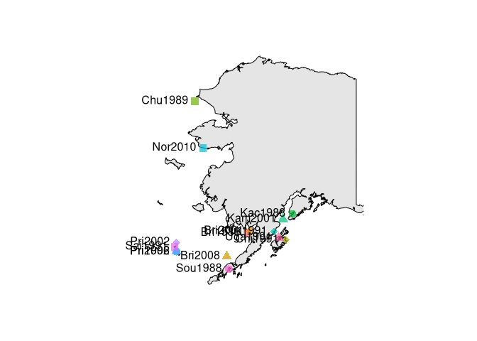

data analysis
================

#### load packages

``` r
library("tidyverse")
```

    ## ── Attaching core tidyverse packages ──────────────────────── tidyverse 2.0.0 ──
    ## ✔ dplyr     1.1.0     ✔ readr     2.1.4
    ## ✔ forcats   1.0.0     ✔ stringr   1.5.0
    ## ✔ ggplot2   3.4.1     ✔ tibble    3.1.8
    ## ✔ lubridate 1.9.2     ✔ tidyr     1.3.0
    ## ✔ purrr     1.0.1     
    ## ── Conflicts ────────────────────────────────────────── tidyverse_conflicts() ──
    ## ✖ dplyr::filter() masks stats::filter()
    ## ✖ dplyr::lag()    masks stats::lag()
    ## ℹ Use the ]8;;http://conflicted.r-lib.org/conflicted package]8;; to force all conflicts to become errors

``` r
library("ggplot2")
library("cowplot")
```

    ## 
    ## Attaching package: 'cowplot'
    ## 
    ## The following object is masked from 'package:lubridate':
    ## 
    ##     stamp

``` r
library("maps")
```

    ## 
    ## Attaching package: 'maps'
    ## 
    ## The following object is masked from 'package:purrr':
    ## 
    ##     map

``` r
library("mapdata")
library(RcppCNPy)
source("/fs/cbsubscb16/storage/sucker_sp2021/scripts/individual_pca_functions_csj.R")
sample_table <- read_tsv("/fs/cbsubscb16/storage/rkc/sample_lists/sample_table.tsv")
```

    ## Rows: 183 Columns: 9
    ## ── Column specification ────────────────────────────────────────────────────────
    ## Delimiter: "\t"
    ## chr (6): population, Loc, GeneralLoc, k3_inferred_pop, k4_inferred_pop, k5_i...
    ## dbl (3): ABLG, StartLatDD, StartLonDD
    ## 
    ## ℹ Use `spec()` to retrieve the full column specification for this data.
    ## ℹ Specify the column types or set `show_col_types = FALSE` to quiet this message.

# make sample table from rkc metadata

``` r
metadata <- read_csv("/fs/cbsubscb16/storage/rkc/sample_lists/rkc_whitelist_1x_metadata.csv")
```

    ## Rows: 183 Columns: 26
    ## ── Column specification ────────────────────────────────────────────────────────
    ## Delimiter: ","
    ## chr (10): AltID, CommonName, SpeciesName, CollectionDate, Locality, Loc, Gen...
    ## dbl (16): ABLG, notSEAK, StartLatDD, StartLonDD, k3_A, k3_B, k3_C, k4_A, k4_...
    ## 
    ## ℹ Use `spec()` to retrieve the full column specification for this data.
    ## ℹ Specify the column types or set `show_col_types = FALSE` to quiet this message.

``` r
sample_table_pribs <- metadata %>% 
  mutate(CollectionDate = parse_date(CollectionDate, format = "%m/%d/%Y")) %>% 
  mutate(year = as.character(format(CollectionDate, "%Y"))) %>% 
  mutate(month = as.character(format(CollectionDate, "%m"))) %>% 
  mutate(day = as.character(format(CollectionDate, "%d"))) %>%
  mutate(population = str_c(substr(Locality, 1, 3), year,sep="")) %>% 
  mutate(Loc = ifelse(str_detect(population, "Pri") | str_detect(population, "Sai"), "Pribilof_Is", Locality)) %>% select(ABLG, population, Loc, GeneralLoc, StartLatDD, StartLonDD, k3_inferred_pop, k4_inferred_pop, k5_inferred_pop)

#write_tsv(sample_table, "/fs/cbsubscb16/storage/rkc/sample_lists/sample_table.tsv")
```

## run pcangsd

``` bash
nohup bash /fs/cbsubscb16/storage/genomic-data-analysis/scripts/run_pcangsd.sh /fs/cbsubscb16/storage/rkc/ /fs/cbsubscb16/storage/rkc/angsd/PCAM-PPLA-wholegenome_polymorphic.beagle.gz 0.05 pca 1 8 > /fs/cbsubscb16/storage/rkc/nohups/run_pcangsd_pca.nohup &
```

## Plot all pop PCA

-   The following individuals are considered outliers: ABLG5617,
    ABLG5618, ABLG5637, ABLG5644, ABLG5648, ABLG5650, ABLG5651,
    ABLG5663, ABLG5667, ABLG5669, ABLG5670

Plot of every site to see if there are any strange outliers. Nothing
obvious here

``` r
alpha = 0.7
size = 2
All_pop_pca <- PCA(genome_cov, sample_table$ABLG, sample_table$Loc, 1, 2, show.ellipse = F, show.line = F, show.label = F, index_exclude=c(94, 95, 103, 106, 107, 109, 110, 118, 119, 120, 121))
```

<!-- -->

``` r
#ggsave("/fs/cbsubscb16/storage/rkc/figures/All_pop_pca.png", device = "png", height = 5, width = 7)
```

-   All regions group together with some putative geneflow/migration
    between Gulf of Alaska (Kodiak) and East Bering Sea (Bristol Bay and
    Pribilof islands)
-   this is consistent with previous studies using mtDNA and nuclear
    markers.

#### Subsample populations to even out sample sizes and run PCA

#### Run pcangsd

``` bash
# Run on cbsunt246
# PID 4134831
nohup bash /fs/cbsubscb16/storage/genomic-data-analysis/scripts/run_pcangsd.sh /fs/cbsubscb16/storage/rkc/ /fs/cbsubscb16/storage/rkc/angsd/subsamp_PCAM-PPLA-wholegenome_polymorphic.beagle.gz 0.05 pca 1 8 > /fs/cbsubscb16/storage/rkc/nohups/run_pcangsd_pca_subsamp.nohup &
```

#### Subsetted PCA

-   The PCA with equal sample sizes has the same grouping pattern as the
    full dataset therefore, unequal sample sizes are not affecting PCAs

``` r
PCA_continuous_var(genome_cov, sample_table$ABLG, sample_table$StartLatDD, 1, 2, "RKC_pca_latitude", show.ellipse = F, show.line = F, show.label = F)

RKC_PCA_lat_plot <- ggplot(data=RKC_pca_latitude,aes(x=PC1, y=PC2)) +
  geom_point(aes(color = population), size = 4, alpha = 0.5) +
  #geom_text(aes(label = individual), nudge_x = -0.1) +
  scale_color_viridis_c(name = "Latitude (DD)", begin = 1, end = 0, option = "plasma") +
  cowplot::theme_cowplot() +
    xlab(paste0("PC1 ", round(RKC_pca_latitude_x_var,2),"%")) +
    ylab(paste0("PC2 ",round(RKC_pca_latitude_y_var,2),"%"))
RKC_PCA_lat_plot
```

<!-- -->

PCA colored by latitude - conceptual plot of first steps for local
adaptation analysis - could use avg sea surface temp or salinity or
other environmental analysis - GxE analysis may also be appropriate
though I’m not sure if these analyses are developed for low coverage
data yet

## Fst peaks from Lauren


## Run pcangsd for southeast alaska

copy and past the above beagle index column list into the script below
to cut the correct columns

#### Run pcangsd

``` bash
# Run on cbsunt246
# PID 7765
nohup bash /fs/cbsubscb16/storage/genomic-data-analysis/scripts/run_pcangsd.sh /fs/cbsubscb16/storage/rkc/ /fs/cbsubscb16/storage/rkc/angsd/SEAK_PCAM-PPLA-wholegenome_polymorphic.beagle.gz 0.05 pca 1 8 > /fs/cbsubscb16/storage/rkc/nohups/run_pcangsd_pca_SEAK.nohup &
```

#### Plot SEAK PCA

``` r
## Read in data
genome_cov_SEAK <- npyLoad("/fs/cbsubscb16/storage/rkc/angsd/pcangsd_SEAK_PCAM-PPLA-wholegenome_polymorphic.cov.npy")

# Color by collection location and date
alpha = 0.5
size = 3
PCA(genome_cov_SEAK, sample_table_SEAK$ABLG, sample_table_SEAK$population, 1, 2, show.ellipse = F, show.line = F, show.label = F, index_exclude = c(23,24))
```

<!-- -->

``` r
# PCA_continuous_var(genome_cov_SEAK, sample_table_SEAK$ABLG, sample_table_SEAK$population, 1, 2, "SEAK_label_pca", show.ellipse = F, show.line = F, show.label = F, index_exclude = c(23,24))
# SEAK_label_pca_plot <- ggplot(SEAK_label_pca, aes(x=PC1,y=PC2)) +
#   geom_point(aes(color = population)) +
#   #eom_text(aes(label = individual)) +
#   cowplot::theme_cowplot() +
#     xlab(paste0("PC1 ", round(SEAK_label_pca_x_var,2),"%")) +
#     ylab(paste0("PC2 ",round(SEAK_label_pca_y_var,2),"%"))
# SEAK_label_pca_plot

#ggsave("/fs/cbsubscb16/storage/rkc/figures/SEAK_pop_pca.png", SEAK_pca, device = "png")
```

-   no obvious structure among southeast Alaska populations


## run pcangsd for Bering Sea

#### subset beagle file

#### run pcangsd

``` bash
# Run on cbsunt246
# PID 8094
nohup bash /fs/cbsubscb16/storage/genomic-data-analysis/scripts/run_pcangsd.sh /fs/cbsubscb16/storage/rkc/ /fs/cbsubscb16/storage/rkc/angsd/BSEA_GOA_PCAM-PPLA-wholegenome_polymorphic.beagle.gz 0.05 pca 1 8 > /fs/cbsubscb16/storage/rkc/nohups/run_pcangsd_pca_BSEA_GOA.nohup &
```

#### Plot BSEA PCA

``` r
## Read in data
library(RcppCNPy)
genome_cov_BSEA_GOA <- npyLoad("/fs/cbsubscb16/storage/rkc/angsd/pcangsd_BSEA_GOA_PCAM-PPLA-wholegenome_polymorphic.cov.npy")

# Color by collection location
alpha = 0.5
size = 3
BSEA_GOA_pop_pca <- PCA(genome_cov_BSEA_GOA, sample_table_BSEA_GOA$ABLG, sample_table_BSEA_GOA$population, 1, 2, show.ellipse = F, show.line = F, show.label = F, index_exclude=c(68, 69, 73, 74, 75))
```

<!-- -->

``` r
#ggsave("/fs/cbsubscb16/storage/rkc/figures/BSEA_pop_pca.png", BSEA_pop_pca, device = "png")
```

-   three obvious groups corresponding with North Bering, East Bering,
    and Gulf of Alaska regions.
-   Pribilofs are more dispersed than Bristol Bay populations. Will look
    into this pattern later.


## Run pcangsd for Aleutian Islands

#### subset beagle file

#### run pcangsd

``` bash
# Run on cbsunt246
# PID 3161905
nohup bash /fs/cbsubscb16/storage/genomic-data-analysis/scripts/run_pcangsd.sh /fs/cbsubscb16/storage/rkc/ /fs/cbsubscb16/storage/rkc/angsd/AI_PCAM-PPLA-wholegenome_polymorphic.beagle.gz 0.05 pca 1 8 > /fs/cbsubscb16/storage/rkc/nohups/run_pcangsd_pca_AI.nohup &
```

#### Plot PCA for Aleutian Islands

``` r
## Read in data
library(RcppCNPy)
genome_cov_AI <- npyLoad("/fs/cbsubscb16/storage/rkc/angsd/pcangsd_AI_PCAM-PPLA-wholegenome_polymorphic.cov.npy")

# Color by collection location
sample_table_AI <- sample_table_AI %>% 
  mutate(year = as.numeric(str_sub(population, 4,7)))

alpha = 0.5
size = 3
AI_pop_pca <- PCA(genome_cov_AI, sample_table_AI$ABLG, sample_table_AI$geo_population, 1, 2, show.ellipse = F, show.line = T, show.label = F)
```

    ## 
    ## Attaching package: 'MASS'

    ## The following object is masked from 'package:dplyr':
    ## 
    ##     select

<!-- -->

-   No obvious structure between Cold Bay and Adak populations

#### Colored by collections (location and sampling year)

``` r
# colored by collections (location and sampling year)
AI_pop_pca <- PCA(genome_cov_AI, sample_table_AI$ABLG, sample_table_AI$population, 1, 2, show.ellipse = F, show.line = T, show.label = F)
```

<!-- -->

-   some grouping between Adak 1988 and Adak 2015 collections. This
    could result from temporal evolution but more likely is an artifact
    of sample quality

## run pcangsd for North Bering

#### subset beagle file

#### run pcangsd

``` bash
# Run on cbsunt246
# PID 2786036
nohup bash /fs/cbsubscb16/storage/genomic-data-analysis/scripts/run_pcangsd.sh /fs/cbsubscb16/storage/rkc/ /fs/cbsubscb16/storage/rkc/angsd/NorthBering_PCAM-PPLA-wholegenome_polymorphic.beagle.gz 0.05 pca 1 8 > /fs/cbsubscb16/storage/rkc/nohups/run_pcangsd_pca_NorthBering.nohup &
```

#### Plot PCA for North Bering

``` r
## Read in data
library(RcppCNPy)
genome_cov_NorthBering <- npyLoad("/fs/cbsubscb16/storage/rkc/angsd/pcangsd_NorthBering_PCAM-PPLA-wholegenome_polymorphic.cov.npy")

# Color by collection location
sample_table_northbering <- sample_table_northbering %>% 
  mutate(year = as.numeric(str_sub(population, 4,7)))

alpha = 0.5
size = 3
NorthBering_pop_pca <- PCA(genome_cov_NorthBering, sample_table_northbering$ABLG, sample_table_northbering$geo_population, 1, 2, show.ellipse = F, show.line = T, show.label = F)
```

<!-- -->

-   Perhaps some difference between Chukchi and Norton Sound
    populations.

## run pcangsd for Gulf of Alaska

#### run pcangsd

``` bash
# Run on cbsunt246
# PID 3158619
nohup bash /fs/cbsubscb16/storage/genomic-data-analysis/scripts/run_pcangsd.sh /fs/cbsubscb16/storage/rkc/ /fs/cbsubscb16/storage/rkc/angsd/GOA_PCAM-PPLA-wholegenome_polymorphic.beagle.gz 0.05 pca 1 8 > /fs/cbsubscb16/storage/rkc/nohups/run_pcangsd_pca_GOA.nohup &
```

#### Plot PCA for GOA

``` r
## Read in data
library(RcppCNPy)
genome_cov_GOA <- npyLoad("/fs/cbsubscb16/storage/rkc/angsd/pcangsd_GOA_PCAM-PPLA-wholegenome_polymorphic.cov.npy")

# Color by collection location
sample_table_GOA <- sample_table_GOA %>%
  mutate(year = as.numeric(str_sub(population, 4,7)))

alpha = 0.5
size = 2
GOA_pop_pca <- PCA(genome_cov_GOA, sample_table_GOA$ABLG, sample_table_GOA$geo_population, 1, 2, show.ellipse = T, show.line = F, show.label = T)
```

    ## Warning in cov.trob(cbind(data$x, data$y)): Probable convergence failure

    ## Warning in cov.trob(cbind(data$x, data$y)): Probable convergence failure

    ## Warning in cov.trob(cbind(data$x, data$y)): Probable convergence failure

    ## Warning in cov.trob(df): Probable convergence failure

    ## Warning in cov.trob(df): Probable convergence failure

    ## Warning in cov.trob(df): Probable convergence failure

<!-- -->

-   no genetic differences between Gulf of Alaska populations

## run pcangsd for Bristol Bay

#### subset beagle file

#### run pcangsd

``` bash
# Run on cbsunt246
# PID 2723881
nohup bash /fs/cbsubscb16/storage/genomic-data-analysis/scripts/run_pcangsd.sh /fs/cbsubscb16/storage/rkc/ /fs/cbsubscb16/storage/rkc/angsd/EastBering_PCAM-PPLA-wholegenome_polymorphic.beagle.gz 0.05 pca 1 8 > /fs/cbsubscb16/storage/rkc/nohups/run_pcangsd_pca_EastBering.nohup &
```

#### Plot EastBering PCA

``` r
## Read in data
library(RcppCNPy)
genome_cov_EastBering <- npyLoad("/fs/cbsubscb16/storage/rkc/angsd/pcangsd_EastBering_PCAM-PPLA-wholegenome_polymorphic.cov.npy")

# Color by collection location
sample_table_eastbering_prib <- sample_table_eastbering %>% 
  mutate(Loc = ifelse(str_detect(population, "Pri") | str_detect(population, "Sai"), "Pribilof_Is", Loc)) %>% 
  mutate(year = as.numeric(str_sub(population, 4,7)))

alpha = 0.5
size = 2
EastBering_pop_pca <- PCA(genome_cov_EastBering, sample_table_eastbering_prib$ABLG, sample_table_eastbering_prib$Loc, 1, 2, show.ellipse = T, show.line = F, show.label = T)
```

<!-- -->

``` r
#ggsave("/fs/cbsubscb16/storage/rkc/figures/BSEA_pop_pca.png", BSEA_pop_pca, device = "png")
```

-   definite genetic differences between Pribilof Island and Bristol Bay
    populations.

#### Map collection sites

## Admixture

#### combine data

``` r
metadata_admx <- read_csv("/fs/cbsubscb16/storage/rkc/sample_lists/rkc_whitelist_1x_metadata.csv") %>% 
  mutate(CollectionDate = parse_date(CollectionDate, format = "%m/%d/%Y")) %>% 
  mutate(year = as.character(format(CollectionDate, "%Y"))) %>% 
  mutate(month = as.character(format(CollectionDate, "%m"))) %>% 
  mutate(day = as.character(format(CollectionDate, "%d"))) %>%
  mutate(population = str_c(substr(Locality, 1, 3), year,sep="")) %>% 
  dplyr::select(ABLG,k3_A,k3_B,k3_C,k4_A,k4_B,k4_C,k4_D,k5_A,k5_B,k5_C,k5_D,k5_E) %>% 
  right_join(sample_table)
```

    ## Rows: 183 Columns: 26
    ## ── Column specification ────────────────────────────────────────────────────────
    ## Delimiter: ","
    ## chr (10): AltID, CommonName, SpeciesName, CollectionDate, Locality, Loc, Gen...
    ## dbl (16): ABLG, notSEAK, StartLatDD, StartLonDD, k3_A, k3_B, k3_C, k4_A, k4_...
    ## 
    ## ℹ Use `spec()` to retrieve the full column specification for this data.
    ## ℹ Specify the column types or set `show_col_types = FALSE` to quiet this message.
    ## Joining with `by = join_by(ABLG)`

#### Admixture k=3

ABLG5617, ABLG5618, ABLG5637, ABLG5644, ABLG5648, ABLG5650, ABLG5651,
ABLG5663, ABLG5667, ABLG5669, ABLG5670

``` r
metadata_admx_k3 <- metadata_admx %>% filter(ABLG != 5617, ABLG != 5618, ABLG != 5637, ABLG != 5644, ABLG != 5648, ABLG != 5650, ABLG != 5651, ABLG != 5663, ABLG != 5667, ABLG != 5669, ABLG != 5670) %>% dplyr::select(ABLG,Loc,k3_A,k3_B,k3_C) %>% 
  gather(population,proportion,k3_A:k3_C,factor_key = T) %>% 
  arrange(Loc) 
metadata_admx_k3$ABLG <- as.character(metadata_admx_k3$ABLG)
metadata_admx_k3$ABLG <- factor(metadata_admx_k3$ABLG, levels = unique(metadata_admx_k3$ABLG))
ggplot(data = metadata_admx_k3, aes(x=factor(ABLG),y=proportion,fill=factor(population))) + 
  geom_bar(stat="identity",position="stack") +  
  theme(axis.text.x = element_text(angle = 90))
```

<!-- -->

``` r
#ggsave("/fs/cbsubscb16/storage/rkc/figures/admix_k3.png", height = 5, width = 20, device = "png")
```

#### Admixture k=4

``` r
metadata_admx_k4 <- metadata_admx %>% filter(ABLG != 5617, ABLG != 5618, ABLG != 5637, ABLG != 5644, ABLG != 5648, ABLG != 5650, ABLG != 5651, ABLG != 5663, ABLG != 5667, ABLG != 5669, ABLG != 5670) %>% dplyr::select(ABLG,Loc,k4_A,k4_B,k4_C,k4_D) %>% 
  gather(population,proportion,k4_A:k4_D,factor_key = T) %>% 
  arrange(Loc) 
metadata_admx_k4$ABLG <- as.character(metadata_admx_k4$ABLG)
metadata_admx_k4$ABLG <- factor(metadata_admx_k4$ABLG, levels = unique(metadata_admx_k4$ABLG))

ggplot(data = metadata_admx_k4, aes(x=factor(ABLG),y=proportion,fill=factor(population))) + 
  geom_bar(stat="identity",position="stack") +  
  theme(axis.text.x = element_text(angle = 90))
```

<!-- -->

``` r
#ggsave("/fs/cbsubscb16/storage/rkc/figures/admix_k4.png", height = 5, width = 20, device = "png")
```

#### Admixture k=5

``` r
metadata_admx_k5 <- metadata_admx %>% filter(ABLG != 5617, ABLG != 5618, ABLG != 5637, ABLG != 5644, ABLG != 5648, ABLG != 5650, ABLG != 5651, ABLG != 5663, ABLG != 5667, ABLG != 5669, ABLG != 5670) %>%  dplyr::select(ABLG,Loc,k5_A,k5_B,k5_C,k5_D,k5_E) %>% 
  gather(population,proportion,k5_A:k5_E,factor_key = T) %>% 
  arrange(Loc) 
metadata_admx_k5$ABLG <- as.character(metadata_admx_k5$ABLG)
metadata_admx_k5$ABLG <- factor(metadata_admx_k5$ABLG, levels = unique(metadata_admx_k5$ABLG))

ggplot(data = metadata_admx_k5, aes(x=factor(ABLG),y=proportion,fill=factor(population))) + 
  geom_bar(stat="identity",position="stack") +  
  theme(axis.text.x = element_text(angle = 90)) 
```

<!-- -->

``` r
#ggsave("/fs/cbsubscb16/storage/rkc/figures/admix_k5.png", height = 5, width = 20, device = "png")
```
