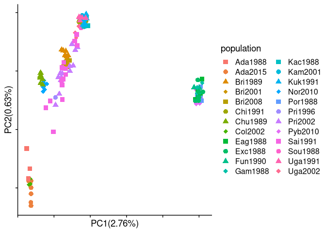
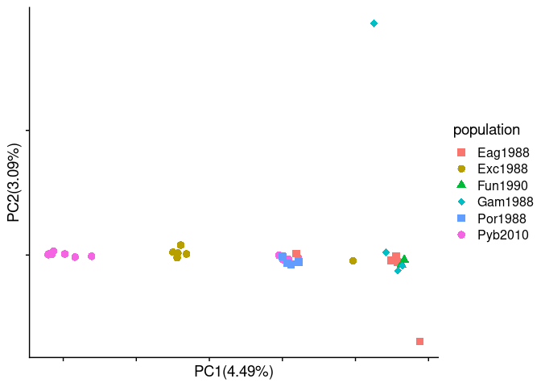

data analysis
================

#### load packages

``` r
library("tidyverse")
```

    ## ── Attaching packages ─────────────────────────────────────── tidyverse 1.3.1 ──

    ## ✓ ggplot2 3.3.3     ✓ purrr   0.3.4
    ## ✓ tibble  3.1.2     ✓ dplyr   1.0.6
    ## ✓ tidyr   1.1.3     ✓ stringr 1.4.0
    ## ✓ readr   1.4.0     ✓ forcats 0.5.1

    ## ── Conflicts ────────────────────────────────────────── tidyverse_conflicts() ──
    ## x dplyr::filter() masks stats::filter()
    ## x dplyr::lag()    masks stats::lag()

``` r
library("ggplot2")
library("cowplot")
source("/fs/cbsubscb16/storage/sucker_sp2021/scripts/individual_pca_functions_csj.R")
```

# make sample table from rkc metadata

``` r
metadata <- read_csv("/fs/cbsubscb16/storage/rkc/sample_lists/rkc_whitelist_1x_metadata.csv")
```

    ## 
    ## ── Column specification ────────────────────────────────────────────────────────
    ## cols(
    ##   .default = col_double(),
    ##   AltID = col_character(),
    ##   CommonName = col_character(),
    ##   SpeciesName = col_character(),
    ##   CollectionDate = col_character(),
    ##   Locality = col_character(),
    ##   Loc = col_character(),
    ##   GeneralLoc = col_character(),
    ##   k3_inferred_pop = col_character(),
    ##   k4_inferred_pop = col_character(),
    ##   k5_inferred_pop = col_character()
    ## )
    ## ℹ Use `spec()` for the full column specifications.

``` r
sample_table <- metadata %>% 
  mutate(CollectionDate = parse_date(CollectionDate, format = "%m/%d/%Y")) %>% 
   mutate(year = as.character(format(CollectionDate, "%Y"))) %>% 
  mutate(month = as.character(format(CollectionDate, "%m"))) %>% 
  mutate(day = as.character(format(CollectionDate, "%d"))) %>%
  mutate(population = str_c(substr(Locality, 1, 3), year,sep="")) %>% 
  select(ABLG, population, Loc, GeneralLoc, StartLatDD, StartLonDD, k3_inferred_pop, k4_inferred_pop, k5_inferred_pop)

write_tsv(sample_table, "/fs/cbsubscb16/storage/rkc/sample_lists/sample_table.tsv")
```

## run pcangsd

``` bash
nohup bash /fs/cbsubscb16/storage/genomic-data-analysis/scripts/run_pcangsd.sh /fs/cbsubscb16/storage/rkc/ /fs/cbsubscb16/storage/rkc/angsd/PCAM-PPLA-wholegenome_polymorphic.beagle.gz 0.05 pca 1 8 > /fs/cbsubscb16/storage/rkc/nohups/run_pcangsd_pca.nohup &
```

## Plot all pop PCA

``` r
## Read in data
library(RcppCNPy)
genome_cov <- npyLoad("/fs/cbsubscb16/storage/rkc/angsd/pcangsd_PCAM-PPLA-wholegenome_polymorphic.cov.npy")

# Color by collection location and date
alpha = 0.7
size = 3
All_pop_pca <- PCA(genome_cov, sample_table$ABLG, sample_table$population, 1, 2, show.ellipse = F, show.line = F, show.label = F, index_exclude=c(94, 95, 103, 106, 107, 109, 110, 118, 119, 120, 121))
```

<!-- -->

``` r
alpha = 0.7
size = 3
All_pop_pca <- PCA(genome_cov, sample_table$ABLG, sample_table$Loc, 1, 2, show.ellipse = F, show.line = F, show.label = F, index_exclude=c(94, 95, 103, 106, 107, 109, 110, 118, 119, 120, 121))
```

<!-- -->

``` r
alpha = 0.7
size = 3
All_pop_pca <- PCA(genome_cov, sample_table$ABLG, sample_table$GeneralLoc, 1, 2, show.ellipse = F, show.line = F, show.label = F, index_exclude=c(94, 95, 103, 106, 107, 109, 110, 118, 119, 120, 121))
```

<!-- -->

``` r
PCA_continuous_var(genome_cov, sample_table$ABLG, sample_table$StartLatDD, 1, 2, "RKC_pca_latitude", show.ellipse = F, show.line = F, show.label = F)

RKC_PCA_lat_plot <- ggplot(data=RKC_pca_latitude,aes(x=PC1, y=PC2)) +
  geom_point(aes(color = population), size = 4, alpha = 0.5) +
  #geom_text(aes(label = individual), nudge_x = -0.1) +
  scale_color_viridis_c(name = "Latitude (DD)", begin = 1, end = 0, option = "plasma") +
  cowplot::theme_cowplot() +
    xlab(paste0("PC1 ", round(RKC_pca_latitude_x_var,2),"%")) +
    ylab(paste0("PC2 ",round(RKC_pca_latitude_y_var,2),"%"))
RKC_PCA_lat_plot
```

<!-- -->

## Run pcangsd for southeast alaska

``` r
sample_table_SEAK <- sample_table %>% 
  mutate(beagle_index = 1 + (3*(seq(1,183) +1))) %>% # converts individual ids to their index column names in beagle
  filter(Loc == "SEAK") %>% 
  filter(ABLG != 5650, ABLG != 5651)

SEAK_beagle_index <- sample_table_SEAK %>% 
  dplyr::select(beagle_index) %>% 
  mutate(beagle_index = str_c(beagle_index, beagle_index+1,beagle_index+2, sep = ",")) # add subsequent 2 beagle column indices to make three total

str_c(SEAK_beagle_index$beagle_index, collapse = ",")
```

    ## [1] "184,185,186,187,188,189,190,191,192,193,194,195,196,197,198,199,200,201,202,203,204,205,206,207,208,209,210,211,212,213,214,215,216,247,248,249,250,251,252,253,254,255,256,257,258,259,260,261,295,296,297,298,299,300,301,302,303,304,305,306,307,308,309,328,329,330,337,338,339,340,341,342,343,344,345,346,347,348,349,350,351,409,410,411,412,413,414,415,416,417,418,419,420,421,422,423,424,425,426"

copy and past the above beagle index column list into the script below
to cut the correct columns

``` bash
nohup zcat /fs/cbsubscb16/storage/rkc/angsd/PCAM-PPLA-wholegenome_polymorphic.beagle.gz | cut -f 184,185,186,187,188,189,190,191,192,193,194,195,196,197,198,199,200,201,202,203,204,205,206,207,208,209,210,211,212,213,214,215,216,247,248,249,250,251,252,253,254,255,256,257,258,259,260,261,295,296,297,298,299,300,301,302,303,304,305,306,307,308,309,328,329,330,331,332,333,334,335,336,337,338,339,340,341,342,343,344,345,346,347,348,349,350,351,409,410,411,412,413,414,415,416,417,418,419,420,421,422,423,424,425,426 --complement |  gzip > /fs/cbsubscb16/storage/rkc/angsd/SEAK_PCAM-PPLA-wholegenome_polymorphic.beagle.gz &
```

#### Run pcangsd

``` bash
# Run on cbsunt246
# PID 14980
nohup bash /fs/cbsubscb16/storage/genomic-data-analysis/scripts/run_pcangsd.sh /fs/cbsubscb16/storage/rkc/ /fs/cbsubscb16/storage/rkc/angsd/SEAK_PCAM-PPLA-wholegenome_polymorphic.beagle.gz 0.05 pca 1 8 > /fs/cbsubscb16/storage/rkc/nohups/run_pcangsd_pca_SEAK.nohup &
```

#### Plot SEAK PCA

``` r
## Read in data
genome_cov_SEAK <- npyLoad("/fs/cbsubscb16/storage/rkc/angsd/pcangsd_SEAK_PCAM-PPLA-wholegenome_polymorphic.cov.npy")

# Color by collection location and date
alpha = 0.5
size = 3
All_pop_pca <- PCA(genome_cov_SEAK, sample_table_SEAK$ABLG, sample_table_SEAK$population, 1, 2, show.ellipse = F, show.line = F, show.label = F, index_exclude=c(94, 95, 103, 106, 107, 109, 110, 118, 119, 120, 121))
```

<!-- -->

## run pcangsd for Bering Sea

``` r
sample_table_BSEA <- sample_table %>% 
  mutate(beagle_index = 1 + (3*(seq(1,183) +1))) %>% # converts individual ids to their index column names in beagle
  filter(GeneralLoc == "Bering Sea") %>% 
  filter(ABLG != 5617, ABLG !=5618, ABLG !=5637, ABLG !=5644, ABLG !=5648, ABLG !=5650, ABLG !=5651, ABLG !=5663, ABLG !=5667, ABLG !=5669, ABLG !=5670)

BSEA_beagle_index <- sample_table_BSEA %>% 
  dplyr::select(beagle_index) %>% 
  mutate(beagle_index = str_c(beagle_index, beagle_index+1,beagle_index+2, sep = ",")) # add subsequent 2 beagle column indices to make three total

str_c(BSEA_beagle_index$beagle_index, collapse = ",")
```

    ## [1] "28,29,30,31,32,33,34,35,36,37,38,39,40,41,42,43,44,45,46,47,48,49,50,51,52,53,54,55,56,57,91,92,93,94,95,96,97,98,99,100,101,102,103,104,105,106,107,108,109,110,111,112,113,114,115,116,117,118,119,120,121,122,123,124,125,126,127,128,129,130,131,132,133,134,135,136,137,138,139,140,141,142,143,144,145,146,147,148,149,150,151,152,153,154,155,156,157,158,159,160,161,162,163,164,165,166,167,168,169,170,171,172,173,174,352,353,354,355,356,357,370,371,372,373,374,375,376,377,378,379,380,381,382,383,384,385,386,387,388,389,390,391,392,393,394,395,396,397,398,399,400,401,402,403,404,405,406,407,408,508,509,510,511,512,513,514,515,516,517,518,519,520,521,522,523,524,525,526,527,528,529,530,531,532,533,534,535,536,537,538,539,540,541,542,543,544,545,546,547,548,549,550,551,552,553,554,555"

#### subset beagle file

``` bash
nohup zcat /fs/cbsubscb16/storage/rkc/angsd/PCAM-PPLA-wholegenome_polymorphic.beagle.gz | cut -f 28,29,30,31,32,33,34,35,36,37,38,39,40,41,42,43,44,45,46,47,48,49,50,51,52,53,54,55,56,57,91,92,93,94,95,96,97,98,99,100,101,102,103,104,105,106,107,108,109,110,111,112,113,114,115,116,117,118,119,120,121,122,123,124,125,126,127,128,129,130,131,132,133,134,135,136,137,138,139,140,141,142,143,144,145,146,147,148,149,150,151,152,153,154,155,156,157,158,159,160,161,162,163,164,165,166,167,168,169,170,171,172,173,174,352,353,354,355,356,357,370,371,372,373,374,375,376,377,378,379,380,381,382,383,384,385,386,387,388,389,390,391,392,393,394,395,396,397,398,399,400,401,402,403,404,405,406,407,408,508,509,510,511,512,513,514,515,516,517,518,519,520,521,522,523,524,525,526,527,528,529,530,531,532,533,534,535,536,537,538,539,540,541,542,543,544,545,546,547,548,549,550,551,552,553,554,555 --complement |  gzip > /fs/cbsubscb16/storage/rkc/angsd/BSEA_PCAM-PPLA-wholegenome_polymorphic.beagle.gz &
```

#### run pcangsd

``` bash
# Run on cbsunt246
# PID 
nohup bash /fs/cbsubscb16/storage/genomic-data-analysis/scripts/run_pcangsd.sh /fs/cbsubscb16/storage/rkc/ /fs/cbsubscb16/storage/rkc/angsd/BSEA_PCAM-PPLA-wholegenome_polymorphic.beagle.gz 0.05 pca 1 8 > /fs/cbsubscb16/storage/rkc/nohups/run_pcangsd_pca_BSEA.nohup &
```
