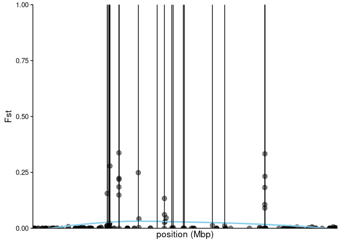

Diversity genome scan
================

## load necessary libraries

``` r
library(tidyverse)
```

    ## ── Attaching core tidyverse packages ──────────────────────── tidyverse 2.0.0 ──
    ## ✔ dplyr     1.1.0     ✔ readr     2.1.4
    ## ✔ forcats   1.0.0     ✔ stringr   1.5.0
    ## ✔ ggplot2   3.4.1     ✔ tibble    3.1.8
    ## ✔ lubridate 1.9.2     ✔ tidyr     1.3.0
    ## ✔ purrr     1.0.1     
    ## ── Conflicts ────────────────────────────────────────── tidyverse_conflicts() ──
    ## ✖ dplyr::filter() masks stats::filter()
    ## ✖ dplyr::lag()    masks stats::lag()
    ## ℹ Use the ]8;;http://conflicted.r-lib.org/conflicted package]8;; to force all conflicts to become errors

``` r
library(cowplot)
```

    ## 
    ## Attaching package: 'cowplot'
    ## 
    ## The following object is masked from 'package:lubridate':
    ## 
    ##     stamp

## Define plotting functions

``` r
get_cum_pos <- function(x){
  x_new <- group_by(x, lgN) %>%
    # Compute lg size
    summarise(lg_length=max(pos)) %>%
    # Calculate cumulative position of each chromosome
    mutate(tot=cumsum(lg_length)-lg_length) %>%
    # Add this info to the initial dataset
    left_join(x, ., by=c("lgN")) %>%
    # Add a cumulative position of each SNP
    arrange(lgN, pos) %>%
    group_by(lgN) %>%
    mutate(pos_cum=pos+tot)
  return(x_new)
}

plot_stat_per_snp <- function(x){
  ggplot(x, aes(x=pos, y=untrans_pairwise)) +
    geom_point(color = "black", size=size, alpha=0.5) +
    scale_color_manual(values = c("black","red")) +
    geom_smooth(color='skyblue', se=F) +
    geom_vline(xintercept = c(10744898, 10745093, 10747909, 10749198, 10749404, 10749513, 10749636, 10749663, 10750169, 10767542, 10767560, 10767619, 10767683, 10767684, 10805120, 10841536, 10855605, 10869842, 10872551, 10892267, 10894263, 10948534, 10972255, 11049895, 11050165, 11050174)) +
    scale_x_continuous(breaks=seq(0, 50, 5)) +
    scale_x_continuous(breaks=seq(0, 50, 5)) +
    coord_cartesian(ylim=c(0, 1), expand = F) +
    xlab('position (Mbp)') +
    ylab('Nucleotide Diversity') +
    #facet_grid(.~lgN, scales='free_x', space='free_x') +
    cowplot::theme_cowplot() +
    theme(panel.spacing = unit(0.1, 'lines'),
          axis.title.x=element_text(),
          legend.position='none',
          axis.ticks.x = element_blank(),
          axis.text.x = element_blank(),
          text = element_text(size=13),
          axis.text = element_text(size=10))
}

plot_stat_per_snp_test <- function(x){
  ggplot(x, aes(x=pos, y=correct_fst)) +
    geom_point(color = "black", size=size, alpha=0.5) +
    scale_color_manual(values = c("black","red")) +
    geom_smooth(color='skyblue', se=F) +
    geom_vline(xintercept = c(10744898, 10745093, 10747909, 10749198, 10749404, 10749513, 10749636, 10749663, 10750169, 10767542, 10767560, 10767619, 10767683, 10767684, 10805120, 10841536, 10855605, 10869842, 10872551, 10892267, 10894263, 10948534, 10972255, 11049895, 11050165, 11050174)) +
    scale_x_continuous(breaks=seq(0, 50, 5)) +
    coord_cartesian(ylim=c(0, 1), expand = F) +
    xlab('position (Mbp)') +
    ylab('Fst') +
    #facet_grid(.~lgN, scales='free_x', space='free_x') +
    cowplot::theme_cowplot() +
    theme(panel.spacing = unit(0.1, 'lines'),
          axis.title.x=element_text(),
          legend.position='none',
          axis.text.x = element_blank(),
          text = element_text(size=13),
          axis.text = element_text(size=10))
}
```

## Read in data

``` r
chr100_div <- read_tsv("/fs/cbsubscb16/storage/rkc/angsd/diversity/PCAM-PPLA_CM023352.1_GOA_polymorphic_folded_wgph.thetas.txt") %>% rename(lgN = '#Chromo', pos = Pos) %>% mutate(untrans_pairwise = exp(Pairwise)) %>% filter(pos > 10600000, pos < 11200000)
```

    ## Rows: 91277 Columns: 7
    ## ── Column specification ────────────────────────────────────────────────────────
    ## Delimiter: "\t"
    ## chr (1): #Chromo
    ## dbl (6): Pos, Watterson, Pairwise, thetaSingleton, thetaH, thetaL
    ## 
    ## ℹ Use `spec()` to retrieve the full column specification for this data.
    ## ℹ Specify the column types or set `show_col_types = FALSE` to quiet this message.

``` r
size = 3

chr100_div_plot <- get_cum_pos(chr100_div) %>% 
  plot_stat_per_snp()
```

    ## Scale for x is already present.
    ## Adding another scale for x, which will replace the existing scale.

``` r
chr100_div_plot
```

    ## `geom_smooth()` using method = 'loess' and formula = 'y ~ x'

<!-- -->

``` r
#ggsave("/fs/cbsubscb16/storage/rkc/figures/GOA_chr100_wgph_div.png", device = "png", width = 7, height = 3)
```

#### Plot fst scan for reference

EastBering-GOA

``` r
chr100_fst_EastBering_GOA <- read_tsv("/fs/cbsubscb16/storage/rkc/angsd/fst/EBS-GOA_wgph.fst.txt") %>%
  filter(chr == 100, pos > 10600000, pos < 11200000) %>% rename(lgN = chr) #%>% mutate(correct_fst = ifelse(fst < 0, 0, fst)) %>% select(lgN, pos, correct_fst)
```

    ## Rows: 3821135 Columns: 3
    ## ── Column specification ────────────────────────────────────────────────────────
    ## Delimiter: "\t"
    ## dbl (3): chr, pos, correct_fst
    ## 
    ## ℹ Use `spec()` to retrieve the full column specification for this data.
    ## ℹ Specify the column types or set `show_col_types = FALSE` to quiet this message.

``` r
chr100_fst_EastBering_GOA %>% arrange(desc(correct_fst))
```

    ## # A tibble: 248 × 3
    ##      lgN      pos correct_fst
    ##    <dbl>    <dbl>       <dbl>
    ##  1   100 10767619       0.337
    ##  2   100 11050165       0.333
    ##  3   100 10750169       0.279
    ##  4   100 10805120       0.249
    ##  5   100 11050174       0.232
    ##  6   100 10767684       0.224
    ##  7   100 10767683       0.218
    ##  8   100 10767560       0.185
    ##  9   100 11049895       0.182
    ## 10   100 10744898       0.156
    ## # … with 238 more rows

``` r
chr100_fst_plot <- get_cum_pos(chr100_fst_EastBering_GOA) %>% plot_stat_per_snp_test()
chr100_fst_plot
```

    ## `geom_smooth()` using method = 'loess' and formula = 'y ~ x'

<!-- -->

``` r
ggsave("/fs/cbsubscb16/storage/rkc/figures/GOA-EastBering_wgph_chr100_fst.png", device = "png", height = 3, width = 7)
```

    ## `geom_smooth()` using method = 'loess' and formula = 'y ~ x'

AI-GOA

``` r
chr100_fst_AI_GOA <- read_tsv("/fs/cbsubscb16/storage/rkc/angsd/fst/AI-GOA_wgph.fst.txt") %>%
  filter(chr == 100, pos > 10600000, pos < 11200000) %>% rename(lgN = chr) #%>% mutate(correct_fst = ifelse(fst < 0, 0, fst)) %>% select(lgN, pos, correct_fst)
```

    ## Rows: 2588645 Columns: 3
    ## ── Column specification ────────────────────────────────────────────────────────
    ## Delimiter: "\t"
    ## dbl (3): chr, pos, correct_fst
    ## 
    ## ℹ Use `spec()` to retrieve the full column specification for this data.
    ## ℹ Specify the column types or set `show_col_types = FALSE` to quiet this message.

``` r
chr100_fst_AI_GOA %>% arrange(desc(correct_fst))
```

    ## # A tibble: 143 × 3
    ##      lgN      pos correct_fst
    ##    <dbl>    <dbl>       <dbl>
    ##  1   100 11050165       0.679
    ##  2   100 10744898       0.612
    ##  3   100 10767542       0.561
    ##  4   100 10972255       0.545
    ##  5   100 10745093       0.540
    ##  6   100 10948534       0.528
    ##  7   100 10767619       0.489
    ##  8   100 10872551       0.441
    ##  9   100 10855605       0.293
    ## 10   100 10841536       0.240
    ## # … with 133 more rows

``` r
chr100_fst_plot <- get_cum_pos(chr100_fst_AI_GOA) %>% plot_stat_per_snp_test()
chr100_fst_plot
```

    ## `geom_smooth()` using method = 'loess' and formula = 'y ~ x'

<!-- -->

``` r
ggsave("/fs/cbsubscb16/storage/rkc/figures/AI-GOA_chr100_wgph_fst.png", device = "png", height = 3, width = 7)
```

    ## `geom_smooth()` using method = 'loess' and formula = 'y ~ x'

GOA-NorthBering

``` r
chr100_fst_NorthBering_GOA <- read_tsv("/fs/cbsubscb16/storage/rkc/angsd/fst/GOA-NBS_wgph.fst.txt") %>%
  filter(chr == 100, pos > 10600000, pos < 11200000) %>% rename(lgN = chr) #%>% mutate(correct_fst = ifelse(fst < 0, 0, fst)) %>% select(lgN, pos, correct_fst)
```

    ## Rows: 2671701 Columns: 3
    ## ── Column specification ────────────────────────────────────────────────────────
    ## Delimiter: "\t"
    ## dbl (3): chr, pos, correct_fst
    ## 
    ## ℹ Use `spec()` to retrieve the full column specification for this data.
    ## ℹ Specify the column types or set `show_col_types = FALSE` to quiet this message.

``` r
chr100_fst_NorthBering_GOA %>% arrange(desc(correct_fst))
```

    ## # A tibble: 145 × 3
    ##      lgN      pos correct_fst
    ##    <dbl>    <dbl>       <dbl>
    ##  1   100 10749404       0.572
    ##  2   100 11050165       0.571
    ##  3   100 10747909       0.567
    ##  4   100 10869842       0.561
    ##  5   100 10894263       0.561
    ##  6   100 10749198       0.554
    ##  7   100 10749513       0.553
    ##  8   100 10749663       0.499
    ##  9   100 10872551       0.492
    ## 10   100 10749636       0.487
    ## # … with 135 more rows

``` r
chr100_fst_plot <- get_cum_pos(chr100_fst_NorthBering_GOA) %>% plot_stat_per_snp_test()
chr100_fst_plot
```

    ## `geom_smooth()` using method = 'loess' and formula = 'y ~ x'

<!-- -->

``` r
ggsave("/fs/cbsubscb16/storage/rkc/figures/GOA-NorthBering_chr100_wgph_fst.png", device = "png", height = 3, width = 7)
```

    ## `geom_smooth()` using method = 'loess' and formula = 'y ~ x'

GOA-SEAK

``` r
chr100_fst_SEAK_GOA <- read_tsv("/fs/cbsubscb16/storage/rkc/angsd/fst/GOA-SEAK_wgph.fst.txt") %>%
  filter(chr == 100, pos > 10600000, pos < 11200000) %>% rename(lgN = chr) #%>% mutate(correct_fst = ifelse(fst < 0, 0, fst)) %>% select(lgN, pos, correct_fst)
```

    ## Rows: 3483616 Columns: 3
    ## ── Column specification ────────────────────────────────────────────────────────
    ## Delimiter: "\t"
    ## dbl (3): chr, pos, correct_fst
    ## 
    ## ℹ Use `spec()` to retrieve the full column specification for this data.
    ## ℹ Specify the column types or set `show_col_types = FALSE` to quiet this message.

``` r
chr100_fst_SEAK_GOA %>% arrange(desc(correct_fst))
```

    ## # A tibble: 196 × 3
    ##      lgN      pos correct_fst
    ##    <dbl>    <dbl>       <dbl>
    ##  1   100 10749513       0.780
    ##  2   100 10892267       0.735
    ##  3   100 11050165       0.664
    ##  4   100 10767560       0.660
    ##  5   100 10805120       0.660
    ##  6   100 11050174       0.651
    ##  7   100 10872551       0.649
    ##  8   100 11049895       0.444
    ##  9   100 10894263       0.414
    ## 10   100 10869842       0.319
    ## # … with 186 more rows

``` r
chr100_fst_plot <- get_cum_pos(chr100_fst_SEAK_GOA) %>% plot_stat_per_snp_test()
chr100_fst_plot
```

    ## `geom_smooth()` using method = 'loess' and formula = 'y ~ x'

<!-- -->

``` r
ggsave("/fs/cbsubscb16/storage/rkc/figures/GOA-SEAK_chr100_wgph_fst.png", device = "png", height = 3, width = 7)
```

    ## `geom_smooth()` using method = 'loess' and formula = 'y ~ x'

## Shared loci in top candidate regions across all comparisons

``` r
list <- c(chr100_fst_AI_GOA,chr100_fst_NorthBering_GOA,chr100_fst_SEAK_GOA)
cand_loci <- rbind(arrange(chr100_fst_AI_GOA, desc(correct_fst))[1:10,],arrange(chr100_fst_EastBering_GOA, desc(correct_fst))[1:10,], arrange(chr100_fst_NorthBering_GOA, desc(correct_fst))[1:10,], arrange(chr100_fst_SEAK_GOA, desc(correct_fst))[1:10,]) %>% group_by(pos) %>% slice(1) %>% select(pos)

#write.table(cand_loci, "/fs/cbsubscb16/storage/rkc/sample_lists/fst_cand_loci.txt")
```

## Calculate tajimas d from the GOA thetas.idx file

``` bash
## window size 5000 and step size 5000
nohup /programs/angsd-0.940/misc/thetaStat do_stat angsd/diversity/PCAM-PPLA_CM023352.1_GOA_polymorphic_folded_wgph.thetas.idx -win 5000 -step 1000 -outnames PCAM-PPLA_CM023352.1_GOA_polymorphic_folded_win5000_step1000_wgph.gz &
```

    ##  /programs/angsd-0.940/misc/thetaStat do_stat angsd/diversity/PCAM-PPLA_CM023352.1_GOA_polymorphic_folded_wgph.thetas.idx -win 5000 -step 1000 -outnames PCAM-PPLA_CM023352.1_GOA_polymorphic_folded_win5000_step1000_wgph.gz
    ##  Assuming binfile:angsd/diversity/PCAM-PPLA_CM023352.1_GOA_polymorphic_folded_wgph.thetas.gz and indexfile:angsd/diversity/PCAM-PPLA_CM023352.1_GOA_polymorphic_folded_wgph.thetas.idx
    ##  -> Problems opening file: 'angsd/diversity/PCAM-PPLA_CM023352.1_GOA_polymorphic_folded_wgph.thetas.idx'

#### Plot Tajima’s D for chr100 outlier region

``` r
tajimas_GOA_s5000 <- read_tsv("/fs/cbsubscb16/storage/rkc/angsd/diversity/PCAM-PPLA_CM023352.1_GOA_polymorphic_folded_win5000_step5000_wgph.gz.pestPG") %>% rename(lgN = 'Chr', pos = WinCenter) %>% filter(pos > 10600000, pos < 11200000, nSites != 0)
```

    ## Rows: 13216 Columns: 14
    ## ── Column specification ────────────────────────────────────────────────────────
    ## Delimiter: "\t"
    ## chr  (2): #(indexStart,indexStop)(firstPos_withData,lastPos_withData)(WinSta...
    ## dbl (12): WinCenter, tW, tP, tF, tH, tL, Tajima, fuf, fud, fayh, zeng, nSites
    ## 
    ## ℹ Use `spec()` to retrieve the full column specification for this data.
    ## ℹ Specify the column types or set `show_col_types = FALSE` to quiet this message.

``` r
tajimas_GOA_s1000 <- read_tsv("/fs/cbsubscb16/storage/rkc/angsd/diversity/PCAM-PPLA_CM023352.1_GOA_polymorphic_folded_win5000_step1000_wgph.gz.pestPG") %>% rename(lgN = 'Chr', pos = WinCenter) %>% filter(pos > 10600000, pos < 11200000, nSites != 0)
```

    ## Rows: 66076 Columns: 14
    ## ── Column specification ────────────────────────────────────────────────────────
    ## Delimiter: "\t"
    ## chr  (2): #(indexStart,indexStop)(firstPos_withData,lastPos_withData)(WinSta...
    ## dbl (12): WinCenter, tW, tP, tF, tH, tL, Tajima, fuf, fud, fayh, zeng, nSites
    ## 
    ## ℹ Use `spec()` to retrieve the full column specification for this data.
    ## ℹ Specify the column types or set `show_col_types = FALSE` to quiet this message.

``` r
ggplot(get_cum_pos(tajimas_GOA_s5000), aes(x=pos, y=Tajima)) +
    geom_point(color = "black", size=size, alpha=0.5) +
    scale_color_manual(values = c("black","red")) +
    geom_smooth(color='skyblue', se=F) +
    geom_vline(xintercept = c(10744898, 10745093, 10747909, 10749198, 10749404, 10749513, 10749636, 10749663, 10750169, 10767542, 10767560, 10767619, 10767683, 10767684, 10805120, 10841536, 10855605, 10869842, 10872551, 10892267, 10894263, 10948534, 10972255, 11049895, 11050165, 11050174)) +
    scale_x_continuous(breaks=seq(0, 50, 5)) +
    scale_x_continuous(breaks=seq(0, 50, 5)) +
    coord_cartesian(ylim=c(-1, 5), expand = F) +
    xlab('position (Mbp)') +
    ylab('Tajimas D') +
    #facet_grid(.~lgN, scales='free_x', space='free_x') +
    cowplot::theme_cowplot() +
    theme(panel.spacing = unit(0.1, 'lines'),
          axis.title.x=element_text(),
          legend.position='none',
          axis.ticks.x = element_blank(),
          axis.text.x = element_blank(),
          text = element_text(size=13),
          axis.text = element_text(size=10))
```

    ## Scale for x is already present.
    ## Adding another scale for x, which will replace the existing scale.
    ## `geom_smooth()` using method = 'loess' and formula = 'y ~ x'

<!-- -->

``` r
#ggsave("/fs/cbsubscb16/storage/rkc/figures/GOA_chr100_wgph_tajima_s5000.png", device = "png", width = 7, height = 3)

ggplot(get_cum_pos(tajimas_GOA_s1000), aes(x=pos, y=Tajima)) +
    geom_point(color = "black", size=size, alpha=0.5) +
    scale_color_manual(values = c("black","red")) +
    geom_smooth(color='skyblue', se=F) +
    geom_vline(xintercept = c(10744898, 10745093, 10747909, 10749198, 10749404, 10749513, 10749636, 10749663, 10750169, 10767542, 10767560, 10767619, 10767683, 10767684, 10805120, 10841536, 10855605, 10869842, 10872551, 10892267, 10894263, 10948534, 10972255, 11049895, 11050165, 11050174)) +
    scale_x_continuous(breaks=seq(0, 50, 5)) +
    scale_x_continuous(breaks=seq(0, 50, 5)) +
    coord_cartesian(ylim=c(-1, 5), expand = F) +
    xlab('position (Mbp)') +
    ylab('Tajimas D') +
    #facet_grid(.~lgN, scales='free_x', space='free_x') +
    cowplot::theme_cowplot() +
    theme(panel.spacing = unit(0.1, 'lines'),
          axis.title.x=element_text(),
          legend.position='none',
          axis.ticks.x = element_blank(),
          axis.text.x = element_blank(),
          text = element_text(size=13),
          axis.text = element_text(size=10))
```

    ## Scale for x is already present.
    ## Adding another scale for x, which will replace the existing scale.
    ## `geom_smooth()` using method = 'loess' and formula = 'y ~ x'

<!-- -->

``` r
#ggsave("/fs/cbsubscb16/storage/rkc/figures/GOA_chr100_wgph_tajima_s1000.png", device = "png", width = 7, height = 3)
```

#### test significance of Tajima’s D in outlier region

``` r
tajimas_GOA_s1000_chr100 <- read_tsv("/fs/cbsubscb16/storage/rkc/angsd/diversity/PCAM-PPLA_CM023352.1_GOA_polymorphic_folded_win5000_step1000_wgph.gz.pestPG") %>% rename(lgN = 'Chr', pos = WinCenter) %>% filter(pos < 10747909 | pos > 10894263, nSites != 0)
```

    ## Rows: 66076 Columns: 14
    ## ── Column specification ────────────────────────────────────────────────────────
    ## Delimiter: "\t"
    ## chr  (2): #(indexStart,indexStop)(firstPos_withData,lastPos_withData)(WinSta...
    ## dbl (12): WinCenter, tW, tP, tF, tH, tL, Tajima, fuf, fud, fayh, zeng, nSites
    ## 
    ## ℹ Use `spec()` to retrieve the full column specification for this data.
    ## ℹ Specify the column types or set `show_col_types = FALSE` to quiet this message.

``` r
tajimas_GOA_s1000_sig <- read_tsv("/fs/cbsubscb16/storage/rkc/angsd/diversity/PCAM-PPLA_CM023352.1_GOA_polymorphic_folded_win5000_step1000_wgph.gz.pestPG") %>% rename(lgN = 'Chr', pos = WinCenter) %>% filter(pos > 10747909, pos < 10894263, nSites != 0)
```

    ## Rows: 66076 Columns: 14
    ## ── Column specification ────────────────────────────────────────────────────────
    ## Delimiter: "\t"
    ## chr  (2): #(indexStart,indexStop)(firstPos_withData,lastPos_withData)(WinSta...
    ## dbl (12): WinCenter, tW, tP, tF, tH, tL, Tajima, fuf, fud, fayh, zeng, nSites
    ## 
    ## ℹ Use `spec()` to retrieve the full column specification for this data.
    ## ℹ Specify the column types or set `show_col_types = FALSE` to quiet this message.

``` r
mean(tajimas_GOA_s1000_chr100$Tajima)
```

    ## [1] 1.889683

``` r
var(tajimas_GOA_s1000_chr100$Tajima)
```

    ## [1] 0.8387839

``` r
mean(tajimas_GOA_s1000_sig$Tajima)
```

    ## [1] 1.453008

``` r
var(tajimas_GOA_s1000_sig$Tajima)
```

    ## [1] 0.911615

``` r
qqnorm(tajimas_GOA_s1000_chr100$Tajima)
```

<!-- -->

``` r
qqnorm(tajimas_GOA_s1000_sig$Tajima)
```

<!-- -->

``` r
# data is not normally distributed but it is close. My sample sizes are large so normality won't be crucial. the t-test statistic will be approximate but likely a good approximation
tajimas_GOA_s1000_sig <- tajimas_GOA_s1000_sig %>% mutate(outlier = TRUE) %>% dplyr::select(pos, Tajima, outlier)
tajimas_GOA_s1000_chr100 <- tajimas_GOA_s1000_chr100 %>% mutate(outlier = FALSE) %>% dplyr::select(pos, Tajima, outlier)

tajima_test <- t.test(tajimas_GOA_s1000_chr100$Tajima, tajimas_GOA_s1000_sig$Tajima)
tajima_test
```

    ## 
    ##  Welch Two Sample t-test
    ## 
    ## data:  tajimas_GOA_s1000_chr100$Tajima and tajimas_GOA_s1000_sig$Tajima
    ## t = 4.4526, df = 94.431, p-value = 2.324e-05
    ## alternative hypothesis: true difference in means is not equal to 0
    ## 95 percent confidence interval:
    ##  0.2419644 0.6313861
    ## sample estimates:
    ## mean of x mean of y 
    ##  1.889683  1.453008
