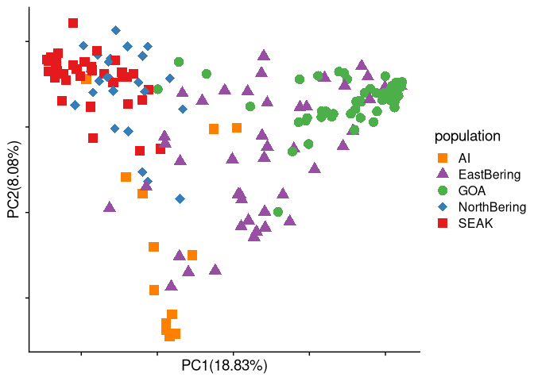

Fst outlier PCAs
================

## Load relevant libraries

``` r
library(tidyverse)
```

    ## ── Attaching core tidyverse packages ──────────────────────── tidyverse 2.0.0 ──
    ## ✔ dplyr     1.1.0     ✔ readr     2.1.4
    ## ✔ forcats   1.0.0     ✔ stringr   1.5.0
    ## ✔ ggplot2   3.4.1     ✔ tibble    3.1.8
    ## ✔ lubridate 1.9.2     ✔ tidyr     1.3.0
    ## ✔ purrr     1.0.1     
    ## ── Conflicts ────────────────────────────────────────── tidyverse_conflicts() ──
    ## ✖ dplyr::filter() masks stats::filter()
    ## ✖ dplyr::lag()    masks stats::lag()
    ## ℹ Use the ]8;;http://conflicted.r-lib.org/conflicted package]8;; to force all conflicts to become errors

``` r
library(cowplot)
```

    ## 
    ## Attaching package: 'cowplot'
    ## 
    ## The following object is masked from 'package:lubridate':
    ## 
    ##     stamp

``` r
source("/fs/cbsubscb16/storage/sucker_sp2021/scripts/individual_pca_functions_csj.R")
sample_table <- read_tsv("/fs/cbsubscb16/storage/rkc/sample_lists/sample_table.tsv")
```

    ## Rows: 183 Columns: 9
    ## ── Column specification ────────────────────────────────────────────────────────
    ## Delimiter: "\t"
    ## chr (6): population, Loc, GeneralLoc, k3_inferred_pop, k4_inferred_pop, k5_i...
    ## dbl (3): ABLG, StartLatDD, StartLonDD
    ## 
    ## ℹ Use `spec()` to retrieve the full column specification for this data.
    ## ℹ Specify the column types or set `show_col_types = FALSE` to quiet this message.

``` r
chrom_df <- read_tsv("/fs/cbsubscb16/storage/rkc/sample_lists/chrom_meta_data.txt")
```

    ## Rows: 104 Columns: 2
    ## ── Column specification ────────────────────────────────────────────────────────
    ## Delimiter: "\t"
    ## chr (2): chr, chr_num
    ## 
    ## ℹ Use `spec()` to retrieve the full column specification for this data.
    ## ℹ Specify the column types or set `show_col_types = FALSE` to quiet this message.

## identify outlier region on Chr 100

``` r
chr100_Fst <- read_tsv("/fs/cbsubscb16/storage/rkc/angsd/PCAM-PPLA_CM023352.1_EastBering-GOA_polymorphic_folded.sfs.pbs.fst.txt")
```

    ## Rows: 62127 Columns: 5
    ## ── Column specification ────────────────────────────────────────────────────────
    ## Delimiter: "\t"
    ## chr (2): region, chr
    ## dbl (3): midPos, Nsites, fst
    ## 
    ## ℹ Use `spec()` to retrieve the full column specification for this data.
    ## ℹ Specify the column types or set `show_col_types = FALSE` to quiet this message.

``` r
chr100_Fst %>% arrange(desc(fst))
```

    ## # A tibble: 62,127 × 5
    ##    region                                              chr   midPos Nsites   fst
    ##    <chr>                                               <chr>  <dbl>  <dbl> <dbl>
    ##  1 (7218,7218)(11048635,11048635)(11048635,11048636)   CM02… 1.10e7      2 0.340
    ##  2 (7166,7166)(10767619,10767619)(10767619,10767620)   CM02… 1.08e7      2 0.337
    ##  3 (7224,7224)(11050165,11050165)(11050165,11050166)   CM02… 1.11e7      2 0.333
    ##  4 (6707,6707)(9997767,9997767)(9997767,9997768)       CM02… 1.00e7      2 0.325
    ##  5 (14285,14285)(21225235,21225235)(21225235,21225236) CM02… 2.12e7      2 0.297
    ##  6 (7161,7161)(10750169,10750169)(10750169,10750170)   CM02… 1.08e7      2 0.279
    ##  7 (7182,7182)(10805120,10805120)(10805120,10805121)   CM02… 1.08e7      2 0.249
    ##  8 (7225,7225)(11050174,11050174)(11050174,11050175)   CM02… 1.11e7      2 0.232
    ##  9 (7168,7168)(10767684,10767684)(10767684,10767685)   CM02… 1.08e7      2 0.224
    ## 10 (7167,7167)(10767683,10767683)(10767683,10767684)   CM02… 1.08e7      2 0.218
    ## # … with 62,117 more rows

``` r
# chr 100 peak is 10744898-11050174
# corresponds to lines 14821-15070
```

``` bash
## extract lines from beagle file
zcat angsd/PCAM-PPLA-wholegenome_polymorphic_CM023352.1.beagle.gz | sed -n '14821,15070p;15071q' | gzip > angsd/PCAM-PPLA-wholegenome_polymorphic_CM023352.1_outlier.beagle.gz
```

## Run PCA for outlier loci

``` bash
nohup python /programs/pcangsd-1.10/pcangsd/pcangsd.py --beagle /fs/cbsubscb16/storage/rkc/angsd/PCAM-PPLA-wholegenome_polymorphic_CM023352.1_outlier.beagle.gz -o /fs/cbsubscb16/storage/rkc/angsd/PCAM-PPLA-wholegenome_polymorphic_CM023352.1_outlier --threads 16 &
```

## Plot PCAs

``` r
sample_table <- read_tsv("/fs/cbsubscb16/storage/rkc/sample_lists/sample_table.tsv")
```

    ## Rows: 183 Columns: 9
    ## ── Column specification ────────────────────────────────────────────────────────
    ## Delimiter: "\t"
    ## chr (6): population, Loc, GeneralLoc, k3_inferred_pop, k4_inferred_pop, k5_i...
    ## dbl (3): ABLG, StartLatDD, StartLonDD
    ## 
    ## ℹ Use `spec()` to retrieve the full column specification for this data.
    ## ℹ Specify the column types or set `show_col_types = FALSE` to quiet this message.

``` r
chr100_outlier_cov <- read_delim("/fs/cbsubscb16/storage/rkc/angsd/PCAM-PPLA-wholegenome_polymorphic_CM023352.1_outlier.cov", delim = " ", col_names = F) %>% as.matrix()
```

    ## Rows: 183 Columns: 183
    ## ── Column specification ────────────────────────────────────────────────────────
    ## Delimiter: " "
    ## dbl (183): X1, X2, X3, X4, X5, X6, X7, X8, X9, X10, X11, X12, X13, X14, X15,...
    ## 
    ## ℹ Use `spec()` to retrieve the full column specification for this data.
    ## ℹ Specify the column types or set `show_col_types = FALSE` to quiet this message.

``` r
alpha = 0.7
size = 3
PCA(chr100_outlier_cov, sample_table$ABLG, sample_table$Loc, 1, 2,show.ellipse = T, show.line = F, show.label = T, index_exclude=c(94, 95, 103, 106, 107, 109, 110, 118, 119, 120, 121))
```

    ## Warning: Using `size` aesthetic for lines was deprecated in ggplot2 3.4.0.
    ## ℹ Please use `linewidth` instead.

    ## 
    ## Attaching package: 'MASS'
    ## 
    ## The following object is masked from 'package:dplyr':
    ## 
    ##     select

<!-- -->

``` r
# ggsave("/fs/cbsubscb16/storage/rkc/figures/chr100_outlier_PCA.png", device = "png", width = 8, height = 6.5)

# Three populations on the margins of the PCA, SEAK, GOA, and Aleutian Islands. East Bering is dispersed but closer to GOA, and North Bering is dispersed but closer to SEAK. 
```

``` r
fst_6_5_10 <- read_delim("/fs/cbsubscb16/storage/rkc/islands_fstcutoff_0.25_nloci6_stepSize5000_windSize10000.txt", col_names = c("position", "chr","start","end","compare")) %>% 
  left_join(chrom_df, by = "chr")
```

    ## Rows: 124 Columns: 5
    ## ── Column specification ────────────────────────────────────────────────────────
    ## Delimiter: " "
    ## chr (3): position, chr, compare
    ## dbl (2): start, end
    ## 
    ## ℹ Use `spec()` to retrieve the full column specification for this data.
    ## ℹ Specify the column types or set `show_col_types = FALSE` to quiet this message.

``` r
fst_6_4_8 <- read_delim("/fs/cbsubscb16/storage/rkc/islands_fstcutoff_0.25_nloci6_stepSize4000_windSize8000.txt")
```

    ## Rows: 119 Columns: 5
    ## ── Column specification ────────────────────────────────────────────────────────
    ## Delimiter: " "
    ## chr (3): CM023253.1_30276001, CM023253.1, AI-GOA.fst.txt
    ## dbl (2): 30276001, 30284001
    ## 
    ## ℹ Use `spec()` to retrieve the full column specification for this data.
    ## ℹ Specify the column types or set `show_col_types = FALSE` to quiet this message.
