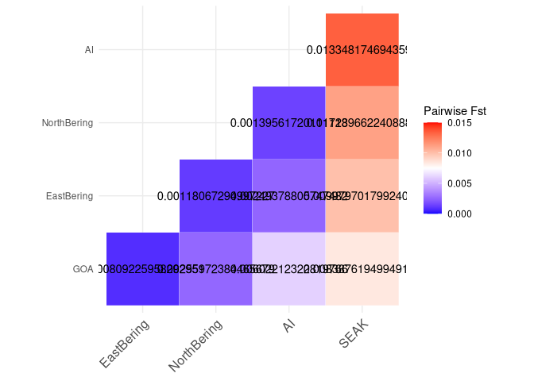

Global Fst
================

``` r
library(tidyverse)
```

    ## ── Attaching core tidyverse packages ──────────────────────── tidyverse 2.0.0 ──
    ## ✔ dplyr     1.1.0     ✔ readr     2.1.4
    ## ✔ forcats   1.0.0     ✔ stringr   1.5.0
    ## ✔ ggplot2   3.4.1     ✔ tibble    3.1.8
    ## ✔ lubridate 1.9.2     ✔ tidyr     1.3.0
    ## ✔ purrr     1.0.1     
    ## ── Conflicts ────────────────────────────────────────── tidyverse_conflicts() ──
    ## ✖ dplyr::filter() masks stats::filter()
    ## ✖ dplyr::lag()    masks stats::lag()
    ## ℹ Use the ]8;;http://conflicted.r-lib.org/conflicted package]8;; to force all conflicts to become errors

``` r
library(cowplot)
```

    ## 
    ## Attaching package: 'cowplot'
    ## 
    ## The following object is masked from 'package:lubridate':
    ## 
    ##     stamp

``` r
sample_table <- read_tsv("/fs/cbsubscb16/storage/rkc/sample_lists/sample_table.tsv")
```

    ## Rows: 183 Columns: 9
    ## ── Column specification ────────────────────────────────────────────────────────
    ## Delimiter: "\t"
    ## chr (6): population, Loc, GeneralLoc, k3_inferred_pop, k4_inferred_pop, k5_i...
    ## dbl (3): ABLG, StartLatDD, StartLonDD
    ## 
    ## ℹ Use `spec()` to retrieve the full column specification for this data.
    ## ℹ Specify the column types or set `show_col_types = FALSE` to quiet this message.

``` r
chrom_df <- read_tsv("/fs/cbsubscb16/storage/rkc/sample_lists/chrom_meta_data.txt")
```

    ## Rows: 104 Columns: 2
    ## ── Column specification ────────────────────────────────────────────────────────
    ## Delimiter: "\t"
    ## chr (2): chr, chr_num
    ## 
    ## ℹ Use `spec()` to retrieve the full column specification for this data.
    ## ℹ Specify the column types or set `show_col_types = FALSE` to quiet this message.

``` r
# Issue: negative Fst values. dev solution: these are method of moments estimators so they can become negative unlike ML estimators. I would just cap them at zero
AI_EastBering <- read_tsv("/fs/cbsubscb16/storage/rkc/angsd/fst/AI-EastBering.fst.txt") %>% 
  mutate(corrected_fst = ifelse(fst < 0, 0, fst))
```

    ## Rows: 2980157 Columns: 5
    ## ── Column specification ────────────────────────────────────────────────────────
    ## Delimiter: "\t"
    ## chr (2): region, chr
    ## dbl (3): midPos, Nsites, fst
    ## 
    ## ℹ Use `spec()` to retrieve the full column specification for this data.
    ## ℹ Specify the column types or set `show_col_types = FALSE` to quiet this message.

``` r
head(AI_EastBering)
```

    ## # A tibble: 6 × 6
    ##   region                          chr        midPos Nsites      fst corrected_…¹
    ##   <chr>                           <chr>       <dbl>  <dbl>    <dbl>        <dbl>
    ## 1 (1,1)(42158,42158)(42158,42159) CM023253.1  42158      2 -0.0169             0
    ## 2 (2,2)(42187,42187)(42187,42188) CM023253.1  42187      2 -0.0204             0
    ## 3 (3,3)(42198,42198)(42198,42199) CM023253.1  42198      2 -0.0158             0
    ## 4 (4,4)(63947,63947)(63947,63948) CM023253.1  63947      2 -0.0112             0
    ## 5 (5,5)(76357,76357)(76357,76358) CM023253.1  76357      2 -0.00338            0
    ## 6 (6,6)(76396,76396)(76396,76397) CM023253.1  76396      2 -0.0133             0
    ## # … with abbreviated variable name ¹​corrected_fst

``` r
mean(AI_EastBering$corrected_fst)
```

    ## [1] 0.002493788

``` r
AI_SEAK <- read_tsv("/fs/cbsubscb16/storage/rkc/angsd/fst/AI-SEAK.fst.txt") %>% 
  mutate(corrected_fst = ifelse(fst < 0, 0, fst))
```

    ## Rows: 2813926 Columns: 5
    ## ── Column specification ────────────────────────────────────────────────────────
    ## Delimiter: "\t"
    ## chr (2): region, chr
    ## dbl (3): midPos, Nsites, fst
    ## 
    ## ℹ Use `spec()` to retrieve the full column specification for this data.
    ## ℹ Specify the column types or set `show_col_types = FALSE` to quiet this message.

``` r
head(AI_SEAK)
```

    ## # A tibble: 6 × 6
    ##   region                          chr        midPos Nsites      fst corrected_…¹
    ##   <chr>                           <chr>       <dbl>  <dbl>    <dbl>        <dbl>
    ## 1 (1,1)(42158,42158)(42158,42159) CM023253.1  42158      2  0.00664      0.00664
    ## 2 (2,2)(42187,42187)(42187,42188) CM023253.1  42187      2 -0.0208       0      
    ## 3 (3,3)(42198,42198)(42198,42199) CM023253.1  42198      2  0.0372       0.0372 
    ## 4 (4,4)(63947,63947)(63947,63948) CM023253.1  63947      2 -0.0156       0      
    ## 5 (5,5)(76357,76357)(76357,76358) CM023253.1  76357      2  0.00640      0.00640
    ## 6 (6,6)(76396,76396)(76396,76397) CM023253.1  76396      2 -0.0190       0      
    ## # … with abbreviated variable name ¹​corrected_fst

``` r
mean(AI_SEAK$corrected_fst)
```

    ## [1] 0.01334817

``` r
AI_GOA <- read_tsv("/fs/cbsubscb16/storage/rkc/angsd/fst/AI-GOA.fst.txt") %>% 
  mutate(corrected_fst = ifelse(fst < 0, 0, fst))
```

    ## Rows: 3024251 Columns: 5
    ## ── Column specification ────────────────────────────────────────────────────────
    ## Delimiter: "\t"
    ## chr (2): region, chr
    ## dbl (3): midPos, Nsites, fst
    ## 
    ## ℹ Use `spec()` to retrieve the full column specification for this data.
    ## ℹ Specify the column types or set `show_col_types = FALSE` to quiet this message.

``` r
mean(AI_GOA$corrected_fst)
```

    ## [1] 0.006022123

``` r
AI_NorthBering <- read_tsv("/fs/cbsubscb16/storage/rkc/angsd/fst/AI-NorthBering.fst.txt") %>% 
  mutate(corrected_fst = ifelse(fst < 0, 0, fst))
```

    ## Rows: 2331023 Columns: 5
    ## ── Column specification ────────────────────────────────────────────────────────
    ## Delimiter: "\t"
    ## chr (2): region, chr
    ## dbl (3): midPos, Nsites, fst
    ## 
    ## ℹ Use `spec()` to retrieve the full column specification for this data.
    ## ℹ Specify the column types or set `show_col_types = FALSE` to quiet this message.

``` r
head(AI_NorthBering)
```

    ## # A tibble: 6 × 6
    ##   region                          chr        midPos Nsites      fst corrected_…¹
    ##   <chr>                           <chr>       <dbl>  <dbl>    <dbl>        <dbl>
    ## 1 (1,1)(42158,42158)(42158,42159) CM023253.1  42158      2 -0.0220             0
    ## 2 (2,2)(42187,42187)(42187,42188) CM023253.1  42187      2 -0.0213             0
    ## 3 (3,3)(76357,76357)(76357,76358) CM023253.1  76357      2 -0.0191             0
    ## 4 (4,4)(76396,76396)(76396,76397) CM023253.1  76396      2 -0.0196             0
    ## 5 (5,5)(76600,76600)(76600,76601) CM023253.1  76600      2 -0.0185             0
    ## 6 (6,6)(76610,76610)(76610,76611) CM023253.1  76610      2 -0.00370            0
    ## # … with abbreviated variable name ¹​corrected_fst

``` r
mean(AI_NorthBering$corrected_fst)
```

    ## [1] 0.001395617

``` r
EastBering_GOA <- read_tsv("/fs/cbsubscb16/storage/rkc/angsd/fst/EastBering-GOA.fst.txt") %>% 
  mutate(corrected_fst = ifelse(fst < 0, 0, fst))
```

    ## Rows: 4352166 Columns: 5
    ## ── Column specification ────────────────────────────────────────────────────────
    ## Delimiter: "\t"
    ## chr (2): region, chr
    ## dbl (3): midPos, Nsites, fst
    ## 
    ## ℹ Use `spec()` to retrieve the full column specification for this data.
    ## ℹ Specify the column types or set `show_col_types = FALSE` to quiet this message.

``` r
mean(EastBering_GOA$corrected_fst)
```

    ## [1] 0.000809226

``` r
EastBering_NorthBering <- read_tsv("/fs/cbsubscb16/storage/rkc/angsd/fst/EastBering-NorthBering.fst.txt") %>% 
  mutate(corrected_fst = ifelse(fst < 0, 0, fst))
```

    ## Rows: 2933753 Columns: 5
    ## ── Column specification ────────────────────────────────────────────────────────
    ## Delimiter: "\t"
    ## chr (2): region, chr
    ## dbl (3): midPos, Nsites, fst
    ## 
    ## ℹ Use `spec()` to retrieve the full column specification for this data.
    ## ℹ Specify the column types or set `show_col_types = FALSE` to quiet this message.

``` r
mean(EastBering_NorthBering$corrected_fst)
```

    ## [1] 0.001180673

``` r
EastBering_SEAK <- read_tsv("/fs/cbsubscb16/storage/rkc/angsd/fst/EastBering-SEAK.fst.txt") %>% 
  mutate(corrected_fst = ifelse(fst < 0, 0, fst))
```

    ## Rows: 3727073 Columns: 5
    ## ── Column specification ────────────────────────────────────────────────────────
    ## Delimiter: "\t"
    ## chr (2): region, chr
    ## dbl (3): midPos, Nsites, fst
    ## 
    ## ℹ Use `spec()` to retrieve the full column specification for this data.
    ## ℹ Specify the column types or set `show_col_types = FALSE` to quiet this message.

``` r
mean(EastBering_SEAK$corrected_fst)
```

    ## [1] 0.009979702

``` r
GOA_NorthBering <- read_tsv("/fs/cbsubscb16/storage/rkc/angsd/fst/GOA-NorthBering.fst.txt") %>% 
  mutate(corrected_fst = ifelse(fst < 0, 0, fst))
```

    ## Rows: 3033644 Columns: 5
    ## ── Column specification ────────────────────────────────────────────────────────
    ## Delimiter: "\t"
    ## chr (2): region, chr
    ## dbl (3): midPos, Nsites, fst
    ## 
    ## ℹ Use `spec()` to retrieve the full column specification for this data.
    ## ℹ Specify the column types or set `show_col_types = FALSE` to quiet this message.

``` r
mean(GOA_NorthBering$corrected_fst)
```

    ## [1] 0.002559724

``` r
GOA_SEAK <- read_tsv("/fs/cbsubscb16/storage/rkc/angsd/fst/GOA-SEAK.fst.txt") %>% 
  mutate(corrected_fst = ifelse(fst < 0, 0, fst))
```

    ## Rows: 4001653 Columns: 5
    ## ── Column specification ────────────────────────────────────────────────────────
    ## Delimiter: "\t"
    ## chr (2): region, chr
    ## dbl (3): midPos, Nsites, fst
    ## 
    ## ℹ Use `spec()` to retrieve the full column specification for this data.
    ## ℹ Specify the column types or set `show_col_types = FALSE` to quiet this message.

``` r
mean(GOA_SEAK$corrected_fst)
```

    ## [1] 0.008387619

``` r
NorthBering_SEAK <- read_tsv("/fs/cbsubscb16/storage/rkc/angsd/fst/NorthBering-SEAK.fst.txt") %>% 
  mutate(corrected_fst = ifelse(fst < 0, 0, fst))
```

    ## Rows: 2707622 Columns: 5
    ## ── Column specification ────────────────────────────────────────────────────────
    ## Delimiter: "\t"
    ## chr (2): region, chr
    ## dbl (3): midPos, Nsites, fst
    ## 
    ## ℹ Use `spec()` to retrieve the full column specification for this data.
    ## ℹ Specify the column types or set `show_col_types = FALSE` to quiet this message.

``` r
mean(NorthBering_SEAK$corrected_fst)
```

    ## [1] 0.01113966

## Fst heatmap

``` r
library(reshape2)
```

    ## 
    ## Attaching package: 'reshape2'

    ## The following object is masked from 'package:tidyr':
    ## 
    ##     smiths

``` r
glob_fst <- read_csv("/fs/cbsubscb16/storage/rkc/angsd/fst/global_fst_matrix.csv")
```

    ## Rows: 10 Columns: 3

    ## ── Column specification ────────────────────────────────────────────────────────
    ## Delimiter: ","
    ## chr (2): pop1, pop2
    ## dbl (1): fst
    ## 
    ## ℹ Use `spec()` to retrieve the full column specification for this data.
    ## ℹ Specify the column types or set `show_col_types = FALSE` to quiet this message.

``` r
globmat <- matrix(c(NA,mean(EastBering_GOA$corrected_fst),mean(GOA_NorthBering$corrected_fst),mean(AI_GOA$corrected_fst),mean(GOA_SEAK$corrected_fst), 
                    rep(NA,2),mean(EastBering_NorthBering$corrected_fst),mean(AI_EastBering$corrected_fst),mean(EastBering_SEAK$corrected_fst), 
                    rep(NA,3),mean(AI_NorthBering$corrected_fst),mean(NorthBering_SEAK$corrected_fst),  
                    rep(NA,4),mean(AI_SEAK$corrected_fst), 
                    rep(NA,5)), 
                  nrow = 5, ncol = 5, dimnames = list(c("GOA","EastBering","NorthBering","AI","SEAK"),
                                                      c("GOA","EastBering","NorthBering","AI","SEAK")))
melted_globmat <- melt(globmat, na.rm = T)
ggplot(melted_globmat, aes(x = Var1, y = Var2, fill = value)) + 
  geom_tile(color="white") +
   scale_fill_gradient2(low = "blue", high = "red", mid = "white",
    midpoint = 0.0075, limit = c(0,0.015), space = "Lab",
    name="Pairwise Fst") +
  geom_text(aes(Var1, Var2, label = value)) +
  theme_minimal() + 
 theme(axis.text.x = element_text(angle = 45, vjust = 1, 
    size = 12, hjust = 1), axis.title = element_blank()) +
 coord_fixed()
```

<!-- -->

``` r
ggsave("/fs/cbsubscb16/storage/rkc/figures/global_fst.png", device = "png", width = 7, height = 7, units = "in")
```
