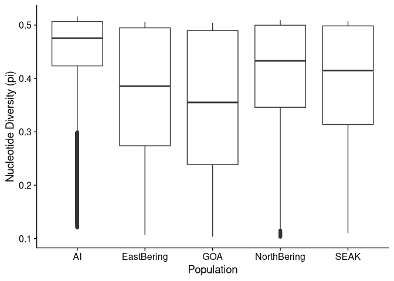

Per pop Nucleotide Diversity
================

## Load relevant libraries

``` r
library(tidyverse)
```

    ## ── Attaching core tidyverse packages ──────────────────────── tidyverse 2.0.0 ──
    ## ✔ dplyr     1.1.0     ✔ readr     2.1.4
    ## ✔ forcats   1.0.0     ✔ stringr   1.5.0
    ## ✔ ggplot2   3.4.1     ✔ tibble    3.1.8
    ## ✔ lubridate 1.9.2     ✔ tidyr     1.3.0
    ## ✔ purrr     1.0.1     
    ## ── Conflicts ────────────────────────────────────────── tidyverse_conflicts() ──
    ## ✖ dplyr::filter() masks stats::filter()
    ## ✖ dplyr::lag()    masks stats::lag()
    ## ℹ Use the ]8;;http://conflicted.r-lib.org/conflicted package]8;; to force all conflicts to become errors

## Load file lists

``` r
POPLIST <- c("AI", "SEAK", "NorthBering", "EastBering", "GOA")
setwd("/fs/cbsubscb16/storage/rkc/")

for(p in POPLIST){
  assign(paste(p,"_list", sep = ""), read_table(paste("sample_lists/", p, "_thetas_list.txt", sep = ""), col_names = F))
}
```

    ## 
    ## ── Column specification ────────────────────────────────────────────────────────
    ## cols(
    ##   X1 = col_character()
    ## )
    ## 
    ## 
    ## ── Column specification ────────────────────────────────────────────────────────
    ## cols(
    ##   X1 = col_character()
    ## )
    ## 
    ## 
    ## ── Column specification ────────────────────────────────────────────────────────
    ## cols(
    ##   X1 = col_character()
    ## )
    ## 
    ## 
    ## ── Column specification ────────────────────────────────────────────────────────
    ## cols(
    ##   X1 = col_character()
    ## )
    ## 
    ## 
    ## ── Column specification ────────────────────────────────────────────────────────
    ## cols(
    ##   X1 = col_character()
    ## )

``` r
sample_table <- read_tsv("sample_lists/sample_table.tsv")
```

    ## Rows: 183 Columns: 9

    ## ── Column specification ────────────────────────────────────────────────────────
    ## Delimiter: "\t"
    ## chr (6): population, Loc, GeneralLoc, k3_inferred_pop, k4_inferred_pop, k5_i...
    ## dbl (3): ABLG, StartLatDD, StartLonDD
    ## 
    ## ℹ Use `spec()` to retrieve the full column specification for this data.
    ## ℹ Specify the column types or set `show_col_types = FALSE` to quiet this message.

## Read data

``` r
setwd("/fs/cbsubscb16/storage/rkc/")

AI_thetas <- read_table(AI_list$X1[1], col_names = T, na = "-inf")
for(f in 2:length(AI_list$X1)){
  AI_thetas <- rbind(AI_thetas, read_table(AI_list$X1[f], col_names = T, na = "-inf"))
}
AI_thetas <- AI_thetas %>% 
  mutate(untrans_pairwise = exp(Pairwise)) %>% mutate(pop = "AI")
mean(AI_thetas$untrans_pairwise, na.rm = T)
```

    ## [1] 0.4582941

``` r
EastBering_thetas <- read_table(EastBering_list$X1[1], col_names = T, na = "-inf")
for(f in 2:length(EastBering_list$X1)){
  EastBering_thetas <- rbind(EastBering_thetas, read_table(EastBering_list$X1[f], col_names = T, na = "-inf"))
}
EastBering_thetas <- EastBering_thetas %>% 
  mutate(untrans_pairwise = exp(Pairwise)) %>% mutate(pop = "EastBering")
mean(EastBering_thetas$untrans_pairwise, na.rm = T)
```

    ## [1] 0.3763233

``` r
GOA_thetas <- read_table(GOA_list$X1[1], col_names = T, na = "-inf")
for(f in 2:length(GOA_list$X1)){
  GOA_thetas <- rbind(GOA_thetas, read_table(GOA_list$X1[f], col_names = T, na = "-inf"))
}
GOA_thetas <- GOA_thetas %>% 
  mutate(untrans_pairwise = exp(Pairwise)) %>% mutate(pop = "GOA")
mean(GOA_thetas$untrans_pairwise, na.rm = T)
```

    ## [1] 0.3549949

``` r
NorthBering_thetas <- read_table(NorthBering_list$X1[1], col_names = T, na = "-inf")
for(f in 2:length(NorthBering_list$X1)){
  NorthBering_thetas <- rbind(NorthBering_thetas, read_table(NorthBering_list$X1[f], col_names = T, na = "-inf"))
}
NorthBering_thetas <- NorthBering_thetas %>% 
  mutate(untrans_pairwise = exp(Pairwise)) %>% mutate(pop = "NorthBering")
mean(NorthBering_thetas$untrans_pairwise, na.rm = T)
```

    ## [1] 0.4168475

``` r
SEAK_thetas <- read_table(SEAK_list$X1[1], col_names = T, na = "-inf")
for(f in 2:length(SEAK_list$X1)){
  SEAK_thetas <- rbind(SEAK_thetas, read_table(SEAK_list$X1[f], col_names = T, na = "-inf"))
}
SEAK_thetas <- SEAK_thetas %>% 
  mutate(untrans_pairwise = exp(Pairwise)) %>% mutate(pop = "SEAK")
mean(SEAK_thetas$untrans_pairwise, na.rm = T)
```

    ## [1] 0.3993773

``` r
thetas_raw <- rbind(AI_thetas,EastBering_thetas,GOA_thetas,NorthBering_thetas,SEAK_thetas)
```

``` r
# Estimators are contained in the thetas.idx file
chr1_thetas <- read_tsv("/fs/cbsubscb16/storage/rkc/angsd/diversity/PCAM-PPLA_CM023253.1_AI_polymorphic_folded.thetas.txt")
```

    ## Rows: 41202 Columns: 7
    ## ── Column specification ────────────────────────────────────────────────────────
    ## Delimiter: "\t"
    ## chr (1): #Chromo
    ## dbl (6): Pos, Watterson, Pairwise, thetaSingleton, thetaH, thetaL
    ## 
    ## ℹ Use `spec()` to retrieve the full column specification for this data.
    ## ℹ Specify the column types or set `show_col_types = FALSE` to quiet this message.

``` r
chr1_thetas_untrans_pi <- chr1_thetas %>% 
  mutate(untrans_pairwise = exp(Pairwise))
mean(chr1_thetas_untrans_pi$untrans_pairwise)
```

    ## [1] 0.4601608

## Plot pi per population

``` r
ggplot(data = thetas_raw, aes(x = pop, y = untrans_pairwise)) +
  geom_boxplot() +
  labs(x = "Population", y = "Nucleotide Diversity (pi)") +
  cowplot::theme_cowplot()
```

    ## Warning: Removed 145 rows containing non-finite values (`stat_boxplot()`).

<!-- -->

``` r
ggsave("/fs/cbsubscb16/storage/rkc/figures/pi_per_pop.png", device = "png", height = 5, width = 7)
```

    ## Warning: Removed 145 rows containing non-finite values (`stat_boxplot()`).
