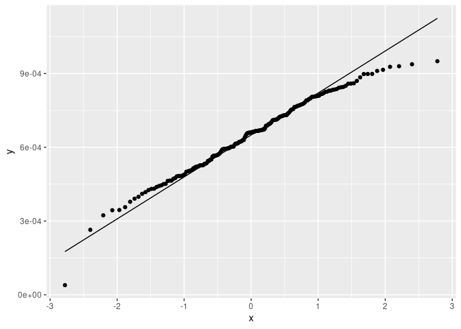

inbreeding_per_pop
================

## Load libraries and file lists

``` r
library(tidyverse)
```

    ## ── Attaching core tidyverse packages ──────────────────────── tidyverse 2.0.0 ──
    ## ✔ dplyr     1.1.0     ✔ readr     2.1.4
    ## ✔ forcats   1.0.0     ✔ stringr   1.5.0
    ## ✔ ggplot2   3.4.1     ✔ tibble    3.1.8
    ## ✔ lubridate 1.9.2     ✔ tidyr     1.3.0
    ## ✔ purrr     1.0.1     
    ## ── Conflicts ────────────────────────────────────────── tidyverse_conflicts() ──
    ## ✖ dplyr::filter() masks stats::filter()
    ## ✖ dplyr::lag()    masks stats::lag()
    ## ℹ Use the ]8;;http://conflicted.r-lib.org/conflicted package]8;; to force all conflicts to become errors

``` r
POPLIST <- c("AI", "SEAK", "NorthBering", "EastBering", "GOA")
setwd("/fs/cbsubscb16/storage/rkc/")

for(p in POPLIST){
  assign(paste(p,"_list", sep = ""), read_table(paste("sample_lists/", p, "_inbreeding.txt", sep = ""), col_names = F))
}
```

    ## 
    ## ── Column specification ────────────────────────────────────────────────────────
    ## cols(
    ##   X1 = col_character()
    ## )
    ## 
    ## 
    ## ── Column specification ────────────────────────────────────────────────────────
    ## cols(
    ##   X1 = col_character()
    ## )
    ## 
    ## 
    ## ── Column specification ────────────────────────────────────────────────────────
    ## cols(
    ##   X1 = col_character()
    ## )
    ## 
    ## 
    ## ── Column specification ────────────────────────────────────────────────────────
    ## cols(
    ##   X1 = col_character()
    ## )
    ## 
    ## 
    ## ── Column specification ────────────────────────────────────────────────────────
    ## cols(
    ##   X1 = col_character()
    ## )

``` r
sample_table <- read_tsv("sample_lists/sample_table.tsv")
```

    ## Rows: 183 Columns: 9
    ## ── Column specification ────────────────────────────────────────────────────────
    ## Delimiter: "\t"
    ## chr (6): population, Loc, GeneralLoc, k3_inferred_pop, k4_inferred_pop, k5_i...
    ## dbl (3): ABLG, StartLatDD, StartLonDD
    ## 
    ## ℹ Use `spec()` to retrieve the full column specification for this data.
    ## ℹ Specify the column types or set `show_col_types = FALSE` to quiet this message.

## Read data

``` r
setwd("/fs/cbsubscb16/storage/rkc/")

AI_inbreeding <- read_table(AI_list$X1[1], col_names = F)
for(f in 2:length(AI_list$X1)){
  AI_inbreeding <- cbind(AI_inbreeding, read_table(AI_list$X1[f], col_names = F))
}
AI_inbreeding <- cbind(filter(sample_table, Loc == "AI") %>% select(ABLG,Loc), AI_inbreeding)

EB_inbreeding <- read_table(EastBering_list$X1[1], col_names = F)
for(f in 2:length(EastBering_list$X1)){
  EB_inbreeding <- cbind(EB_inbreeding, read_table(EastBering_list$X1[f], col_names = F))
}
EB_inbreeding <- cbind(filter(sample_table, Loc == "EastBering") %>% select(ABLG,Loc), EB_inbreeding)

GOA_inbreeding <- read_table(GOA_list$X1[1], col_names = F)
for(f in 2:length(GOA_list$X1)){
  GOA_inbreeding <- cbind(GOA_inbreeding, read_table(GOA_list$X1[f], col_names = F))
}
GOA_inbreeding <- cbind(filter(sample_table, Loc == "GOA") %>% select(ABLG,Loc), GOA_inbreeding)

NB_inbreeding <- read_table(NorthBering_list$X1[1], col_names = F)
for(f in 2:length(NorthBering_list$X1)){
  NB_inbreeding <- cbind(NB_inbreeding, read_table(NorthBering_list$X1[f], col_names = F))
}
NB_inbreeding <- cbind(filter(sample_table, Loc == "NorthBering") %>% select(ABLG,Loc), NB_inbreeding)

SEAK_inbreeding <- read_table(SEAK_list$X1[1], col_names = F)
for(f in 2:length(SEAK_list$X1)){
  SEAK_inbreeding <- cbind(SEAK_inbreeding, read_table(SEAK_list$X1[f], col_names = F))
}
SEAK_inbreeding <- cbind(filter(sample_table, Loc == "SEAK") %>% select(ABLG,Loc), SEAK_inbreeding)

inbreeding_raw <- rbind(AI_inbreeding,EB_inbreeding,GOA_inbreeding,NB_inbreeding,SEAK_inbreeding)

colnames(inbreeding_raw) <- c("ABLG", "Loc",seq(1,104,1))
```

## Calculate per ind avg inbreeding coefficient across all chromosomes

``` r
inbreeding_raw <- inbreeding_raw %>% mutate(ind_mean = rowMeans(.[3:106]), .after = Loc)
```

## ANOVA to test differences in inbreeding among pops

``` r
FIS_anova <- aov(ind_mean ~ Loc, data = inbreeding_raw)

summary(FIS_anova)
```

    ##              Df    Sum Sq   Mean Sq F value Pr(>F)    
    ## Loc           4 1.568e-06 3.919e-07    26.2 <2e-16 ***
    ## Residuals   178 2.662e-06 1.500e-08                   
    ## ---
    ## Signif. codes:  0 '***' 0.001 '**' 0.01 '*' 0.05 '.' 0.1 ' ' 1

## Test assumptions

``` r
ggplot(inbreeding_raw, aes(sample = ind_mean)) + 
  stat_qq() + stat_qq_line()
```

<!-- -->

``` r
plot(predict(FIS_anova), residuals(FIS_anova))
```

<!-- -->

## FIS boxplot

``` r
inbreeding_raw %>% ggplot(aes(x = Loc, y = ind_mean)) +
  geom_boxplot() +
  geom_point(position = position_jitter(width = 0.1), alpha = 0.5, size = 1.5) +
  labs(x = "Population", y = "Fis") +
  cowplot::theme_cowplot()
```

<!-- -->

``` r
#ggsave("/fs/cbsubscb16/storage/rkc/figures/inbreeding_boxplot.png", device = "png", height = 5, width = 8)
```

## Post-hoc tests

``` r
TukeyHSD(FIS_anova, conf.level = 0.95)
```

    ##   Tukey multiple comparisons of means
    ##     95% family-wise confidence level
    ## 
    ## Fit: aov(formula = ind_mean ~ Loc, data = inbreeding_raw)
    ## 
    ## $Loc
    ##                                 diff           lwr           upr     p adj
    ## EastBering-AI           1.524123e-04  5.431040e-05  2.505142e-04 0.0002902
    ## GOA-AI                  2.466497e-04  1.516497e-04  3.416496e-04 0.0000000
    ## NorthBering-AI          3.349073e-06 -1.022758e-04  1.089739e-04 0.9999867
    ## SEAK-AI                 1.003081e-04 -1.403385e-06  2.020195e-04 0.0552678
    ## GOA-EastBering          9.423736e-05  2.753162e-05  1.609431e-04 0.0013032
    ## NorthBering-EastBering -1.490632e-04 -2.301883e-04 -6.793820e-05 0.0000100
    ## SEAK-EastBering        -5.210424e-05 -1.280640e-04  2.385550e-05 0.3262585
    ## NorthBering-GOA        -2.433006e-04 -3.206458e-04 -1.659554e-04 0.0000000
    ## SEAK-GOA               -1.463416e-04 -2.182505e-04 -7.443269e-05 0.0000008
    ## SEAK-NorthBering        9.695900e-05  1.150428e-05  1.824137e-04 0.0174013

#### mean and 95% CI

``` r
inbreeding_raw %>% group_by(Loc) %>% 
  summarise(mean = mean(ind_mean), conf95_low = mean(ind_mean)-(qt(0.975,df=length(ind_mean)-1)*sd(ind_mean)/sqrt(length(ind_mean))), conf95_high = mean(ind_mean)+(qt(0.975,df=length(ind_mean)-1)*sd(ind_mean)/sqrt(length(ind_mean))), n = length(ind_mean))
```

    ## # A tibble: 5 × 5
    ##   Loc             mean conf95_low conf95_high     n
    ##   <chr>          <dbl>      <dbl>       <dbl> <int>
    ## 1 AI          0.000511   0.000423    0.000600    16
    ## 2 EastBering  0.000664   0.000627    0.000700    45
    ## 3 GOA         0.000758   0.000730    0.000785    59
    ## 4 NorthBering 0.000515   0.000472    0.000557    28
    ## 5 SEAK        0.000611   0.000565    0.000658    35

## Heterozygosity per pop

diversity stats from angsd output seems off
