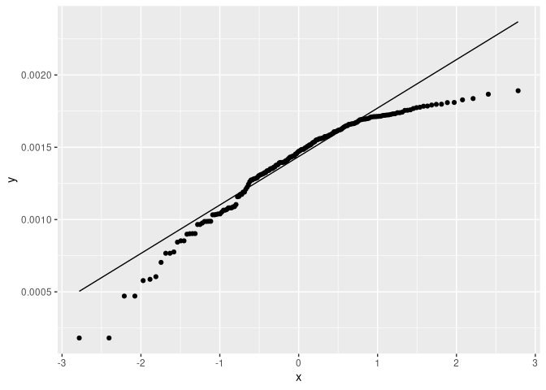
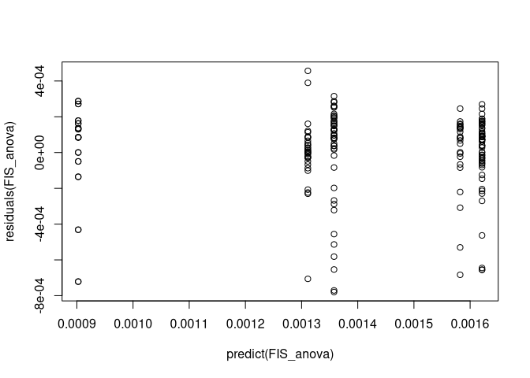
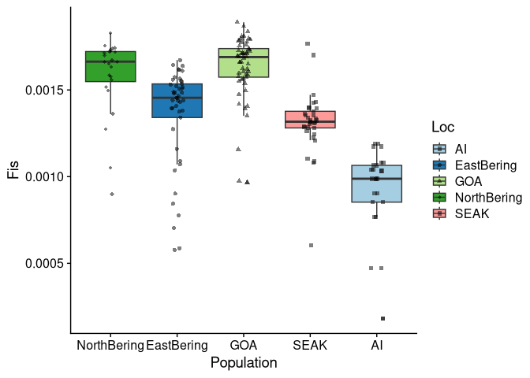

inbreeding_per_pop
================

## Load libraries and file lists

``` r
library(tidyverse)
```

    ## ── Attaching core tidyverse packages ──────────────────────── tidyverse 2.0.0 ──
    ## ✔ dplyr     1.1.0     ✔ readr     2.1.4
    ## ✔ forcats   1.0.0     ✔ stringr   1.5.0
    ## ✔ ggplot2   3.4.1     ✔ tibble    3.1.8
    ## ✔ lubridate 1.9.2     ✔ tidyr     1.3.0
    ## ✔ purrr     1.0.1     
    ## ── Conflicts ────────────────────────────────────────── tidyverse_conflicts() ──
    ## ✖ dplyr::filter() masks stats::filter()
    ## ✖ dplyr::lag()    masks stats::lag()
    ## ℹ Use the ]8;;http://conflicted.r-lib.org/conflicted package]8;; to force all conflicts to become errors

``` r
library(stats)
POPLIST <- c("AI", "SEAK", "NorthBering", "EastBering", "GOA")
setwd("/fs/cbsubscb16/storage/rkc/")

for(p in POPLIST){
  assign(paste(p,"_list", sep = ""), read_table(paste("sample_lists/", p, "_inbreeding.txt", sep = ""), col_names = F))
}
```

    ## 
    ## ── Column specification ────────────────────────────────────────────────────────
    ## cols(
    ##   X1 = col_character()
    ## )
    ## 
    ## 
    ## ── Column specification ────────────────────────────────────────────────────────
    ## cols(
    ##   X1 = col_character()
    ## )
    ## 
    ## 
    ## ── Column specification ────────────────────────────────────────────────────────
    ## cols(
    ##   X1 = col_character()
    ## )
    ## 
    ## 
    ## ── Column specification ────────────────────────────────────────────────────────
    ## cols(
    ##   X1 = col_character()
    ## )
    ## 
    ## 
    ## ── Column specification ────────────────────────────────────────────────────────
    ## cols(
    ##   X1 = col_character()
    ## )

``` r
sample_table <- read_tsv("/fs/cbsubscb16/storage/rkc/sample_lists/sample_table.tsv")
```

    ## Rows: 183 Columns: 9
    ## ── Column specification ────────────────────────────────────────────────────────
    ## Delimiter: "\t"
    ## chr (6): population, Loc, GeneralLoc, k3_inferred_pop, k4_inferred_pop, k5_i...
    ## dbl (3): ABLG, StartLatDD, StartLonDD
    ## 
    ## ℹ Use `spec()` to retrieve the full column specification for this data.
    ## ℹ Specify the column types or set `show_col_types = FALSE` to quiet this message.

## Estimate per individual inbreeding

``` bash
# translate beagle to glf - author says this method may not work
zcat PCAM-PPLA_wgph.beagle.gz | tail -n +2 | perl -an -e 'for($i=3; $i<=$#F; $i++){print(pack("d",($F[$i]==0 ? -inf : log($F[$i]))))}' > PCAM-PPLA_wgph.glf

zcat AI_PCAM-PPLA_wgph.beagle.gz | tail -n +2 | perl -an -e 'for($i=3; $i<=$#F; $i++){print(pack("d",($F[$i]==0 ? -inf : log($F[$i]))))}' > AI_PCAM-PPLA_wgph.glf

zcat EBS_PCAM-PPLA_wgph.beagle.gz | tail -n +2 | perl -an -e 'for($i=3; $i<=$#F; $i++){print(pack("d",($F[$i]==0 ? -inf : log($F[$i]))))}' > EBS_AI_PCAM-PPLA_wgph.glf

zcat GOA_PCAM-PPLA_wgph.beagle.gz | tail -n +2 | perl -an -e 'for($i=3; $i<=$#F; $i++){print(pack("d",($F[$i]==0 ? -inf : log($F[$i]))))}' > GOA_PCAM-PPLA_wgph.glf

zcat NBS_PCAM-PPLA_wgph.beagle.gz | tail -n +2 | perl -an -e 'for($i=3; $i<=$#F; $i++){print(pack("d",($F[$i]==0 ? -inf : log($F[$i]))))}' > NBS_PCAM-PPLA_wgph.glf

zcat SEAK_PCAM-PPLA_wgph.beagle.gz | tail -n +2 | perl -an -e 'for($i=3; $i<=$#F; $i++){print(pack("d",($F[$i]==0 ? -inf : log($F[$i]))))}' > SEAK_PCAM-PPLA_wgph.glf

## run ngsF on cluster
# Job ID 1803940
# ERROR: error while loading shared libraries: libgsl.so.0: cannot open shared object file: No such file or directory

echo '#!/bin/bash
#SBATCH --job-name=ngsF_RKC
#SBATCH --output=/home/cas399/rkc/log/ngsF_inbreeding_AI.log
#SBATCH --partition=regular
#SBATCH --nodes=1
#SBATCH --ntasks=16
#SBATCH --mem=75G
#SBATCH --mail-user=cas399@cornell.edu  
#SBATCH --mail-type=END

## Mount the storage
/programs/bin/labutils/mount_server cbsubscb16 /storage

## create temp workdir and move files 
WORKDIR=/workdir/$USER/$SLURM_JOB_ID/
mkdir -p $WORKDIR
cd $WORKDIR

## Transfer the input files
cp /fs/cbsubscb16/storage/rkc/angsd/AI_PCAM-PPLA_wgph.glf $WORKDIR

## Run ngsF
/programs/ngsF-1.2.0/ngsF --n_threads 16 --n_ind 16 --n_sites 8016901 --glf AI_PCAM-PPLA_wgph.glf --out PCAM-PPLA_wgph_inbreeding_AI.txt

## copy output back to cbsubscb16
rm *.glf
cp * /fs/cbsubscb16/storage/rkc/angsd/'| sbatch

## EBS

echo '#!/bin/bash
#SBATCH --job-name=ngsF_RKC
#SBATCH --output=/home/cas399/rkc/log/ngsF_inbreeding_EBS.log
#SBATCH --partition=regular
#SBATCH --nodes=1
#SBATCH --ntasks=16
#SBATCH --mem=75G
#SBATCH --mail-user=cas399@cornell.edu  
#SBATCH --mail-type=END

## Mount the storage
/programs/bin/labutils/mount_server cbsubscb16 /storage

## create temp workdir and move files 
WORKDIR=/workdir/$USER/$SLURM_JOB_ID/
mkdir -p $WORKDIR
cd $WORKDIR

## Transfer the input files
cp /fs/cbsubscb16/storage/rkc/angsd/EBS_PCAM-PPLA_wgph.glf $WORKDIR

## Run ngsF
/programs/ngsF-1.2.0/ngsF --n_threads 16 --n_ind 45 --n_sites 8016901 --glf EBS_PCAM-PPLA_wgph.glf --out PCAM-PPLA_wgph_inbreeding_EBS.txt

## copy output back to cbsubscb16
rm *.glf
cp * /fs/cbsubscb16/storage/rkc/angsd/'| sbatch

## GOA

echo '#!/bin/bash
#SBATCH --job-name=ngsF_RKC
#SBATCH --output=/home/cas399/rkc/log/ngsF_inbreeding_GOA.log
#SBATCH --partition=regular
#SBATCH --nodes=1
#SBATCH --ntasks=16
#SBATCH --mem=75G
#SBATCH --mail-user=cas399@cornell.edu  
#SBATCH --mail-type=END

## Mount the storage
/programs/bin/labutils/mount_server cbsubscb16 /storage

## create temp workdir and move files 
WORKDIR=/workdir/$USER/$SLURM_JOB_ID/
mkdir -p $WORKDIR
cd $WORKDIR

## Transfer the input files
cp /fs/cbsubscb16/storage/rkc/angsd/GOA_PCAM-PPLA_wgph.glf $WORKDIR

## Run ngsF
/programs/ngsF-1.2.0/ngsF --n_threads 16 --n_ind 59 --n_sites 8016901 --glf GOA_PCAM-PPLA_wgph.glf --out PCAM-PPLA_wgph_inbreeding_GOA.txt

## copy output back to cbsubscb16
rm *.glf
cp * /fs/cbsubscb16/storage/rkc/angsd/'| sbatch

## NBS

echo '#!/bin/bash
#SBATCH --job-name=ngsF_RKC
#SBATCH --output=/home/cas399/rkc/log/ngsF_inbreeding_NBS.log
#SBATCH --partition=regular
#SBATCH --nodes=1
#SBATCH --ntasks=16
#SBATCH --mem=75G
#SBATCH --mail-user=cas399@cornell.edu  
#SBATCH --mail-type=END

## Mount the storage
/programs/bin/labutils/mount_server cbsubscb16 /storage

## create temp workdir and move files 
WORKDIR=/workdir/$USER/$SLURM_JOB_ID/
mkdir -p $WORKDIR
cd $WORKDIR

## Transfer the input files
cp /fs/cbsubscb16/storage/rkc/angsd/NBS_PCAM-PPLA_wgph.glf $WORKDIR

## Run ngsF
/programs/ngsF-1.2.0/ngsF --n_threads 16 --n_ind 28 --n_sites 8016901 --glf NBS_PCAM-PPLA_wgph.glf --out PCAM-PPLA_wgph_inbreeding_NBS.txt

## copy output back to cbsubscb16
rm *.glf
cp * /fs/cbsubscb16/storage/rkc/angsd/'| sbatch

## SEAK

echo '#!/bin/bash
#SBATCH --job-name=ngsF_RKC
#SBATCH --output=/home/cas399/rkc/log/ngsF_inbreeding_SEAK.log
#SBATCH --partition=regular
#SBATCH --nodes=1
#SBATCH --ntasks=16
#SBATCH --mem=75G
#SBATCH --mail-user=cas399@cornell.edu  
#SBATCH --mail-type=END

## Mount the storage
/programs/bin/labutils/mount_server cbsubscb16 /storage

## create temp workdir and move files 
WORKDIR=/workdir/$USER/$SLURM_JOB_ID/
mkdir -p $WORKDIR
cd $WORKDIR

## Transfer the input files
cp /fs/cbsubscb16/storage/rkc/angsd/SEAK_PCAM-PPLA_wgph.glf $WORKDIR

## Run ngsF
/programs/ngsF-1.2.0/ngsF --n_threads 16 --n_ind 35 --n_sites 8016901 --glf SEAK_PCAM-PPLA_wgph.glf --out PCAM-PPLA_wgph_inbreeding_SEAK.txt

## copy output back to cbsubscb16
rm *.glf
cp * /fs/cbsubscb16/storage/rkc/angsd/'| sbatch
```

## Read data

``` r
# setwd("/fs/cbsubscb16/storage/rkc/")
# 
# AI_inbreeding <- read_table(AI_list$X1[1], col_names = F)
# for(f in 2:length(AI_list$X1)){
#   AI_inbreeding <- cbind(AI_inbreeding, read_table(AI_list$X1[f], col_names = F))
# }
# AI_inbreeding <- cbind(filter(sample_table, Loc == "AI") %>% select(ABLG,Loc), AI_inbreeding)
# 
# EB_inbreeding <- read_table(EastBering_list$X1[1], col_names = F)
# for(f in 2:length(EastBering_list$X1)){
#   EB_inbreeding <- cbind(EB_inbreeding, read_table(EastBering_list$X1[f], col_names = F))
# }
# EB_inbreeding <- cbind(filter(sample_table, Loc == "EastBering") %>% select(ABLG,Loc), EB_inbreeding)
# 
# GOA_inbreeding <- read_table(GOA_list$X1[1], col_names = F)
# for(f in 2:length(GOA_list$X1)){
#   GOA_inbreeding <- cbind(GOA_inbreeding, read_table(GOA_list$X1[f], col_names = F))
# }
# GOA_inbreeding <- cbind(filter(sample_table, Loc == "GOA") %>% select(ABLG,Loc), GOA_inbreeding)
# 
# NB_inbreeding <- read_table(NorthBering_list$X1[1], col_names = F)
# for(f in 2:length(NorthBering_list$X1)){
#   NB_inbreeding <- cbind(NB_inbreeding, read_table(NorthBering_list$X1[f], col_names = F))
# }
# NB_inbreeding <- cbind(filter(sample_table, Loc == "NorthBering") %>% select(ABLG,Loc), NB_inbreeding)
# 
# SEAK_inbreeding <- read_table(SEAK_list$X1[1], col_names = F)
# for(f in 2:length(SEAK_list$X1)){
#   SEAK_inbreeding <- cbind(SEAK_inbreeding, read_table(SEAK_list$X1[f], col_names = F))
# }
# SEAK_inbreeding <- cbind(filter(sample_table, Loc == "SEAK") %>% select(ABLG,Loc), SEAK_inbreeding)
# 
# inbreeding_raw <- rbind(AI_inbreeding,EB_inbreeding,GOA_inbreeding,NB_inbreeding,SEAK_inbreeding)
# 
# colnames(inbreeding_raw) <- c("ABLG", "Loc",seq(1,104,1))
```

## Read in ngsParalogs inbreeding files

``` r
AI_inbreeding <- sample_table %>% filter(Loc == "AI") %>% cbind(read_tsv("/fs/cbsubscb16/storage/rkc/angsd/PCAM-PPLA_wgph_inbreeding_AI.txt", col_names = F))
```

    ## Rows: 16 Columns: 1
    ## ── Column specification ────────────────────────────────────────────────────────
    ## Delimiter: "\t"
    ## dbl (1): X1
    ## 
    ## ℹ Use `spec()` to retrieve the full column specification for this data.
    ## ℹ Specify the column types or set `show_col_types = FALSE` to quiet this message.

``` r
EBS_inbreeding <- sample_table %>% filter(Loc == "EastBering") %>% cbind(read_tsv("/fs/cbsubscb16/storage/rkc/angsd/PCAM-PPLA_wgph_inbreeding_EBS.txt", col_names = F)) %>% full_join(AI_inbreeding)
```

    ## Rows: 45 Columns: 1
    ## ── Column specification ────────────────────────────────────────────────────────
    ## Delimiter: "\t"
    ## dbl (1): X1
    ## 
    ## ℹ Use `spec()` to retrieve the full column specification for this data.
    ## ℹ Specify the column types or set `show_col_types = FALSE` to quiet this message.
    ## Joining with `by = join_by(ABLG, population, Loc, GeneralLoc, StartLatDD, StartLonDD, k3_inferred_pop, k4_inferred_pop, k5_inferred_pop, X1)`

``` r
GOA_inbreeding <- sample_table %>% filter(Loc == "GOA") %>% cbind(read_tsv("/fs/cbsubscb16/storage/rkc/angsd/PCAM-PPLA_wgph_inbreeding_GOA.txt", col_names = F))
```

    ## Rows: 59 Columns: 1
    ## ── Column specification ────────────────────────────────────────────────────────
    ## Delimiter: "\t"
    ## dbl (1): X1
    ## 
    ## ℹ Use `spec()` to retrieve the full column specification for this data.
    ## ℹ Specify the column types or set `show_col_types = FALSE` to quiet this message.

``` r
NBS_inbreeding <- sample_table %>% filter(Loc == "NorthBering") %>% cbind(read_tsv("/fs/cbsubscb16/storage/rkc/angsd/PCAM-PPLA_wgph_inbreeding_NBS.txt", col_names = F))
```

    ## Rows: 28 Columns: 1
    ## ── Column specification ────────────────────────────────────────────────────────
    ## Delimiter: "\t"
    ## dbl (1): X1
    ## 
    ## ℹ Use `spec()` to retrieve the full column specification for this data.
    ## ℹ Specify the column types or set `show_col_types = FALSE` to quiet this message.

``` r
SEAK_inbreeding <- sample_table %>% filter(Loc == "SEAK") %>% cbind(read_tsv("/fs/cbsubscb16/storage/rkc/angsd/PCAM-PPLA_wgph_inbreeding_SEAK.txt", col_names = F))
```

    ## Rows: 35 Columns: 1
    ## ── Column specification ────────────────────────────────────────────────────────
    ## Delimiter: "\t"
    ## dbl (1): X1
    ## 
    ## ℹ Use `spec()` to retrieve the full column specification for this data.
    ## ℹ Specify the column types or set `show_col_types = FALSE` to quiet this message.

``` r
inbreeding_raw <- rbind(AI_inbreeding,EBS_inbreeding,GOA_inbreeding,NBS_inbreeding,SEAK_inbreeding)
`%!in%` <- negate(`%in%`)
inbreeding_raw <- inbreeding_raw %>% filter(ABLG %!in% c(5617, 5618, 5637, 5644, 5648, 5650, 5651, 5663, 5667, 5669, 5670))
```

## ANOVA to test differences in inbreeding among pops

``` r
FIS_anova <- aov(X1 ~ Loc, data = inbreeding_raw)

summary(FIS_anova)
```

    ##              Df    Sum Sq  Mean Sq F value Pr(>F)    
    ## Loc           4 1.036e-05 2.59e-06      45 <2e-16 ***
    ## Residuals   180 1.036e-05 5.75e-08                   
    ## ---
    ## Signif. codes:  0 '***' 0.001 '**' 0.01 '*' 0.05 '.' 0.1 ' ' 1

``` r
TukeyHSD(FIS_anova)
```

    ##   Tukey multiple comparisons of means
    ##     95% family-wise confidence level
    ## 
    ## Fit: aov(formula = X1 ~ Loc, data = inbreeding_raw)
    ## 
    ## $Loc
    ##                                 diff           lwr           upr     p adj
    ## EastBering-AI           4.552940e-04  0.0002924475  6.181406e-04 0.0000000
    ## GOA-AI                  7.187490e-04  0.0005623056  8.751924e-04 0.0000000
    ## NorthBering-AI          6.797885e-04  0.0004926621  8.669149e-04 0.0000000
    ## SEAK-AI                 4.087203e-04  0.0002353699  5.820706e-04 0.0000000
    ## GOA-EastBering          2.634550e-04  0.0001316297  3.952803e-04 0.0000012
    ## NorthBering-EastBering  2.244944e-04  0.0000574027  3.915862e-04 0.0026027
    ## SEAK-EastBering        -4.657374e-05 -0.0001980785  1.049311e-04 0.9154041
    ## NorthBering-GOA        -3.896053e-05 -0.0001998182  1.218972e-04 0.9631050
    ## SEAK-GOA               -3.100287e-04 -0.0004546290 -1.654284e-04 0.0000002
    ## SEAK-NorthBering       -2.710682e-04 -0.0004484125 -9.372391e-05 0.0003816

## Test assumptions

``` r
ggplot(inbreeding_raw, aes(sample = X1)) + 
  stat_qq() + stat_qq_line()
```

<!-- -->

``` r
plot(predict(FIS_anova), residuals(FIS_anova))
```

<!-- -->

- assumptions are not well met, but our sample size is high so our ANOVA
  will be a good approximation of the true F stat

## FIS boxplot

``` r
inbreeding_raw %>% ggplot(aes(x = factor(Loc,levels = c("NorthBering", "EastBering","GOA","SEAK","AI")), y = X1)) +
  geom_boxplot(aes(fill = Loc), outlier.shape = NA) +
  scale_fill_brewer(type = "qual", palette = 3) +
  geom_point(aes(pch = Loc),position = position_jitter(width = 0.1), alpha = 0.5, size = 1.5) +
  scale_shape_manual(values = c(15,16,17,18,15)) +
  labs(x = "Population", y = "Fis") +
  cowplot::theme_cowplot()
```

<!-- -->

``` r
# ggsave("/fs/cbsubscb16/storage/rkc/figures/inbreeding_boxplot_wgph.png", device = "png", height = 5, width = 8)
```

## Post-hoc tests

``` r
TukeyHSD(FIS_anova, conf.level = 0.95)
```

    ##   Tukey multiple comparisons of means
    ##     95% family-wise confidence level
    ## 
    ## Fit: aov(formula = X1 ~ Loc, data = inbreeding_raw)
    ## 
    ## $Loc
    ##                                 diff           lwr           upr     p adj
    ## EastBering-AI           4.552940e-04  0.0002924475  6.181406e-04 0.0000000
    ## GOA-AI                  7.187490e-04  0.0005623056  8.751924e-04 0.0000000
    ## NorthBering-AI          6.797885e-04  0.0004926621  8.669149e-04 0.0000000
    ## SEAK-AI                 4.087203e-04  0.0002353699  5.820706e-04 0.0000000
    ## GOA-EastBering          2.634550e-04  0.0001316297  3.952803e-04 0.0000012
    ## NorthBering-EastBering  2.244944e-04  0.0000574027  3.915862e-04 0.0026027
    ## SEAK-EastBering        -4.657374e-05 -0.0001980785  1.049311e-04 0.9154041
    ## NorthBering-GOA        -3.896053e-05 -0.0001998182  1.218972e-04 0.9631050
    ## SEAK-GOA               -3.100287e-04 -0.0004546290 -1.654284e-04 0.0000002
    ## SEAK-NorthBering       -2.710682e-04 -0.0004484125 -9.372391e-05 0.0003816

#### mean and 95% CI

``` r
# inbreeding_raw %>% group_by(Loc) %>% 
#   summarise(mean = mean(ind_mean), conf95_low = mean(ind_mean)-(qt(0.975,df=length(ind_mean)-1)*sd(ind_mean)/sqrt(length(ind_mean))), conf95_high = mean(ind_mean)+(qt(0.975,df=length(ind_mean)-1)*sd(ind_mean)/sqrt(length(ind_mean))), n = length(ind_mean))
```
