Local PCA
================

## Load required packages

``` r
library(tidyverse)
```

    ## ── Attaching core tidyverse packages ──────────────────────── tidyverse 2.0.0 ──
    ## ✔ dplyr     1.1.0     ✔ readr     2.1.4
    ## ✔ forcats   1.0.0     ✔ stringr   1.5.0
    ## ✔ ggplot2   3.4.1     ✔ tibble    3.1.8
    ## ✔ lubridate 1.9.2     ✔ tidyr     1.3.0
    ## ✔ purrr     1.0.1     
    ## ── Conflicts ────────────────────────────────────────── tidyverse_conflicts() ──
    ## ✖ dplyr::filter() masks stats::filter()
    ## ✖ dplyr::lag()    masks stats::lag()
    ## ℹ Use the ]8;;http://conflicted.r-lib.org/conflicted package]8;; to force all conflicts to become errors

``` r
library(cowplot)
```

    ## 
    ## Attaching package: 'cowplot'
    ## 
    ## The following object is masked from 'package:lubridate':
    ## 
    ##     stamp

``` r
source("/fs/cbsubscb16/storage/sucker_sp2021/scripts/individual_pca_functions_csj.R")
```

## Subset beagle into chromosomes

#### Make lg list

``` bash
zcat angsd/PCAM-PPLA-wholegenome_polymorphic.beagle.gz | sed 's/\_.*//' | uniq > sample_lists/lg_list.txt
```

#### Run subsetting script

``` bash
## Run on cluster
## Job ID 48750

echo '#!/bin/bash 
bash /fs/cbsubscb16/storage/genomic-data-analysis/scripts/subset_beagle_by_lg.sh /fs/cbsubscb16/storage/rkc/angsd/PCAM-PPLA-wholegenome_polymorphic.beagle.gz /fs/cbsubscb16/storage/rkc/sample_lists/lg_list.txt 24' | \
sbatch \
--nodelist=cbsubscb16 \
--partition=regular \
--nodes=1 \
--ntasks=25 \
--mem=5G \
--output=/home/cas399/rkc/log/subset_beagle.log
```

## Run local PCA 10000 SNP window

``` bash
## Run on cluster
## current issue, new pcangsd flags differ. will have to modify local_pca_1.sh script. 
## Job ID 49957

echo '#!/bin/bash 
bash /fs/cbsubscb16/storage/genomic-data-analysis/scripts/run_local_pca.sh /fs/cbsubscb16/storage/rkc/angsd/PCAM-PPLA-wholegenome_polymorphic.beagle.gz /fs/cbsubscb16/storage/rkc/sample_lists/lg_list.txt 10000 2 26 /fs/cbsubscb16/storage/genomic-data-analysis/scripts/local_pca_1.sh /fs/cbsubscb16/storage/genomic-data-analysis/scripts/local_pca_2.R python /programs/pcangsd-1.10/pcangsd/pcangsd.py' | \
sbatch \
--nodelist=cbsubscb16 \
--partition=regular \
--nodes=1 \
--ntasks=26 \
--mem=5G \
--output=/home/cas399/rkc/log/local_pca_all_chr.log
```

### Assemble local_pca input

``` r
lg_list <- read_lines("/fs/cbsubscb16/storage/rkc/sample_lists/lg_list.txt")
i=1
for (lg in lg_list){
  pca_summary_temp <- read_tsv(paste0("/fs/cbsubscb16/storage/rkc/angsd/local_pca/window10000/snp_position_10000snp_", lg, "_2pc.tsv"), col_names = F)
  snp_position_temp <- read_tsv(paste0("/fs/cbsubscb16/storage/rkc/angsd/local_pca/window10000/snp_position_10000snp_", lg, "_2pc.tsv"), col_names = F)
  if (i == 1) {
    pca_summary <- pca_summary_temp
    snp_position <- snp_position_temp
  } else {
    pca_summary <- bind_rows(pca_summary, pca_summary_temp)
    snp_position <- bind_rows(snp_position, snp_position_temp)
  }
  i <- i+1
}
#write_tsv(pca_summary, "/fs/cbsubscb16/storage/rkc/angsd/local_pca/pca_summary_10000snp_2pc.tsv", col_names = F)
#write_tsv(snp_position, "/fs/cbsubscb16/storage/rkc/angsd/local_pca/snp_position_10000snp_2pc.tsv", col_names = F)
```

### Run pc_dist and assemble the output

``` r
rscript <- "library(tidyverse)
library(lostruct)
## Read the input
pca_summary <- read_tsv('/fs/cbsubscb16/storage/rkc/angsd/local_pca/pca_summary_10000snp_2pc.tsv', col_names = F) 
## Run pc_dist with pca_summary
pca_summary <- as.matrix(pca_summary)
attr(pca_summary, 'npc') <- 2
dist <- pc_dist(pca_summary)
write_tsv(as.data.frame(dist), '/fs/cbsubscb16/storage/rkc/angsd/local_pca/window_dist_10000snp_2pc.tsv', col_names = F)"
write_lines(rscript, "/fs/cbsubscb16/storage/rkc/scripts/run_pc_dist_10000snp_2pc.R")
```

``` r
nohup Rscript /fs/cbsubscb16/storage/rkc/scripts/run_pc_dist_10000snp_2pc.R \
> /fs/cbsubscb16/storage/rkc/nohups/run_pc_dist_10000snp_2pc.nohup 2>&1 &
```

### Analysis with all windows

``` r
## Read the SNP position file
snp_position10000 <- read_tsv("/fs/cbsubscb16/storage/rkc/angsd/local_pca/window10000/snp_position_10000snp_2pc.tsv", col_names = F) %>%
  transmute(lg = sub("\\_.*", "", X1), 
            start = as.integer(sub(".*\\_", "", X1)), 
            stop = as.integer(sub(".*\\_", "", X2)), 
            center = (start+stop)/2)
## Read in the window distance matrix
dist10000 <- read_tsv("/fs/cbsubscb16/storage/rkc/angsd/local_pca/window10000/window_dist_10000snp_2pc.tsv", col_names = F) %>%
  as.matrix()
## Do MDS with the distance matrix
mds10000 <- cmdscale(as.dist(dist10000), k=10, eig = T)
proportion_variance <- round(mds10000$eig/sum(mds10000$eig)*100,2)
mds10000 <- mds10000$points %>%
  as.data.frame() %>%
  set_names(paste0("dist_", 1:10)) %>%
  bind_cols(snp_position10000, .)

## Rename chromosomes in numerical order
mds10000_chr <- mds10000 %>% 
  mutate(lgN = NA, .after = lg)
mds10000_chr$lgN[1] <- "LG001"
n=1
for(i in 2:length(mds10000_chr$lg)){
  if(mds10000_chr$lg[i] == mds10000_chr$lg[i-1]){
    mds10000_chr$lgN[i] <- paste("LG",sprintf("%03.0f", n), sep = "")
  }
  if(mds10000_chr$lg[i] != mds10000_chr$lg[i-1]){
    n <- n+1
    mds10000_chr$lgN[i] <- paste("LG",sprintf("%03.0f", n), sep = "")
  }
}
mds10000_chr <- mds10000_chr %>% 
  dplyr::select(-lg) 

mds10000 %>%
  gather(key = axis, value = value, 5:14) %>%
  mutate(axis=fct_relevel(axis, paste0("dist_", 1:10))) %>%
  ggplot(aes(x=center/10^6, y=value, color=axis)) +
  geom_point(size=0.5) +
  facet_grid(axis~lg, scales="free_x", space="free_x") +
  theme_bw() +
  xlab("position (Mbp)") +
  ylab("principal coordinate value") +
  theme(panel.spacing = unit(0.1, "lines"),
      axis.title.x=element_text(),
      legend.position="none",
      text = element_text(size=10),
      axis.text = element_text(size=6),
      panel.grid.major = element_blank(), 
      panel.grid.minor = element_blank()) 
```

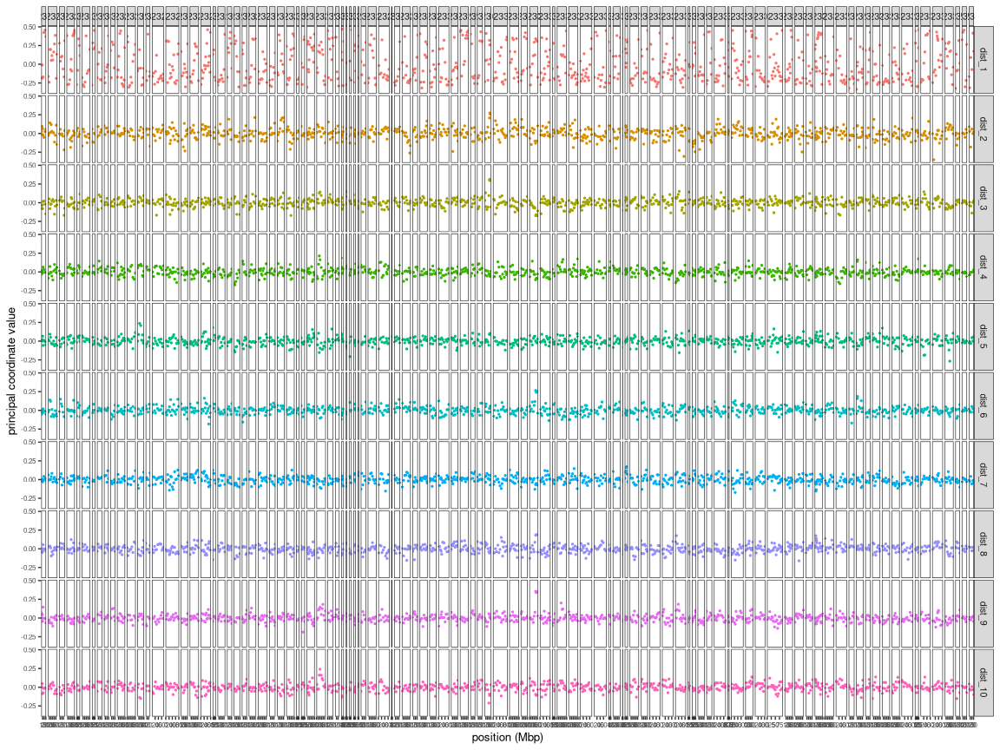<!-- -->

``` r
#ggsave("/fs/cbsubscb16/storage/rkc/figures/local_pca_scan.png", plot = last_plot(), device = "png", width = 20, height = 10, units = "in")
ggplot(mds10000_chr, aes(x=dist_1, y=dist_2, color=lgN, shape=lgN)) +
  geom_point() +
  scale_shape_manual(values = c(rep(c(15,16,17,18),26))) +
  xlab(paste0("PCo1 (", proportion_variance[1], "%)")) +
  ylab(paste0("PCo2 (", proportion_variance[2], "%)")) +
  cowplot::theme_cowplot()
```

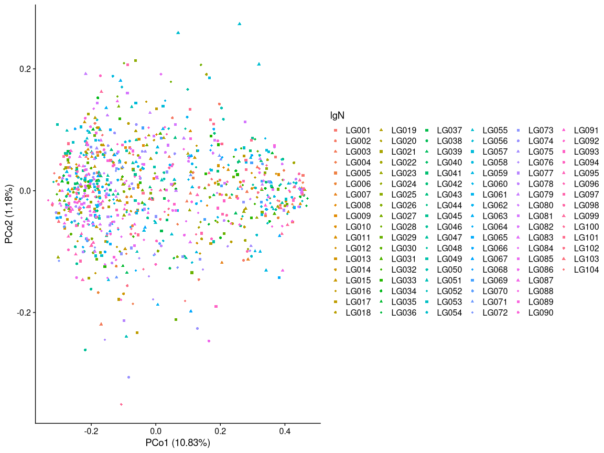<!-- -->

``` r
ggplot(mds10000,aes(x=dist_3, y=dist_4, color=lg, shape=lg)) +
  geom_point() +
  scale_shape_manual(values = c(rep(c(15,16,17,18),26))) +
  xlab(paste0("PCo3 (", proportion_variance[3], "%)")) +
  ylab(paste0("PCo4 (", proportion_variance[4], "%)")) +
  cowplot::theme_cowplot()
```

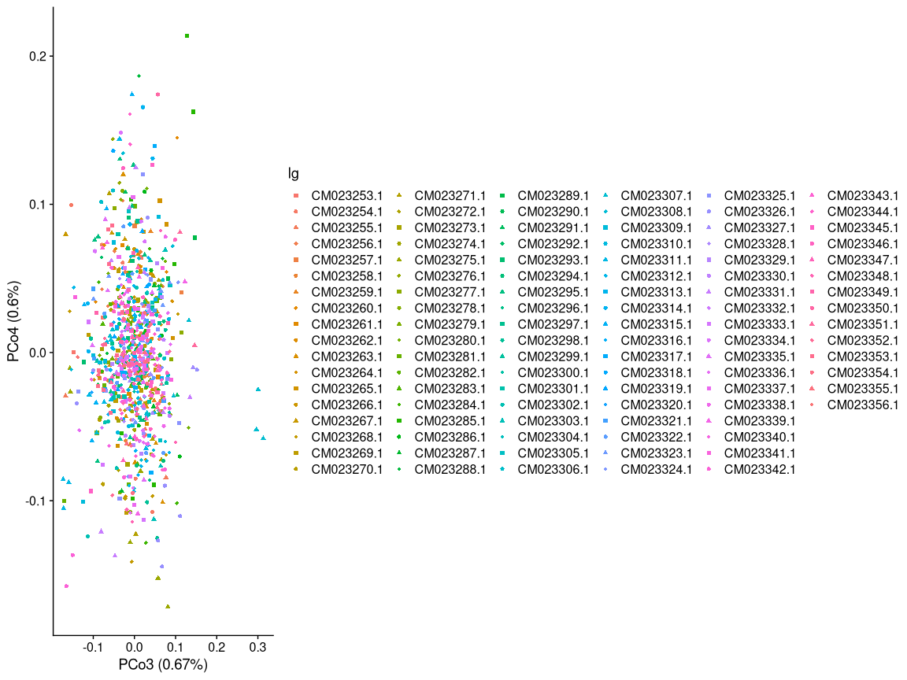<!-- -->

``` r
ggplot(mds10000,aes(x=dist_5, y=dist_6, color=lg, shape=lg)) +
  geom_point() +
  scale_shape_manual(values = c(rep(c(15,16,17,18),26))) +
  xlab(paste0("PCo5 (", proportion_variance[5], "%)")) +
  ylab(paste0("PCo6 (", proportion_variance[6], "%)")) +
  cowplot::theme_cowplot()
```

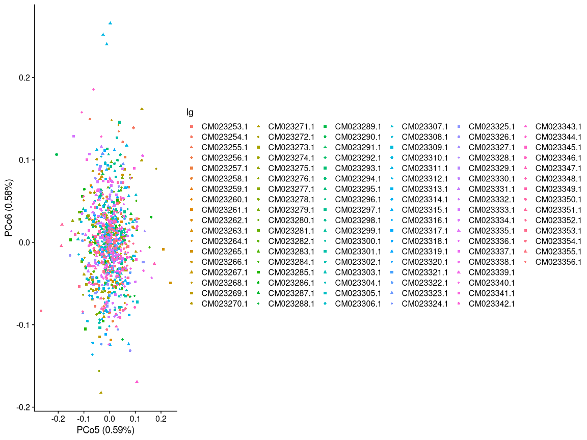<!-- -->

``` r
ggplot(mds10000,aes(x=dist_7, y=dist_8, color=lg, shape=lg)) +
  geom_point() +
  scale_shape_manual(values = c(rep(c(15,16,17,18),26))) +
  xlab(paste0("PCo7 (", proportion_variance[7], "%)")) +
  ylab(paste0("PCo8 (", proportion_variance[8], "%)")) +
  cowplot::theme_cowplot()
```

<!-- -->

## Run local PCA 1000 SNP window

``` bash
## Run on cluster
## Job ID 

echo '#!/bin/bash 
bash /fs/cbsubscb16/storage/genomic-data-analysis/scripts/run_local_pca.sh /fs/cbsubscb16/storage/rkc/angsd/PCAM-PPLA-wholegenome_polymorphic.beagle.gz /fs/cbsubscb16/storage/rkc/sample_lists/lg_list.txt 1000 2 26 /fs/cbsubscb16/storage/genomic-data-analysis/scripts/local_pca_1.sh /fs/cbsubscb16/storage/genomic-data-analysis/scripts/local_pca_2.R python /programs/pcangsd-1.10/pcangsd/pcangsd.py' | \
sbatch \
--nodelist=cbsubscb16 \
--partition=regular \
--nodes=1 \
--ntasks=26 \
--mem=5G \
--output=/home/cas399/rkc/log/local_pca_all_chr_1000.log
```

### Assemble local_pca input - 1000snp

``` r
lg_list <- read_lines("/fs/cbsubscb16/storage/rkc/sample_lists/lg_list.txt")
i=1
for (lg in lg_list){
  pca_summary_temp <- read_tsv(paste0("/fs/cbsubscb16/storage/rkc/angsd/local_pca/window1000/pca_summary_1000snp_", lg, "_2pc.tsv"), col_names = F)
  snp_position_temp <- read_tsv(paste0("/fs/cbsubscb16/storage/rkc/angsd/local_pca/window1000/snp_position_1000snp_", lg, "_2pc.tsv"), col_names = F)
  if (i == 1) {
    pca_summary <- pca_summary_temp
    snp_position <- snp_position_temp
  } else {
    pca_summary <- bind_rows(pca_summary, pca_summary_temp)
    snp_position <- bind_rows(snp_position, snp_position_temp)
  }
  i <- i+1
}

write_tsv(pca_summary, "/fs/cbsubscb16/storage/rkc/angsd/local_pca/window1000/pca_summary_1000snp_2pc.tsv", col_names = F)
write_tsv(snp_position, "/fs/cbsubscb16/storage/rkc/angsd/local_pca/window1000/snp_position_1000snp_2pc.tsv", col_names = F)
```

### Run pc_dist and assemble the output - 1000snp

``` r
rscript <- "library(tidyverse)
library(lostruct)
## Read the input
pca_summary <- read_tsv('/fs/cbsubscb16/storage/rkc/angsd/local_pca/window1000/pca_summary_1000snp_2pc.tsv', col_names = F) 
## Run pc_dist with pca_summary
pca_summary <- as.matrix(pca_summary)
attr(pca_summary, 'npc') <- 2
dist <- pc_dist(pca_summary)
write_tsv(as.data.frame(dist), '/fs/cbsubscb16/storage/rkc/angsd/local_pca/window1000/window_dist_1000snp_2pc.tsv', col_names = F)"
write_lines(rscript, "/fs/cbsubscb16/storage/rkc/scripts/run_pc_dist_1000snp_2pc.R")
```

``` r
nohup /programs/R-4.2.1-r9/bin/Rscript /fs/cbsubscb16/storage/rkc/scripts/run_pc_dist_1000snp_2pc.R \
> /fs/cbsubscb16/storage/rkc/nohups/run_pc_dist_1000snp_2pc.nohup 2>&1 &
```

### Analysis with all windows - 1000snp

``` r
## Read the SNP position file
snp_position <- read_tsv("/fs/cbsubscb16/storage/rkc/angsd/local_pca/window1000/snp_position_1000snp_2pc.tsv", col_names = F) %>%
  transmute(lg = sub("\\_.*", "", X1), 
            start = as.integer(sub(".*\\_", "", X1)), 
            stop = as.integer(sub(".*\\_", "", X2)), 
            center = (start+stop)/2)
## Read in the window distance matrix
dist <- read_tsv("/fs/cbsubscb16/storage/rkc/angsd/local_pca/window1000/window_dist_1000snp_2pc.tsv", col_names = F) %>%
  as.matrix()
## Do MDS with the distance matrix
# mds <- cmdscale(as.dist(dist), k=10, eig = T)
# proportion_variance <- round(mds$eig/sum(mds$eig)*100,2)
# mds <- mds$points %>%
#   as.data.frame() %>%
#   set_names(paste0("dist_", 1:10)) %>%
#   bind_cols(snp_position, .)

mds_table <- read_tsv("/fs/cbsubscb16/storage/rkc/angsd/local_pca/window1000/mds_table.tsv")

## Rename chromosomes in numerical order
mds_chr <- mds_table %>% 
  mutate(lgN = NA, .after = lg)
mds_chr$lgN[1] <- "LG001"
n=1
for(i in 2:length(mds_chr$lg)){
  if(mds_chr$lg[i] == mds_chr$lg[i-1]){
    mds_chr$lgN[i] <- paste("LG",sprintf("%03.0f", n), sep = "")
  }
  if(mds_chr$lg[i] != mds_chr$lg[i-1]){
    n <- n+1
    mds_chr$lgN[i] <- paste("LG",sprintf("%03.0f", n), sep = "")
  }
}
mds_chr <- mds_chr %>% 
  dplyr::select(-lg) 

#write_tsv(mds, "/fs/cbsubscb16/storage/rkc/angsd/local_pca/window1000/mds_table.tsv")

# Make chromosome list file w/ a chromosome name column and a number column
# chr_list <- mds_chr %>% 
#   dplyr::select(lg, lgN) %>% 
#   rename(chr = lg, chr_num = lgN) %>% 
#   unique()
#write_tsv(chr_list, "/fs/cbsubscb16/storage/rkc/sample_lists/chrom_meta_data.txt")
```

``` r
mds_table <- read_tsv("/fs/cbsubscb16/storage/rkc/angsd/local_pca/window1000/mds_table.tsv")
```

    ## Rows: 9028 Columns: 14
    ## ── Column specification ────────────────────────────────────────────────────────
    ## Delimiter: "\t"
    ## chr  (1): lg
    ## dbl (13): start, stop, center, dist_1, dist_2, dist_3, dist_4, dist_5, dist_...
    ## 
    ## ℹ Use `spec()` to retrieve the full column specification for this data.
    ## ℹ Specify the column types or set `show_col_types = FALSE` to quiet this message.

``` r
mds_chr %>%
  gather(key = axis, value = value, 5:14) %>%
  mutate(axis=fct_relevel(axis, paste0("dist_", 1:10))) %>%
  ggplot(aes(x=center/10^6, y=value, color=axis)) +
  geom_point(size=0.5) +
  facet_grid(axis~lgN, scales="free_x", space="free_x") +
  theme_bw() +
  xlab("position (Mbp)") +
  ylab("principal coordinate value") +
  theme(panel.spacing = unit(0.1, "lines"),
      axis.title.x=element_text(),
      legend.position="none",
      text = element_text(size=10),
      axis.text = element_text(size=6),
      panel.grid.major = element_blank(), 
      panel.grid.minor = element_blank()) 
```

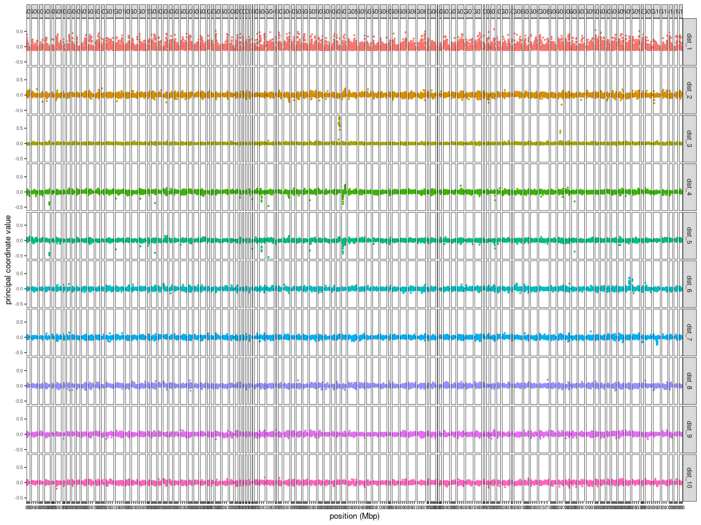<!-- -->

``` r
#ggsave("/fs/cbsubscb16/storage/rkc/figures/local_pca_scan_1000snp.png", plot = last_plot(), device = "png", width = 20, height = 10, units = "in")
ggplot(mds_chr, aes(x=dist_1, y=dist_2, color=lgN, shape=lgN)) +
  geom_point() +
  scale_shape_manual(values = c(rep(c(15,16,17,18),26))) +
  xlab(paste0("PCo1 (", proportion_variance[1], "%)")) +
  ylab(paste0("PCo2 (", proportion_variance[2], "%)")) +
  cowplot::theme_cowplot()
```

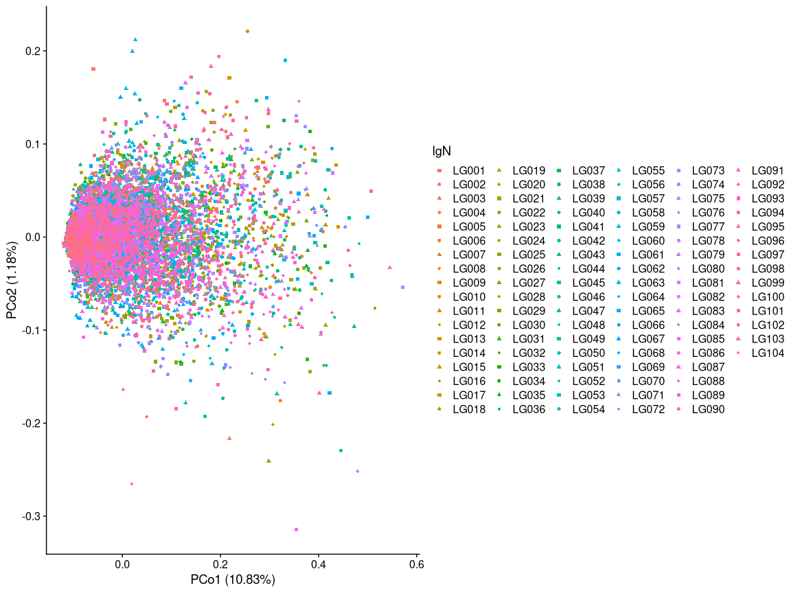<!-- -->

``` r
ggplot(mds_chr, aes(x=dist_3, y=dist_4, color=lgN, shape=lgN)) +
  geom_point() +
  scale_shape_manual(values = c(rep(c(15,16,17,18),26))) +
  xlab(paste0("PCo3 (", proportion_variance[3], "%)")) +
  ylab(paste0("PCo4 (", proportion_variance[4], "%)")) +
  cowplot::theme_cowplot()
```

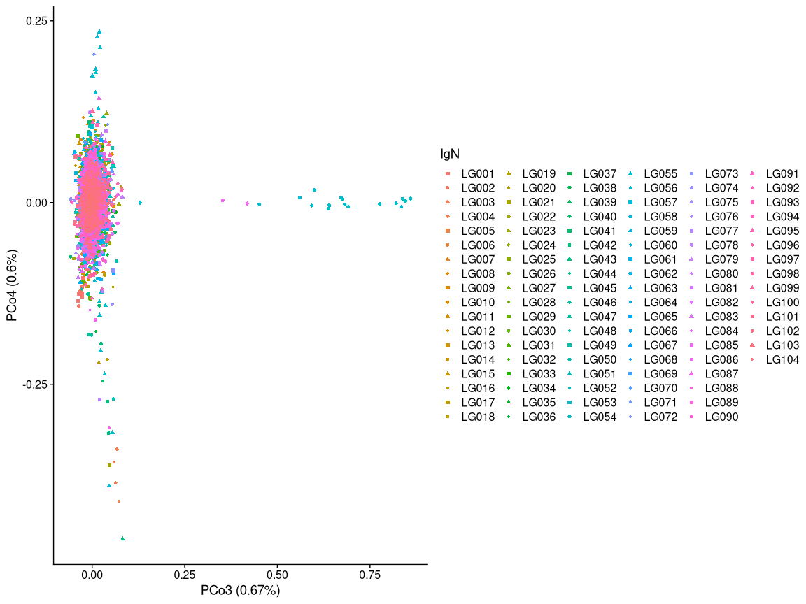<!-- -->

``` r
ggplot(mds_chr, aes(x=dist_4, y=dist_5, color=lgN, shape=lgN)) +
  geom_point() +
  scale_shape_manual(values = c(rep(c(15,16,17,18),26))) +
  xlab(paste0("PCo4 (", proportion_variance[4], "%)")) +
  ylab(paste0("PCo5 (", proportion_variance[5], "%)")) +
  cowplot::theme_cowplot()
```

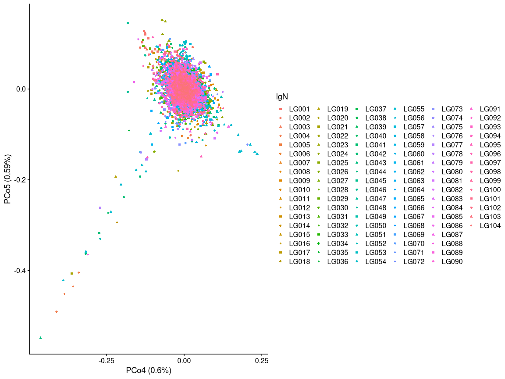<!-- -->

## Find top 1% of outliers

``` r
mds_dist1_outliers <- mds_chr %>% 
  arrange(desc(dist_1)) %>% 
  head(.,90)

## top 90% outliers for dist_1 is > 0.3596825. We'll round to 0.3 
# name outliers for dist_1 
mds_chr %>% 
  gather(key = axis, value = value, 5:14) %>%
  mutate(axis=fct_relevel(axis, paste0("dist_", 1:10))) %>% 
  filter(axis %in% paste0("dist_", c(1, 3, 4, 5, 7))) %>%
  mutate(outlier = ifelse ( (axis=="dist_1" & value > 0.3) | (axis=="dist_3" & value > 0.1) | (axis=="dist_4" & value < -0.1) | (axis=="dist_4" & value > 0.1) | (axis=="dist_5" & value < -0.1) | (lgN == "LG100" & axis=="dist_7" & value < -0.07),TRUE, FALSE) ) %>%
  ggplot(aes(x=center/10^6, y=value, color=outlier)) +
  geom_point(size=0.5) +
  scale_color_manual(values = c("grey", "red")) +
  facet_grid(axis~lgN, scales="free", space="free_x") +
  theme_bw() +
  xlab("position (Mbp)") +
  ylab("principal coordinate value") +
  theme(panel.spacing = unit(0.1, "lines"),
      axis.title.x=element_text(),
      legend.position="none",
      text = element_text(size=10),
      axis.text.x = element_blank(),
      axis.ticks.x = element_blank(),
      axis.text = element_text(size=6),
      panel.grid.major = element_blank(), 
      panel.grid.minor = element_blank()) 
```

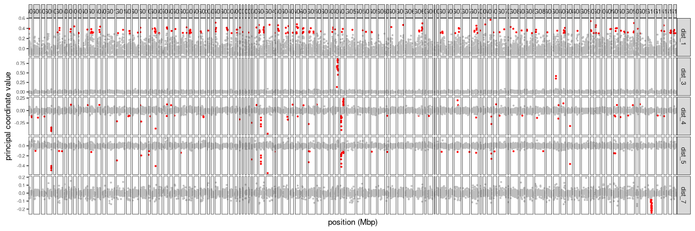<!-- -->

``` r
mds_chr %>% arrange(desc(dist_2))
```

    ## # A tibble: 9,028 × 14
    ##    lgN    start   stop center  dist_1 dist_2   dist_3   dist_4   dist_5   dist_6
    ##    <chr>  <dbl>  <dbl>  <dbl>   <dbl>  <dbl>    <dbl>    <dbl>    <dbl>    <dbl>
    ##  1 LG014 6.53e6 6.94e6 6.73e6  0.255   0.221 -0.00235 -3.53e-2 -0.0209  -0.0491 
    ##  2 LG055 3.48e7 3.50e7 3.49e7  0.0264  0.212  0.0142   2.28e-1 -0.138    0.0225 
    ##  3 LG055 3.32e7 3.34e7 3.33e7  0.0205  0.199  0.0217   2.13e-1 -0.122    0.0350 
    ##  4 LG002 5.00e7 5.16e7 5.08e7  0.197   0.194  0.00384 -5.09e-2  0.0371   0.00934
    ##  5 LG058 1.30e7 1.36e7 1.33e7  0.332   0.190 -0.0228   3.34e-2  0.0335   0.0361 
    ##  6 LG095 3.87e7 3.92e7 3.90e7  0.181   0.183  0.0288  -4.46e-2  0.0182   0.0296 
    ##  7 LG001 3.00e7 3.08e7 3.04e7 -0.0591  0.181 -0.0382  -1.35e-1  0.103    0.00727
    ##  8 LG101 1.35e7 1.42e7 1.38e7  0.140   0.172 -0.00652 -1.01e-1  0.0505  -0.0223 
    ##  9 LG013 2.90e7 2.95e7 2.93e7  0.218   0.171  0.00535  4.56e-2  0.00528  0.0402 
    ## 10 LG079 2.39e7 2.44e7 2.42e7  0.129   0.166  0.0536  -7.75e-4 -0.00472  0.0482 
    ## # … with 9,018 more rows, and 4 more variables: dist_7 <dbl>, dist_8 <dbl>,
    ## #   dist_9 <dbl>, dist_10 <dbl>

``` r
## Nothing > 0.23 for dist_2

mds_dist3_outliers <- mds_chr %>% 
  arrange(desc(dist_3)) %>% 
  head(.,18)
## islands in dist_3 are > 0.35242881
ggplot(mds_dist1_outliers, aes(x=dist_3, y=dist_4, color=lgN, shape=lgN)) +
  geom_point() +
  scale_shape_manual(values = c(rep(c(15,16,17,18),26))) +
  xlab(paste0("PCo3 (", proportion_variance[3], "%)")) +
  ylab(paste0("PCo4 (", proportion_variance[4], "%)")) +
  cowplot::theme_cowplot()
```

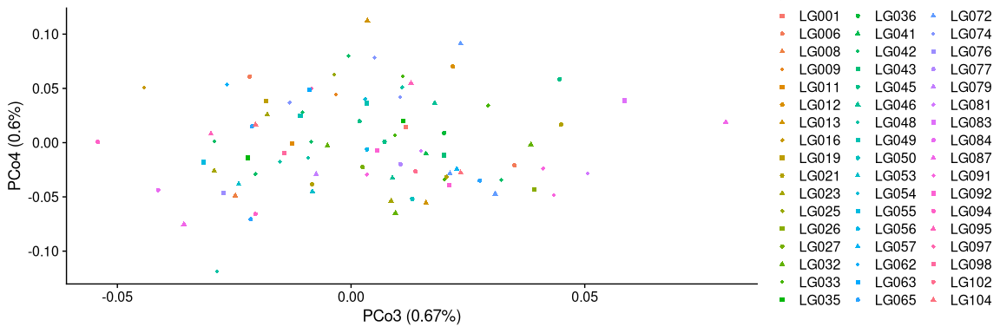<!-- -->

## Look at PCA pattern with local PCA outliers

#### First make a list of beagle files

``` bash
ls /fs/cbsubscb16/storage/rkc/angsd/local_pca/*beagle*.gz > /fs/cbsubscb16/storage/rkc/angsd/local_pca/window1000/beagle_list.txt
```

#### Subset the list of all beagle files to only include outlier windows

``` r
# Nicolas did this step which is likely only necessary if you filter out inversion before looking for outliers. 
# We could probably just use regular mds table
# mds_table <- mds %>% 
#   mutate(start=str_c(lg, start, sep = "_"), stop=str_c(lg, stop, sep = "_")) %>% dplyr::select(-lg)

beagle_list <- read_tsv("/fs/cbsubscb16/storage/rkc/angsd/local_pca/window1000/beagle_list.txt", col_names = F)
```

    ## Rows: 9028 Columns: 1
    ## ── Column specification ────────────────────────────────────────────────────────
    ## Delimiter: "\t"
    ## chr (1): X1
    ## 
    ## ℹ Use `spec()` to retrieve the full column specification for this data.
    ## ℹ Specify the column types or set `show_col_types = FALSE` to quiet this message.

``` r
## dist_1 outliers
dist1_outlier_index <- which(mds_table$dist_1 > 0.3)
beagle_list_dist1_outlier <- beagle_list[dist1_outlier_index,]
write_tsv(beagle_list_dist1_outlier, "/fs/cbsubscb16/storage/rkc/angsd/local_pca/window1000/beagle_list_dist1_outlier.txt", col_names = F)

## dist_3 outliers
dist3_outlier_index <- which(mds_table$dist_3 > 0.1)
beagle_list_dist3_outlier <- beagle_list[dist3_outlier_index,]
write_tsv(beagle_list_dist3_outlier, "/fs/cbsubscb16/storage/rkc/angsd/local_pca/window1000/beagle_list_dist3_outlier.txt", col_names = F)

## dist_4 outliers
dist4_outlier_index <- which(mds_table$dist_4 < -0.1 | mds_table$dist_4 > 0.1)
beagle_list_dist4_outlier <- beagle_list[dist4_outlier_index,]
write_tsv(beagle_list_dist4_outlier, "/fs/cbsubscb16/storage/rkc/angsd/local_pca/window1000/beagle_list_dist4_outlier.txt", col_names = F)

## dist_5 outliers
dist5_outlier_index <- which(mds_table$dist_5 < -0.1)
beagle_list_dist5_outlier <- beagle_list[dist5_outlier_index,]
write_tsv(beagle_list_dist5_outlier, "/fs/cbsubscb16/storage/rkc/angsd/local_pca/window1000/beagle_list_dist5_outlier.txt", col_names = F)

## dist_7 chr 100 outliers
dist7_outlier_index <- which(str_detect(mds_table$start, "CM023352.1") & mds_table$dist_7 < -0.07)
beagle_list_dist7_outlier <- beagle_list[dist7_outlier_index,]
# write_tsv(beagle_list_dist5_outlier, "/fs/cbsubscb16/storage/rkc/angsd/local_pca/window1000/beagle_list_dist5_outlier.txt", col_names = F)
```

#### Make combined beagle files across outlier windows

``` bash
## dist_1
for BEAGLE in `cat /fs/cbsubscb16/storage/rkc/angsd/local_pca/window1000/beagle_list_dist1_outlier.txt`; do
  if [ ! -f /fs/cbsubscb16/storage/rkc/angsd/local_pca/window1000/PCAM-PPLA-wholegenome_polymorphic.beagle.dist1_outlier ] ; then
    zcat $BEAGLE > /fs/cbsubscb16/storage/rkc/angsd/local_pca/window1000/PCAM-PPLA-wholegenome_polymorphic.beagle.dist1_outlier
  else zcat $BEAGLE | tail -n +2 >> /fs/cbsubscb16/storage/rkc/angsd/local_pca/window1000/PCAM-PPLA-wholegenome_polymorphic.beagle.dist1_outlier
  fi
done
gzip /fs/cbsubscb16/storage/rkc/angsd/local_pca/window1000/PCAM-PPLA-wholegenome_polymorphic.beagle.dist1_outlier

## dist_3 
for BEAGLE in `cat /fs/cbsubscb16/storage/rkc/angsd/local_pca/window1000/beagle_list_dist3_outlier.txt`; do
  if [ ! -f /fs/cbsubscb16/storage/rkc/angsd/local_pca/window1000/PCAM-PPLA-wholegenome_polymorphic.beagle.dist3_outlier ] ; then
    zcat $BEAGLE > /fs/cbsubscb16/storage/rkc/angsd/local_pca/window1000/PCAM-PPLA-wholegenome_polymorphic.beagle.dist3_outlier
  else zcat $BEAGLE | tail -n +2 >> /fs/cbsubscb16/storage/rkc/angsd/local_pca/window1000/PCAM-PPLA-wholegenome_polymorphic.beagle.dist3_outlier
  fi
done
gzip /fs/cbsubscb16/storage/rkc/angsd/local_pca/window1000/PCAM-PPLA-wholegenome_polymorphic.beagle.dist3_outlier

## dist_4
for BEAGLE in `cat /fs/cbsubscb16/storage/rkc/angsd/local_pca/window1000/beagle_list_dist4_outlier.txt`; do
  if [ ! -f /fs/cbsubscb16/storage/rkc/angsd/local_pca/window1000/PCAM-PPLA-wholegenome_polymorphic.beagle.dist4_outlier ] ; then
    zcat $BEAGLE > /fs/cbsubscb16/storage/rkc/angsd/local_pca/window1000/PCAM-PPLA-wholegenome_polymorphic.beagle.dist4_outlier
  else zcat $BEAGLE | tail -n +2 >> /fs/cbsubscb16/storage/rkc/angsd/local_pca/window1000/PCAM-PPLA-wholegenome_polymorphic.beagle.dist4_outlier
  fi
done
gzip /fs/cbsubscb16/storage/rkc/angsd/local_pca/window1000/PCAM-PPLA-wholegenome_polymorphic.beagle.dist4_outlier

## dist_5
for BEAGLE in `cat /fs/cbsubscb16/storage/rkc/angsd/local_pca/window1000/beagle_list_dist5_outlier.txt`; do
  if [ ! -f /fs/cbsubscb16/storage/rkc/angsd/local_pca/window1000/PCAM-PPLA-wholegenome_polymorphic.beagle.dist5_outlier ] ; then
    zcat $BEAGLE > /fs/cbsubscb16/storage/rkc/angsd/local_pca/window1000/PCAM-PPLA-wholegenome_polymorphic.beagle.dist5_outlier
  else zcat $BEAGLE | tail -n +2 >> /fs/cbsubscb16/storage/rkc/angsd/local_pca/window1000/PCAM-PPLA-wholegenome_polymorphic.beagle.dist5_outlier
  fi
done
gzip /fs/cbsubscb16/storage/rkc/angsd/local_pca/window1000/PCAM-PPLA-wholegenome_polymorphic.beagle.dist5_outlier

## dist_7 chr 100
for BEAGLE in `cat /fs/cbsubscb16/storage/rkc/angsd/local_pca/window1000/beagle_list_dist7_outlier.txt`; do
  if [ ! -f /fs/cbsubscb16/storage/rkc/angsd/local_pca/window1000/PCAM-PPLA-wholegenome_polymorphic.beagle.dist7_outlier ] ; then
    zcat $BEAGLE > /fs/cbsubscb16/storage/rkc/angsd/local_pca/window1000/PCAM-PPLA-wholegenome_polymorphic.beagle.dist7_outlier
  else zcat $BEAGLE | tail -n +2 >> /fs/cbsubscb16/storage/rkc/angsd/local_pca/window1000/PCAM-PPLA-wholegenome_polymorphic.beagle.dist7_outlier
  fi
done
gzip /fs/cbsubscb16/storage/rkc/angsd/local_pca/window1000/PCAM-PPLA-wholegenome_polymorphic.beagle.dist7_outlier
```

#### Run pcangsd on outlier beagles from each dist

``` bash
export PYTHONPATH=/programs/pcangsd-1.10/lib64/python3.9/site-packages:/programs/pcangsd-1.10/lib/python3.9/site-packages:/programs/pcangsd-1.10/pcangsd

export LD_LIBRARY_PATH=/programs/pcangsd-1.10/pcangsd

## dist_1
nohup python /programs/pcangsd-1.10/pcangsd/pcangsd.py --beagle /fs/cbsubscb16/storage/rkc/angsd/local_pca/window1000/PCAM-PPLA-wholegenome_polymorphic.beagle.dist1_outlier.gz -o /fs/cbsubscb16/storage/rkc/angsd/local_pca/window1000/PCAM-PPLA-wholegenome_polymorphic.beagle.dist1_outlier --threads 16 &
## dist_3
nohup python /programs/pcangsd-1.10/pcangsd/pcangsd.py --beagle /fs/cbsubscb16/storage/rkc/angsd/local_pca/window1000/PCAM-PPLA-wholegenome_polymorphic.beagle.dist3_outlier.gz -o /fs/cbsubscb16/storage/rkc/angsd/local_pca/window1000/PCAM-PPLA-wholegenome_polymorphic.beagle.dist3_outlier --threads 16 &
## dist_4
nohup python /programs/pcangsd-1.10/pcangsd/pcangsd.py --beagle /fs/cbsubscb16/storage/rkc/angsd/local_pca/window1000/PCAM-PPLA-wholegenome_polymorphic.beagle.dist4_outlier.gz -o /fs/cbsubscb16/storage/rkc/angsd/local_pca/window1000/PCAM-PPLA-wholegenome_polymorphic.beagle.dist4_outlier --threads 16 &
## dist_5
nohup python /programs/pcangsd-1.10/pcangsd/pcangsd.py --beagle /fs/cbsubscb16/storage/rkc/angsd/local_pca/window1000/PCAM-PPLA-wholegenome_polymorphic.beagle.dist5_outlier.gz -o /fs/cbsubscb16/storage/rkc/angsd/local_pca/window1000/PCAM-PPLA-wholegenome_polymorphic.beagle.dist5_outlier --threads 16 &
## dist_7
nohup python /programs/pcangsd-1.10/pcangsd/pcangsd.py --beagle /fs/cbsubscb16/storage/rkc/angsd/local_pca/window1000/PCAM-PPLA-wholegenome_polymorphic.beagle.dist7_outlier.gz -o /fs/cbsubscb16/storage/rkc/angsd/local_pca/window1000/PCAM-PPLA-wholegenome_polymorphic.beagle.dist7_outlier --threads 16 &
```

## Plot these PCAs

``` r
sample_table <- read_tsv("/fs/cbsubscb16/storage/rkc/sample_lists/sample_table.tsv")
```

    ## Rows: 183 Columns: 9
    ## ── Column specification ────────────────────────────────────────────────────────
    ## Delimiter: "\t"
    ## chr (6): population, Loc, GeneralLoc, k3_inferred_pop, k4_inferred_pop, k5_i...
    ## dbl (3): ABLG, StartLatDD, StartLonDD
    ## 
    ## ℹ Use `spec()` to retrieve the full column specification for this data.
    ## ℹ Specify the column types or set `show_col_types = FALSE` to quiet this message.

#### MDS axis 1

``` r
alpha = 0.7
size = 3
dist1_outlier_cov <- read_delim("/fs/cbsubscb16/storage/rkc/angsd/local_pca/window1000/PCAM-PPLA-wholegenome_polymorphic.beagle.dist1_outlier.cov", delim = " ", col_names = F) %>% as.matrix()
```

    ## Rows: 183 Columns: 183
    ## ── Column specification ────────────────────────────────────────────────────────
    ## Delimiter: " "
    ## dbl (183): X1, X2, X3, X4, X5, X6, X7, X8, X9, X10, X11, X12, X13, X14, X15,...
    ## 
    ## ℹ Use `spec()` to retrieve the full column specification for this data.
    ## ℹ Specify the column types or set `show_col_types = FALSE` to quiet this message.

``` r
PCA(dist1_outlier_cov, sample_table$ABLG, sample_table$Loc, 1, 2,show.ellipse = F, show.line = F, show.label = F, index_exclude=c(94, 95, 103, 106, 107, 109, 110, 118, 119, 120, 121))
```

    ## Warning: Using `size` aesthetic for lines was deprecated in ggplot2 3.4.0.
    ## ℹ Please use `linewidth` instead.

<!-- -->

``` r
dist3_outlier_cov <- read_delim("/fs/cbsubscb16/storage/rkc/angsd/local_pca/window1000/PCAM-PPLA-wholegenome_polymorphic.beagle.dist3_outlier.cov", delim = " ", col_names = F) %>% as.matrix()
```

    ## Rows: 183 Columns: 183
    ## ── Column specification ────────────────────────────────────────────────────────
    ## Delimiter: " "
    ## dbl (183): X1, X2, X3, X4, X5, X6, X7, X8, X9, X10, X11, X12, X13, X14, X15,...
    ## 
    ## ℹ Use `spec()` to retrieve the full column specification for this data.
    ## ℹ Specify the column types or set `show_col_types = FALSE` to quiet this message.

``` r
PCA(dist3_outlier_cov, sample_table$ABLG, sample_table$Loc, 1, 2,show.ellipse = F, show.line = F, show.label = F, index_exclude=c(94, 95, 103, 106, 107, 109, 110, 118, 119, 120, 121))
```

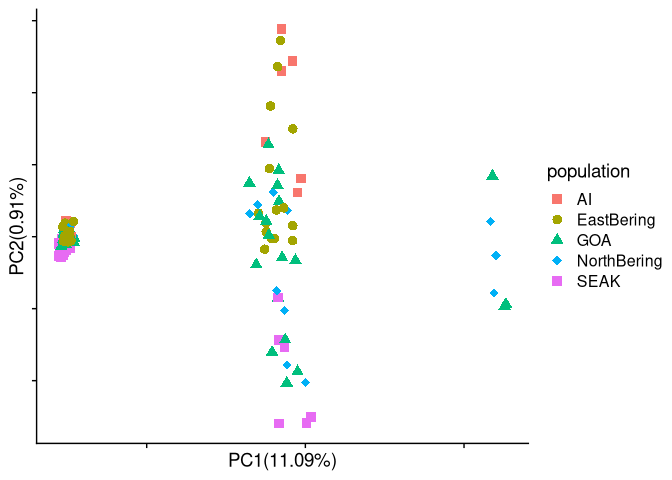<!-- -->

``` r
dist4_outlier_cov <- read_delim("/fs/cbsubscb16/storage/rkc/angsd/local_pca/window1000/PCAM-PPLA-wholegenome_polymorphic.beagle.dist4_outlier.cov", delim = " ", col_names = F) %>% as.matrix()
```

    ## Rows: 183 Columns: 183
    ## ── Column specification ────────────────────────────────────────────────────────
    ## Delimiter: " "
    ## dbl (183): X1, X2, X3, X4, X5, X6, X7, X8, X9, X10, X11, X12, X13, X14, X15,...
    ## 
    ## ℹ Use `spec()` to retrieve the full column specification for this data.
    ## ℹ Specify the column types or set `show_col_types = FALSE` to quiet this message.

``` r
PCA(dist4_outlier_cov, sample_table$ABLG, sample_table$Loc, 1, 2,show.ellipse = F, show.line = F, show.label = F, index_exclude=c(94, 95, 103, 106, 107, 109, 110, 118, 119, 120, 121))
```

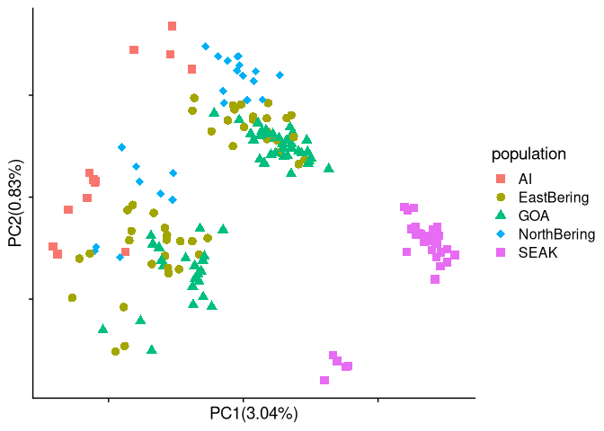<!-- -->

``` r
dist5_outlier_cov <- read_delim("/fs/cbsubscb16/storage/rkc/angsd/local_pca/window1000/PCAM-PPLA-wholegenome_polymorphic.beagle.dist5_outlier.cov", delim = " ", col_names = F) %>% as.matrix()
```

    ## Rows: 183 Columns: 183
    ## ── Column specification ────────────────────────────────────────────────────────
    ## Delimiter: " "
    ## dbl (183): X1, X2, X3, X4, X5, X6, X7, X8, X9, X10, X11, X12, X13, X14, X15,...
    ## 
    ## ℹ Use `spec()` to retrieve the full column specification for this data.
    ## ℹ Specify the column types or set `show_col_types = FALSE` to quiet this message.

``` r
PCA(dist5_outlier_cov, sample_table$ABLG, sample_table$Loc, 1, 2,show.ellipse = F, show.line = F, show.label = F, index_exclude=c(94, 95, 103, 106, 107, 109, 110, 118, 119, 120, 121))
```

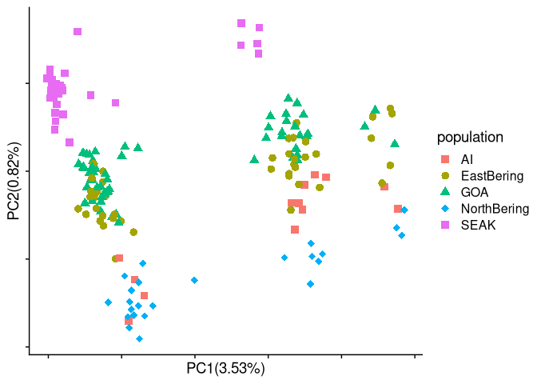<!-- -->

``` r
dist7_outlier_cov <- read_delim("/fs/cbsubscb16/storage/rkc/angsd/local_pca/window1000/PCAM-PPLA-wholegenome_polymorphic.beagle.dist7_outlier.cov", delim = " ", col_names = F) %>% as.matrix()
```

    ## Rows: 183 Columns: 183
    ## ── Column specification ────────────────────────────────────────────────────────
    ## Delimiter: " "
    ## dbl (183): X1, X2, X3, X4, X5, X6, X7, X8, X9, X10, X11, X12, X13, X14, X15,...
    ## 
    ## ℹ Use `spec()` to retrieve the full column specification for this data.
    ## ℹ Specify the column types or set `show_col_types = FALSE` to quiet this message.

``` r
PCA(dist7_outlier_cov, sample_table$ABLG, sample_table$Loc, 1, 2,show.ellipse = F, show.line = F, show.label = F, index_exclude=c(94, 95, 103, 106, 107, 109, 110, 118, 119, 120, 121))
```

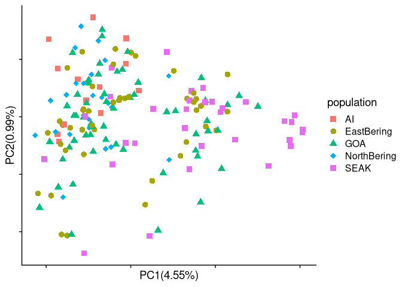<!-- -->
