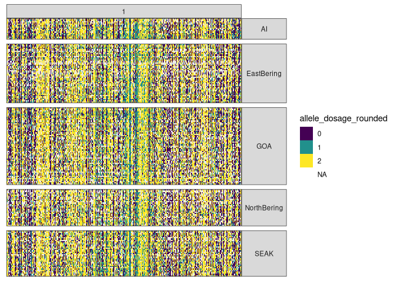
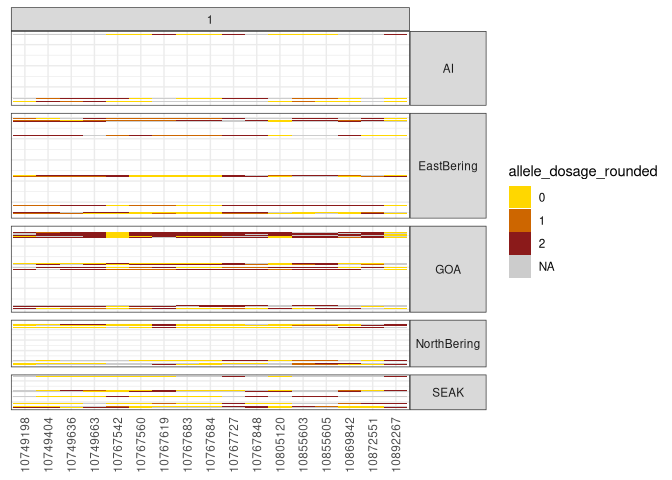
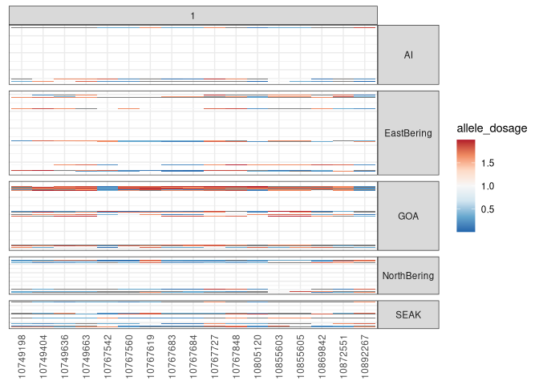
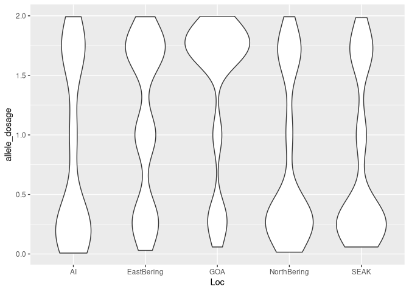

SNP Heatmap
================

## load appropriate libraries and data

``` r
library(tidyverse)
library(knitr)
sample_table <- read_tsv("/fs/cbsubscb16/storage/rkc/sample_lists/sample_table.tsv", col_types = c(rep("c",4),"d","d",rep("c",3)))

## Define a function to get allele dosage from genotype likelihood
get_allele_dosage <- function(x){
  if(x[2]==x[3] & x[3]==x[4]){
    return(NA) ## return NA at sites with no coverages (where rescaled GLs are 0.333, 0.333, 0.333)
  } else {
    if(x[1]>0.5) { ## polarize the GLs based on frequency at reference individual
      x[2:4] <- x[4:2]
    }
    return(x[3] + 2*x[4])
  }
}
```

``` bash
## subset outlier region on chromosome 100
## outlier region is between 10744898-11050174 which corresponds with lines 14821-15070.
## We'll capture adjacent regions too: 10600000-11200000, corresponding to 
zcat angsd/PCAM-PPLA-wholegenome_polymorphic_CM023352.1.beagle.gz | sed -n -e '1p' -e '14635,15268p;15269q' | gzip > angsd/PCAM-PPLA-wholegenome_polymorphic_CM023352.1_outlierPlus.beagle.gz
```

``` bash
# extract chromosome 100 from whole genome beagle file
zcat /fs/cbsubscb16/storage/rkc/angsd/PCAM-PPLA_wgph.beagle.gz | awk -v pattern="CM023352.1|marker" '$1 ~ pattern' | gzip > /fs/cbsubscb16/storage/rkc/angsd/PCAM-PPLA_wgph_chr100.beagle.gz
```

``` r
# read beagle file
outlier_beagle <- read_tsv("/fs/cbsubscb16/storage/rkc/angsd/PCAM-PPLA-wholegenome_polymorphic_CM023352.1_outlierPlus.beagle.gz") #%>% dplyr::select(-c(Ind336...505,Ind336...506,Ind336...507))

# ngsParalog dataset
outlier_beagle <- read_tsv("/fs/cbsubscb16/storage/rkc/angsd/PCAM-PPLA_wgph_chr100.beagle.gz") #%>% dplyr::select(-c(Ind336...505,Ind336...506,Ind336...507))
```

## Polarize genotype probabilities

``` r
# We will polarize by a Gulf of Alaska population with no admixture with East Bering. Let's use ABLG5592
# reduce outlier beagle to first 30 row to test script
outlier_beagle_30 <- head(outlier_beagle, 30)
```

``` r
# try nicolas' and liams script for extracting allelic dosage and polarize in same step
# separate linkage group and position 
outlier_beagle <- outlier_beagle %>% separate(marker, c(NA ,"lg", "pos")) %>% 
  dplyr::select(-allele2)

# set up the data frame, ncols should equal the number of samples and nrows should equal the number of loci
dosage <- as.data.frame(matrix(ncol = (ncol(outlier_beagle)-3)/3+3, nrow = nrow(outlier_beagle)))
dosage[,1:3]=outlier_beagle[,1:3]

## Get allele dosage iteratively from each individual
# 4 columns are extracted for each individual. the 1st of the four columns is the GL for the major allele for the polarizing individual. Choose the reference column according to the individual you want to polarize from. In our case, that is column 67 (ABLG5418)
for (j in 1:((ncol(outlier_beagle)-3)/3)){
  temp_ind <- outlier_beagle[,c(67, (1+3*j):(3+3*j))]
  dosage[,3+j] <- apply(temp_ind, 1, get_allele_dosage)
}

# rename columns to match sample names

colnames(dosage) <- c("V1","V2","V3",as.double(sample_table$ABLG))
```

#### Convert to long format for plotting

``` r
dosage_long <- pivot_longer(dosage, cols = 4:ncol(dosage), names_to = "ABLG", values_to = "allele_dosage") %>% 
  dplyr::select(-V3) %>% 
  rename(lg = V1, pos = V2) %>% 
  left_join(dplyr::select(sample_table, population, Loc, ABLG), by = "ABLG")

#write_tsv(dosage_long, "/fs/cbsubscb16/storage/rkc/angsd/PCAM-PPLA-wholegenome_polymorphic_CM023352.1_outlierPlus.alleledosage.tsv")
```

## Plot genotype heatmaps

``` r
# dosage_long <- read_tsv("/fs/cbsubscb16/storage/rkc/angsd/PCAM-PPLA-wholegenome_polymorphic_CM023352.1_outlierPlus.alleledosage.tsv")

dosage_long_plot <- dosage_long %>% 
  mutate(allele_dosage_rounded = as.character(round(allele_dosage))) %>% 
  ggplot(aes(x=as_factor(pos), y=ABLG, fill = allele_dosage_rounded)) +
  geom_tile() +
  scale_fill_viridis_d(direction = 1) +
  facet_grid(Loc~lg, scales = "free", space = "free") +
  theme_bw() +
  theme(axis.text = element_blank(),
        axis.title = element_blank(),
        axis.ticks.x = element_blank(),
        axis.ticks.y = element_blank(),
        panel.spacing.x = unit(0.2, "lines"),
        strip.text.y = element_text(angle = 0))
dosage_long_plot
```

<!-- -->

``` r
#ggsave("/fs/cbsubscb16/storage/rkc/figures/snp_heatmap_chr100_outlier.png", device = "png",width = 11, height = 8.5)
```

## Zoom in on outlier area only (chr100 (CM023352.1) positions 10744898-11050174)

``` bash
## subset outlier region on chromosome 100
## outlier region is between 10744898-11050174 which corresponds with lines 14821-15070.
zcat angsd/PCAM-PPLA-wholegenome_polymorphic_CM023352.1.beagle.gz | sed -n -e '1p' -e '14821,15070p;15071q' | gzip > angsd/PCAM-PPLA-wholegenome_polymorphic_CM023352.1_outlierZoom.beagle.gz

## subset outlier region on chr100 for ngsParalogs dataset
## outlier region is between 10747909-10894263
zcat angsd/PCAM-PPLA_wgph_chr100.beagle.gz | sed -n -e '1p' -e '13798,13916p;13917q' | gzip > angsd/PCAM-PPLA_wgph_chr100_outlier.beagle.gz
```

``` r
# read beagle file
#outlier_beagle_zoom <- read_tsv("/fs/cbsubscb16/storage/rkc/angsd/PCAM-PPLA-wholegenome_polymorphic_CM023352.1_outlierZoom.beagle.gz") 

# read ngsParalogs data file
outlier_beagle_zoom <- read_tsv("/fs/cbsubscb16/storage/rkc/angsd/PCAM-PPLA_wgph_chr100_outlier.beagle.gz")
```

## Polarize genotype probabilities

``` r
# try nicolas' and liams script for extracting allelic dosage and polarize in same step
# separate linkage group and position 
outlier_beagle_zoom <- outlier_beagle_zoom %>% separate(marker, c(NA ,"lg", "pos")) %>% 
  dplyr::select(-allele2)
# make column for just mean GOA allele dosage
# subsample for just GOA inds
GOA_beagle_index <- sample_table %>% 
  mutate(beagle_index = 1 + (3*(seq(0,182) +1))) %>% # converts individual ids to their index column names in beagle
  filter(Loc == "GOA") %>% 
  dplyr::select(beagle_index)
x <- matrix(NA,1,1)

for(i in GOA_beagle_index$beagle_index){
  x <- rbind(x,i)
  x <- rbind(x,i+1) 
  x <- rbind(x,i+2)
}
x <- x[-1]

GOA_beagle <- outlier_beagle_zoom %>% dplyr::select(all_of(x))

GOA_majors <- GOA_beagle %>% dplyr::select(seq(4,ncol(GOA_beagle), by = 3))
GOA_majors[GOA_majors == 0.333333] <- NA
ref_col <- matrix(NA, nrow = 26, ncol = 1)
for(i in 1:nrow(GOA_majors)){
  ref_col[i] <- mean(as.matrix(GOA_majors[i,]), na.rm = T)
}

outlier_beagle_zoom <- outlier_beagle_zoom %>% mutate(ref_col = ref_col)
# set up the data frame, ncols should equal the number of samples and nrows should equal the number of loci
dosage_zoom <- as.data.frame(matrix(ncol = (ncol(outlier_beagle_zoom)-3)/3+3, nrow = nrow(outlier_beagle_zoom)))
dosage_zoom[,1:3]=outlier_beagle_zoom[,1:3]

## Get allele dosage iteratively from each individual
# 4 columns are extracted for each individual. the 1st of the four columns is the GL for the major allele for the polarizing individual. Choose the reference column according to the individual you want to polarize from. In our case, that is column 67 (ABLG5418)
for (j in 1:((ncol(outlier_beagle_zoom)-3)/3)){
  temp_ind <- outlier_beagle_zoom[,c(553, (1+3*j):(3+3*j))]
  dosage_zoom[,3+j] <- apply(temp_ind, 1, get_allele_dosage)
}

# rename columns to match sample names

colnames(dosage_zoom) <- c("V1","V2","V3",as.double(sample_table$ABLG))
```

#### Convert to long format for plotting

``` r
dosage_zoom_long <- pivot_longer(dosage_zoom, cols = 4:ncol(dosage_zoom), names_to = "ABLG", values_to = "allele_dosage") %>% 
  dplyr::select(-V3) %>% 
  rename(lg = V1, pos = V2) %>% 
  left_join(dplyr::select(sample_table, population, Loc, ABLG), by = "ABLG")

#write_tsv(dosage_zoom_long, "/fs/cbsubscb16/storage/rkc/angsd/PCAM-PPLA-wholegenome_polymorphic_CM023352.1_outlierZoom.alleledosage.tsv")
```

## Plot genotype heatmaps

## Just produce heatmap for 10 highest fst candidate loci from each pairwise comparison

``` r
# read beagle file
outlier_beagle_cand <- read_tsv("/fs/cbsubscb16/storage/rkc/angsd/PCAM-PPLA-wholegenome_polymorphic_CM023352.1_outlierCandidates.beagle.gz") 

dosage_zoom_long <- read_tsv("/fs/cbsubscb16/storage/rkc/angsd/PCAM-PPLA-wholegenome_polymorphic_CM023352.1_outlierZoom.alleledosage.tsv")
# filter zoomed file for 8 highest fst SNPs
dosage_outlier_long <- dosage_zoom_long %>% filter(pos == 10749404 | pos == 10869842 | pos == 10749198 | pos == 10749663 | pos == 10872551 | pos == 10749636 | pos == 10767848 | pos == 10767727 | pos == 10892267 | pos == 10767560 | pos == 10805120 | pos == 10767619 | pos == 10767684 | pos == 10767683 | pos == 10767542 | pos == 10855603 | pos == 10855605)
```

``` r
# try nicolas' and liams script for extracting allelic dosage and polarize in same step
# separate linkage group and position 
outlier_beagle_cand <- outlier_beagle_cand %>% separate(marker, c(NA ,"lg", "pos")) %>% 
  dplyr::select(-allele2) %>% mutate(lg = "49")

# make column for just mean GOA allele dosage
# subsample for just GOA inds
GOA_beagle_index <- sample_table %>% 
  mutate(beagle_index = 1 + (3*(seq(0,182) +1))) %>% # converts individual ids to their index column names in beagle
  filter(Loc == "GOA") %>% 
  dplyr::select(beagle_index)
x <- matrix(NA,1,1)

for(i in GOA_beagle_index$beagle_index){
  x <- rbind(x,i)
  x <- rbind(x,i+1) 
  x <- rbind(x,i+2)
}
x <- x[-1]

GOA_beagle <- outlier_beagle_cand %>% select(all_of(x))

GOA_majors <- GOA_beagle %>% select(seq(4,ncol(GOA_beagle), by = 3))
GOA_majors[GOA_majors == 0.333333] <- NA
ref_col <- matrix(NA, nrow = 26, ncol = 1)
for(i in 1:nrow(GOA_majors)){
  ref_col[i] <- mean(as.matrix(GOA_majors[i,]), na.rm = T)
}

outlier_beagle_cand <- outlier_beagle_cand %>% mutate(ref_col = ref_col[,1])
# set up the data frame, ncols should equal the number of samples and nrows should equal the number of loci
dosage_cand <- as.data.frame(matrix(ncol = (ncol(outlier_beagle_cand)-3)/3+3, nrow = nrow(outlier_beagle_cand)))
dosage_cand[,1:3]=outlier_beagle_cand[,1:3]

## Get allele dosage iteratively from each individual
# 4 columns are extracted for each individual. the 1st of the four columns is the GL for the major allele for the polarizing individual. Choose the reference column according to the individual you want to polarize from. In our case, that is column 67 (ABLG5418)
for (j in 1:((ncol(outlier_beagle_cand)-3)/3)){
  temp_ind <- outlier_beagle_cand[,c(553, (1+3*j):(3+3*j))]
  dosage_cand[,3+j] <- apply(temp_ind, 1, get_allele_dosage)
}

# rename columns to match sample names

colnames(dosage_cand) <- c("V1","V2","V3",as.double(sample_table$ABLG))
```

#### Convert to long format for plotting

``` r
dosage_cand_long <- pivot_longer(dosage_cand, cols = 4:ncol(dosage_cand), names_to = "ABLG", values_to = "allele_dosage") %>% 
  dplyr::select(-V3) %>% 
  rename(lg = V1, pos = V2) %>% 
  left_join(dplyr::select(sample_table, population, Loc, ABLG), by = "ABLG")

#write_tsv(dosage_zoom_long, "/fs/cbsubscb16/storage/rkc/angsd/PCAM-PPLA-wholegenome_polymorphic_CM023352.1_outlierZoom.alleledosage.tsv")
```

## Plot genotype heatmaps

``` r
dosage_cand_long_plot <- dosage_outlier_long %>% 
  mutate(allele_dosage_rounded = as.character(round(allele_dosage))) %>% 
  ggplot(aes(x=as_factor(pos), y=ABLG, fill = allele_dosage_rounded)) +
  geom_tile() +
  scale_fill_manual(values = c("gold","darkorange3","firebrick4"), na.value = "grey80") +
  facet_grid(Loc~lg, scales = "free", space = "free") +
  theme_bw() +
  theme(axis.text.y = element_blank(),
        axis.text.x = element_text(angle = 90, vjust = 0.5, hjust=1),
        axis.title = element_blank(),
        axis.ticks.x = element_blank(),
        axis.ticks.y = element_blank(),
        panel.spacing.x = unit(0.2, "lines"),
        strip.text.y = element_text(angle = 0))
dosage_cand_long_plot
```

<!-- -->

``` r
# ggsave("/fs/cbsubscb16/storage/rkc/figures/snp_heatmap_chr100_outlierCandidates.png", device = "png",width = 11, height = 8.5)
```

## Plot genotype heatmaps continuous

``` r
dosage_cand_long_plot <- dosage_outlier_long %>% 
  ggplot(aes(x=as_factor(pos), y=ABLG, fill = allele_dosage)) +
  geom_tile() +
  scale_fill_distiller(type = "div", palette = 5) +
  facet_grid(Loc~lg, scales = "free", space = "free") +
  theme_bw() +
  theme(axis.text.y = element_blank(),
        axis.text.x = element_text(angle = 90, vjust = 0.5, hjust=1),
        axis.title = element_blank(),
        axis.ticks.x = element_blank(),
        axis.ticks.y = element_blank(),
        panel.spacing.x = unit(0.2, "lines"),
        strip.text.y = element_text(angle = 0))
dosage_cand_long_plot
```

<!-- -->

``` r
# ggsave("/fs/cbsubscb16/storage/rkc/figures/snp_heatmap_chr100_outlierCandidates.png", device = "png", width = 5, height = 3)
```

#### Dosage boxplot

``` r
dosage_outlier_long %>% group_by(Loc, ABLG) %>% summarize(med = median(allele_dosage, na.rm = T))
```

    ## `summarise()` has grouped output by 'Loc'. You can override using the `.groups`
    ## argument.

    ## # A tibble: 183 × 3
    ## # Groups:   Loc [5]
    ##    Loc    ABLG   med
    ##    <chr> <dbl> <dbl>
    ##  1 AI     5328 0.200
    ##  2 AI     5331 0.334
    ##  3 AI     5333 0.200
    ##  4 AI     5334 0.334
    ##  5 AI     5339 0.334
    ##  6 AI     5343 0.334
    ##  7 AI     5345 0.997
    ##  8 AI     5560 1.34 
    ##  9 AI     5561 1.33 
    ## 10 AI     5564 0.334
    ## # … with 173 more rows

``` r
dosage_outlier_long %>% group_by(Loc, ABLG) %>%  
  ggplot(aes(x=Loc, y=allele_dosage)) +
    geom_violin()# +
```

    ## Warning: Removed 812 rows containing non-finite values (`stat_ydensity()`).

<!-- -->

``` r
    geom_jitter(width = 0.1)
```

    ## geom_point: na.rm = FALSE
    ## stat_identity: na.rm = FALSE
    ## position_jitter
